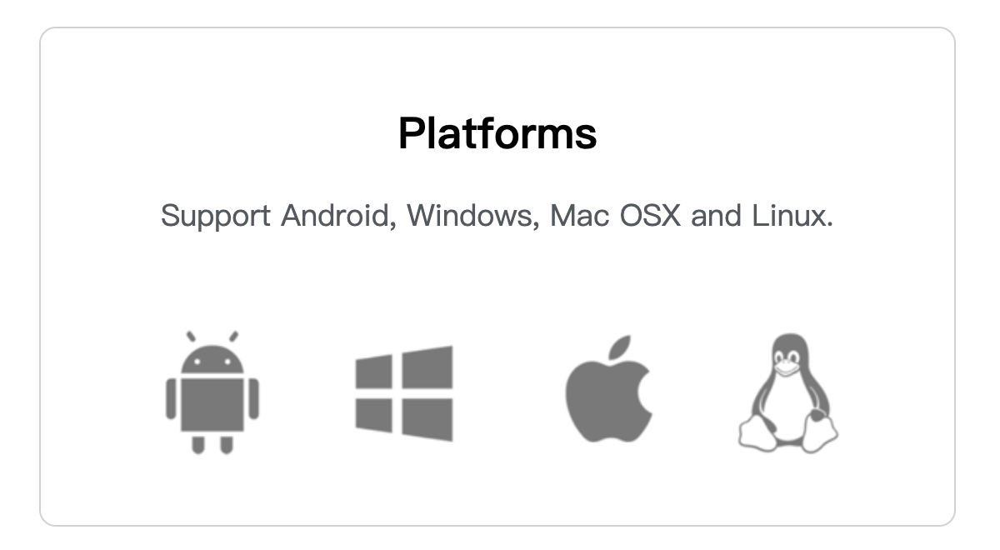

# product description

## Product Description

Developed by Elephant Robotics, the MyCobot Pro 630 robotic arm is a collaborative robot designed for education, research and light industrial automation. Known for its compact design and powerful functionality, this robot is dedicated to providing endless possibilities for innovation and learning. It has a maximum wingspan of 630mm, a maximum payload of 2kg, and supports programming languages of varying difficulty, making it suitable for users of all skill levels.

## Support extended development content

MyCobot Pro630 encourages users to participate in extension development:

- Programming language: Supports Python language.
-Hardware interface: including IO, USB, etc., for easy connection of various sensors and actuators.
- Software libraries: Provides a rich set of open source libraries and APIs to simplify the development process.
- System compatibility: Compatible with Windows, Linux and MacOS, suitable for various development environments.
   

## What you can learn

By reading the official documentation, you will learn:

- Basic Setup: Installation, configuration and initial operation guide.
- Programming Guide: How to control and program the MyCobot Pro 630 using various languages and platforms.
- Custom development: How to use extended interfaces and software libraries to develop custom applications.
- Success Stories: Insights into the use of MyCobot Pro 630 in different areas.
- Maintenance and troubleshooting: maintenance tips and solutions to common problems.

## Chapter summary

The next part of this manual will guide you into sub-chapters for a more comprehensive understanding of our product specifications, control core parameters, mechanical structural parameters, electrical characteristic parameters and coordinate system definitions.

Please choose the following chapters based on your interests and needs:

- [Design Philosophy](1.1-DesignPhilosophy.md)
This section mainly talks about the reasons for designing this product and the benefits of the existence of the product to users.
and contribution to the development of the industry in which the product is located.

- [Suitable Users](1.2-SuitableUsers.md)
This section mainly describes the recommended user groups for which this product is suitable, as well as the recommended application directions of products suitable for different user groups.

- [Application Scenario](1.3-ApplicationScenario.md)
This section describes the application scenarios recommended for this product and other application scenarios that users can independently expand.

- [Peripheral accessories](1.4-AccessoriesTools/README.md)
This section describes the accessories that can be used with this product and explains the corresponding application scenarios of each accessory.

## Thanks for reading

Thank you very much for reading the MyCobot Pro 630 User Manual. We hope this manual helps you better understand and use this robot effectively. If you have any questions or need further assistance, please feel free to contact our customer support team. We look forward to seeing more innovations you create with MyCobot Pro 630 and welcome you to our rapidly growing developer community. If you have read all of this chapter, you can continue to the next chapter.

---
[← Previous page](../README.md) | [Next page →](./1.1-DesignPhilosophy.md)