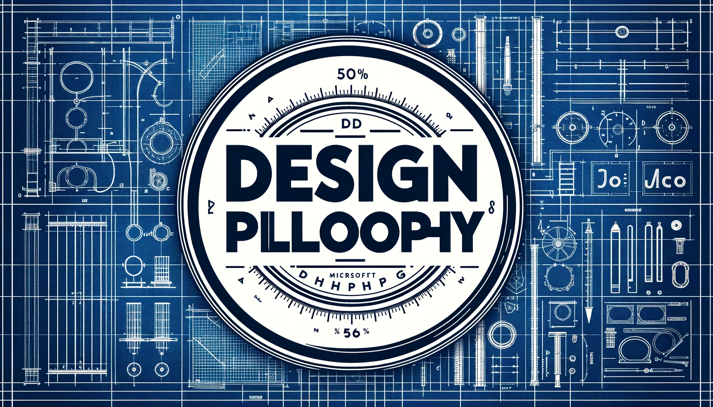

# design concept

## plan for design

MyCobot Pro630 is a product belonging to the "MyCobot Pro630 Series". It uses a Raspberry Pi microprocessor and has embedded RoboFlow visual programming software. It is a machine "assistant" developed by Elephant Robot for makers and researchers. Designed for educational research, business demonstrations, and personal learning, it aims to provide a multi-functional robot suitable for both teaching and research, as well as for the exploration of personal interests. In the field of educational research, it is intended to be a practical teaching tool to help students and researchers understand and apply robotics. When it comes to commercial displays, the MyCobot Pro630 provides an attractive way to showcase technology products or concepts. For individual learners, it provides an affordable, feature-rich platform for learning programming and robotics.

## Help for users

- Educational research: MyCobot Pro630 can provide educational institutions and researchers with an efficient and economical teaching and research tool, allowing students and researchers to gain a deeper understanding of robotics technology through hands-on learning and experimentation.

- Business Demonstration: For enterprises, MyCobot Pro630 can be used as an innovative demonstration tool to attract audiences and potential customers through robot demonstrations and showcase the company's technical strength and innovative ideas.

-Personal learning: For individual enthusiasts, MyCobot Pro630 provides a convenient platform for them to start their robotics journey, whether it is programming, mechanical design or artificial intelligence applications.

## Industry Contribution

- Promote STEM education: Through its application in educational research, MyCobot Pro630 encourages the development of STEM (Science, Technology, Engineering and Mathematics) education and stimulates students' interest in technology and innovation.

- Promote technology application: MyCobot Pro630 is reasonably priced and functional, lowering the technical threshold and enabling more people to access and utilize advanced robotic technology, thereby promoting the widespread application of technology and improving the public's technical literacy.

- Inspiring innovation and personal development: MyCobot Pro630 provides an open and flexible learning platform for individual learners and enthusiasts, promoting interdisciplinary learning and innovation, and cultivating talents for the future development of robotics and related fields.

---

[← Previous page](./1-ProductIntroduction.md) | [Next page →](../1-ProductIntroduction/1.2-SuitableUsers.md)