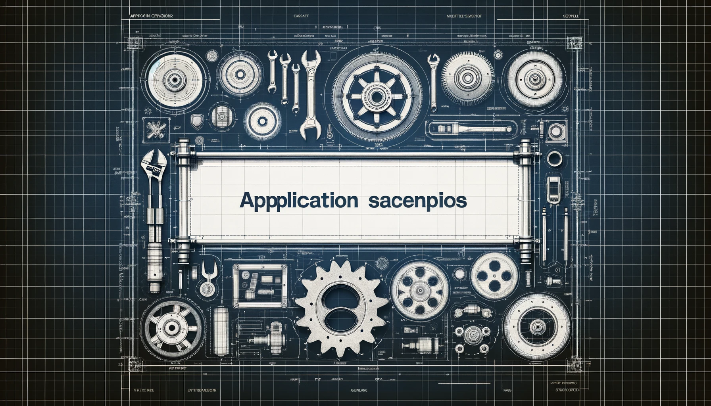

#Application scenarios

## Recommended application scenarios

- In the field of education: Use MyCobot Pro630 for programming teaching, robot design and manufacturing, and interdisciplinary scientific research projects to stimulate students' innovative thinking and problem-solving abilities.

- Scientific research: Use MyCobot Pro630 as a research tool for cutting-edge research in the fields of robotics, artificial intelligence and automation, for algorithm testing, data collection and model verification.

- Business Demonstrations: Program MyCobot Pro630 to perform eye-catching tasks or simulate actual workflows to demonstrate technological innovation and enhance your brand.

- Personal learning and entertainment: Individual users can learn basic programming, robot control, and even advanced concepts of machine learning and artificial intelligence through MyCobot Pro630, and can also use it as a personal project or hobby.

- For customer reference, we provide the following detailed application scenario table, covering some common application scenarios. It is important to note that this does not mean that MyCobot Pro630 is limited to these applications; you can use it for any other applicable scenarios:

| User Group | Application Scenarios | Goals and Benefits |
|------------|-----------------------|--------------------|
| **Teachers and Students in Education** | - STEM Education - Robotics Projects - Interdisciplinary Research Projects | - Increase students' interest in technology - Enhance hands-on and problem-solving skills - Promote innovative thinking and teamwork |
| **Researchers** | - Prototype Development - Experimental Research - Algorithm Testing and Validation | - Accelerate research progress - Bridge theory with practice - Advance technological innovation |
| **Professionals in Commercial Presentations and Marketing** | - Exhibition Display - Technical Demonstrations - Brand Promotion | - Attract potential customers and investors - Showcase the company's technological strength and innovative products - Enhance brand influence |
| **Individual Enthusiasts and Self-Learners** | - Programming Learning - Exploration of Robotics Technology - Basics of Artificial Intelligence | - Improve personal skills and knowledge - Achieve self-education and development - Explore the potential of robotics technology and AI |

---

[← Previous page](../1-ProductIntroduction/1.2-SuitableUsers.md) | [Next page →](../1-ProductIntroduction/1.4-AccessoriesTools/README.md)