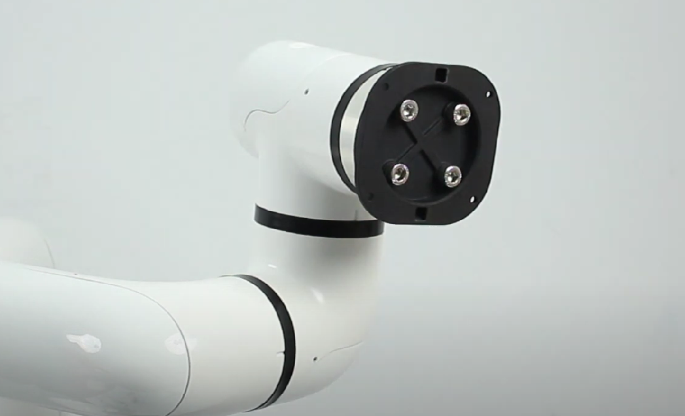
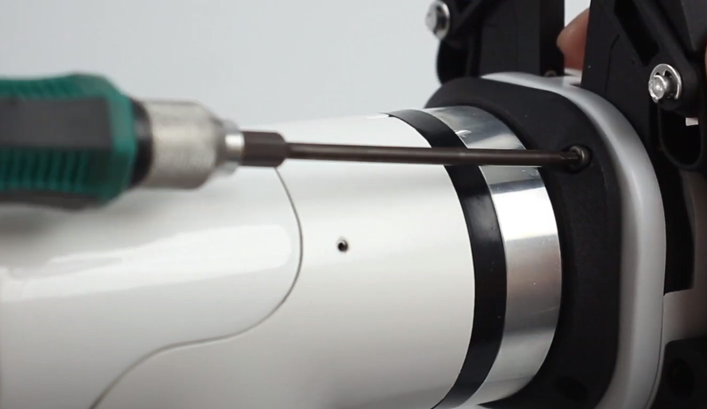

# **myCobotPro Adaptive Gripper**

> **Compatible models:** myCobot 320, myCobot Pro 630

## Product Image

## Specification

| **Name** | **myCobotPro Adaptive Grabber Black and White** |
| :----------- | :----------------------------------- |
| Material | Photosensitive resin + nylon |
| Process Technology | 3D Printing |
| Clamping range | 0-90 mm |
| Clamping force | 1000 grams |
| Repeatability Accuracy | 0.5 mm |
| Service life | 1 year |
| Drive mode | Electric drive |
| Transmission mode | Gear + connecting rod |
| Size | 158x105x55mm |
| Weight | 350 grams |
| Fixing method | Screw fixing |
| Usage environment requirements | Normal temperature and pressure |
| Control Interface | Serial Port/IO Control |
| Applicable equipment | ER myCobot 320 series, ER myCobot Pro 630 |

## Used to grab objects

### Introduction

- A manipulator is a robotic component that works like a human hand. It has the advantages of complex structure, firm grasping of objects, not easy to fall, and easy operation.

- The gripper kit includes the gripper connection line and flange, which controls the end effector of the robotic arm through a programmable system to achieve functions such as grabbing objects and multi-point positioning. Grippers can be used in all development environments such as ROS, Arduino, Roboflow, etc.

### working principle

- Driven by the motor, the finger surface of the manipulator makes linear reciprocating motion to achieve opening or closing actions. The acceleration and deceleration of the electric manipulator is controllable, with minimal impact on the workpiece, the positioning point is controllable, and the clamping is controllable.

### Suitable

- small cube

- small ball

- Long objects

Purchase link:

- [Taobao](https://shop504055678.taobao.com)
- [shopify](https://shop.elephantrobotics.com/)

### Install and use

- Clamp installation:

   - Structural installation:

     1. Align the gasket with the hole at the end of the robotic arm and tighten the screws:
        

     2. Align the screw holes of the clamping jaw with the holes around the gasket and tighten with the fine screws:
        

   - Electrical connections:
  
   

     >Please note that the robot arm must be powered off when plugging and unplugging, that is, the green light at the end is not on. If hot-plugging is performed while powered on, there is a risk of damaging the gripper.

     1. Align the m8 cable with the interface of the robot arm. Note that there is a gap at the interface and the connecting cable has corresponding protrusions. After confirming the direction, insert it and tighten it:
        
     2. Insert the gripper control interface and pay attention to the direction of the notch:
        

---

[← Previous page](../README.md) | [Next page →](./2-ElectricGripper.md)