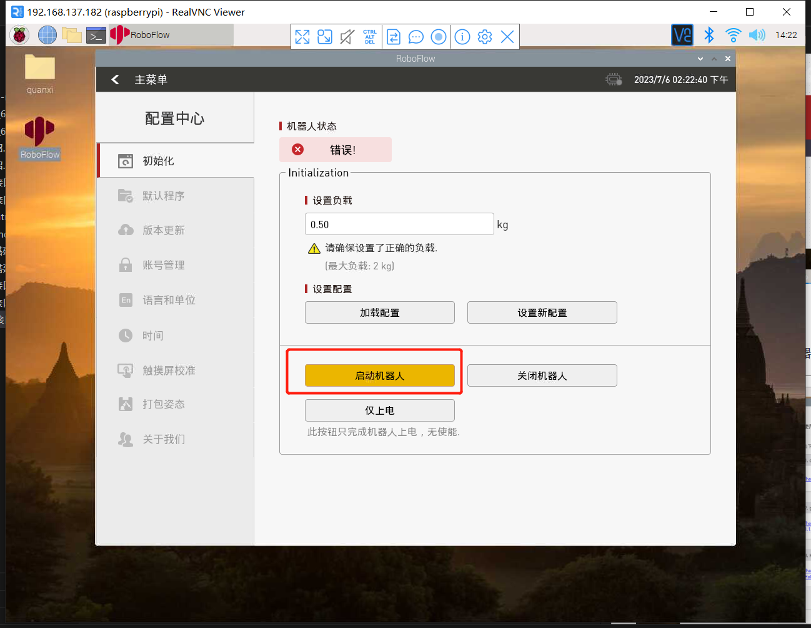

# **myCobotPro Adaptive Gripper**

> **Compatible models:** myCobot 320, myCobot Pro 630,myCobot Pro 600

## Product Image


## Specifications

| **Name** | **myCobotPro Adaptive Gripper Black and White** |
| :----------- | :-------------------------------------- |
| Material | Photosensitive resin + nylon |
| Process technology | 3D printing |
| Gripping range | 0-90 mm |
| Clamping force | 1000 grams |
| Drive mode | Electric drive |
| Gearbox mode | Gear + connecting rod |
| Dimensions | 158x105x55mm |
| Weight | 350 grams |
| Fixing method | Screw fixing |
| Environment requirements | Normal temperature and pressure |
| Control interface | Serial port/IO control |
| Applicable devices | myCobot 320 series, myCobot Pro 630, myCobot Pro 600 |
<!-- | Repeatability accuracy | 0.5 mm |
| Service life | 1 year | -->
## Used for grabbing objects

### Introduction

- A manipulator is a robot component that works like a human hand. It has the advantages of complex structure, firm gripping of objects, not easy to fall, and easy operation.

- The gripper kit includes gripper connection wires and flanges. The end effector of the manipulator is controlled by a programmable system to realize functions such as grabbing objects and multi-point positioning. The gripper can be used in all development environments, such as ROS, Arduino, Roboflow, etc.

### Working principle

- Driven by the motor, the finger surface of the manipulator makes linear reciprocating motion to achieve opening or closing actions. The acceleration and deceleration of the electric manipulator are controllable, the impact on the workpiece is minimal, the positioning point is controllable, and the clamping is controllable.

### Applicable objects

- Small cubes

- Small balls

- Long objects

<!-- Purchase link:

- [Taobao](https://shop504055678.taobao.com)

- [shopify](https://shop.elephantrobotics.com/) -->

### Installation and use

- Gripper installation:

- Structural installation:

1. Align the gasket with the hole at the end of the robot arm and tighten it with screws:


2. Align the screw holes of the gripper with the holes around the gasket and tighten them with thin screws:


- Electrical connection:


> **Note that the robot arm should be powered off, that is, the green light at the end should not be on when plugging and unplugging. If hot-plugging is performed with power on, there is a risk of damaging the gripper. **

1. Align the m8 cable with the interface of the robot arm. Note that there is a notch at the interface and a corresponding protrusion on the connecting cable. After confirming the direction, insert it and tighten it:

2. Insert the gripper control interface, and also pay attention to the direction of the notch:


<br>

## Python programming control
You need to use roboflow to enable the robot first, then run the following python script to test whether the gripper is normal



Confirm the IP address of the robot: Enter ifconfig in the terminal to obtain


```python
from pymycobot import ElephantRobot
import time
if __name__=="__main__":
try:
#IP fill in the actual robot's wireless IP
elephant_client=ElephantRobot("192.168.10.158",5001)
elephant_client.start_client()
for i in range(1):
#Close
elephant_client.set_digital_out(16,1)
elephant_client.set_digital_out(17,0)
time.sleep(2)
#Open
elephant_client.set_digital_out(16,0)
elephant_client.set_digital_out(17,1)
time.sleep(2)
elephant_client.set_digital_out(16,0)
elephant_client.set_digital_out(17,0)

except KeyboardInterrupt:
elephant_client.stop_client()
print("socket end")

```


---

[← Previous page](../README.md) | [Next page →](./2-ElectricGripper.md)