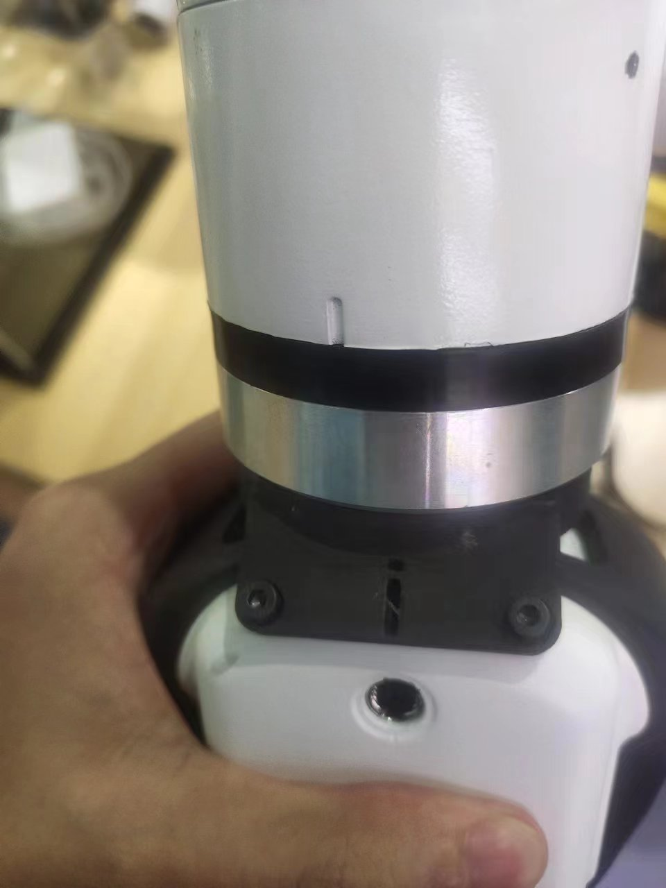
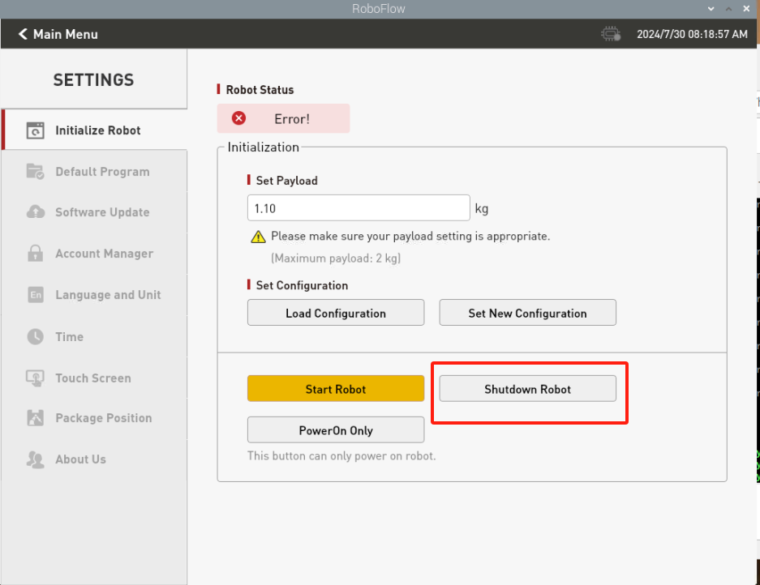

# **myCobotPro 自适应夹爪**

> **兼容型号：** myCobot 320、myCobot Pro 630、myCobot Pro 600

## 产品图片

  


## 规格

| **名称**     | **myCobotPro 自适应抓取器 黑白款**      |
| :----------- | :-------------------------------------- |
| 材料         | 光敏树脂 + 尼龙                         |
| 工艺技术     | 3D 打印                                 |
| 夹取范围     | 0-90 mm                                 |
| 夹紧力       | 1000 grams                              |
| 驱动模式     | 电驱动                                  |
| 变速箱模式   | 齿轮+连接杆                             |
| 尺寸         | 158x105x55mm                            |
| 重量         | 350 grams                               |
| 固定方法     | 螺丝固定                                |
| 使用环境要求 | 常温常压                                |
| 控制接口     | 串行端口/IO 控制                        |
| 适用设备     |  myCobot 320 系列、 myCobot Pro 630、 myCobot Pro 600 |
<!-- | 重复性精度   | 0.5 mm                                  |
| 使用寿命     | 1 年                                    | -->
## 用于抓取物体

### 引言

- 机械手是一种能像人手一样工作的机器人部件。它具有结构复杂、抓取物体牢固、不易掉落、操作简便等优点。

- 抓手套件包括抓手连接线和法兰，通过可编程系统控制机械臂的末端效应器，实现抓取物体和多点定位等功能。抓手可用于所有开发环境，如 ROS、Arduino、Roboflow 等。

### 工作原理

- 在电机的驱动下，机械手的手指表面做直线往复运动，实现打开或关闭动作。电动机械手的加减速可控，对工件的冲击最小，定位点可控，夹紧可控。

### 适用对象

- 小方块

- 小球

- 长条物体

<!-- 购买链接:

- [淘宝](https://shop504055678.taobao.com)
- [shopify](https://shop.elephantrobotics.com/) -->

### 安装使用

- 夹爪安装：

  - 结构安装：

    1. 将垫片对准机械臂末端孔位，配合螺丝拧紧：
       

    2. 将夹爪的螺丝孔对准垫片四周的孔位，配合细螺丝拧紧：
       

       

  - 电气连接：
  
    

    > **注意在机械臂不上电的状态下进行，即末端绿灯不亮的情况下进行插拔，如果带电热插拔，会有损坏夹爪的风险。**

    1. 将 m8 线对准机械臂的接口，注意接口处有缺口，连接线有对应突起，确认方向后插入，并拧紧：
       
    2. 插入夹爪控制接口，同样注意缺口的方向：
       

<br>

## python编程控制
需要先使用roboflow将机械臂使能，再运行下面的python脚本内容，测试夹爪是否正常


确认机械臂的IP地址：终端输入 ifconfig 获取


###  IO控制模式
```python

from pymycobot import ElephantRobot
import time

# 将ip更改成P600树莓派的实时ip

elephant_client = ElephantRobot("192.168.10.158", 5001)

# 启动机器人必要指令
elephant_client.start_client()
time.sleep(1)
elephant_client.set_gripper_mode(1)
time.sleep(1)
elephant_client.power_off()#夹爪透传换IO模式时需要先关闭机器再重启机器人一次，仅使用夹爪透传模式不必关闭机器人
elephant_client.power_off()
time.sleep(3)
elephant_client.state_off()
time.sleep(3)
elephant_client.power_on()
time.sleep(3)
elephant_client.state_on()
time.sleep(3)
elephant_client.set_digital_out(16, 0)  # IO恢复低电平
time.sleep(1)
elephant_client.set_digital_out(17, 0)  # IO恢复低电平
time.sleep(1)


# IO模式
#夹爪全开全闭合控制代码，注意在夹爪透传切换IO模式时需要先关闭机器再重启机器人一次，才能切换回夹爪IO模式
for i in range(3):
   
    elephant_client.set_digital_out(16, 1)  # 闭合夹爪
    time.sleep(1)
    elephant_client.set_digital_out(17, 0)  # IO恢复低电平
    time.sleep(1)
    elephant_client.set_digital_out(16, 0)  #IO恢复低电平
    time.sleep(1)
    elephant_client.set_digital_out(17, 1)  # 打开夹爪
    time.sleep(1)

elephant_client.set_digital_out(16, 0)  # IO恢复低电平
time.sleep(1)
elephant_client.set_digital_out(17, 0)  # IO恢复低电平
time.sleep(1) 


```

### 透传模式
```python
from pymycobot import ElephantRobot
import time

# 将ip更改成P600树莓派的实时ip

elephant_client = ElephantRobot("192.168.10.158", 5001)

# 启动机器人必要指令
elephant_client.start_client()
time.sleep(1)
elephant_client.set_gripper_mode(0)
time.sleep(1)
# elephant_client.power_off()#夹爪透传换IO模式时需要先关闭机器再重启机器人一次，仅使用夹爪透传模式不必关闭机器人
elephant_client.state_off()
time.sleep(3)
elephant_client.power_on()
time.sleep(3)
elephant_client.state_on()
time.sleep(3)

#透传模式

for i in range(3):
    elephant_client.set_gripper_value(26,20)
    time.sleep(1)
    elephant_client.set_gripper_value(86,20)
    time.sleep(1)


```
## 夹爪零位校准
**夹爪出厂时已做过零位校准，若夹爪的行程不对，可以按照下面操作进行校准**

在roboflow先关闭机器人，手动将夹爪张开到最大



然后再启动机器人


然后再执行下面脚本

```python
from pymycobot import ElephantRobot
import time

# 将ip更改成P600树莓派的实时ip

elephant_client = ElephantRobot("192.168.10.158", 5001)

# 启动机器人必要指令
elephant_client.start_client()
time.sleep(1)
elephant_client.set_gripper_mode(0)
time.sleep(1)
elephant_client.set_gripper_calibrate()
time.sleep(1)


```


---

[← 上一页](../README.md) | [下一页 →](./2-ElectricGripper.md)
