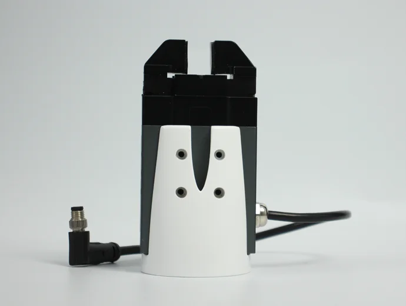
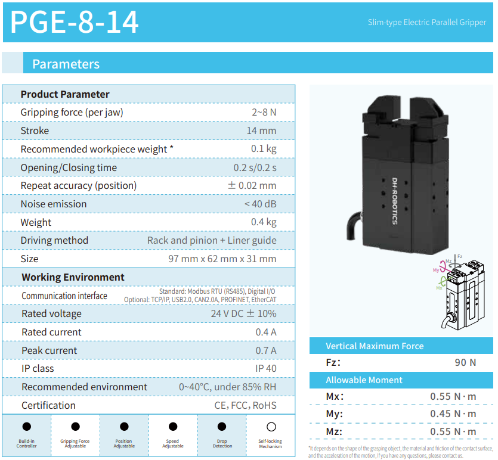
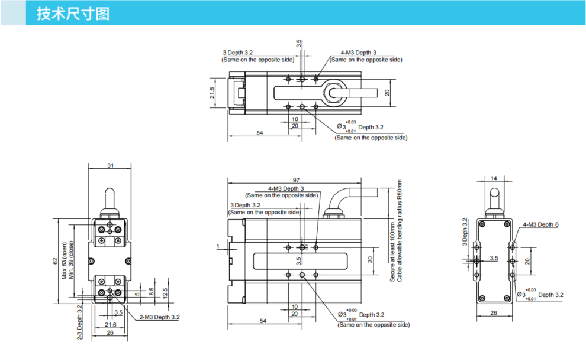
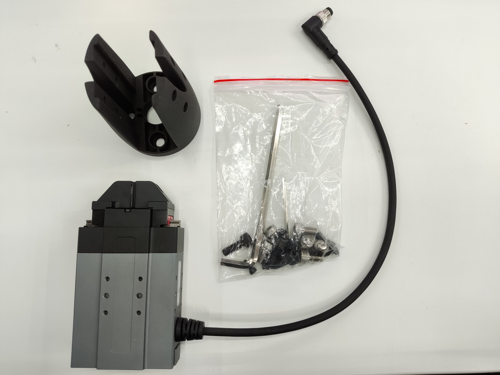
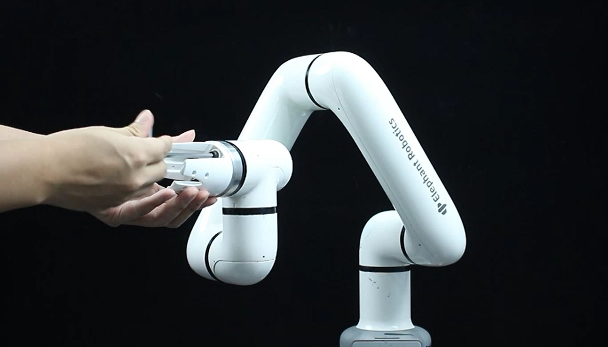
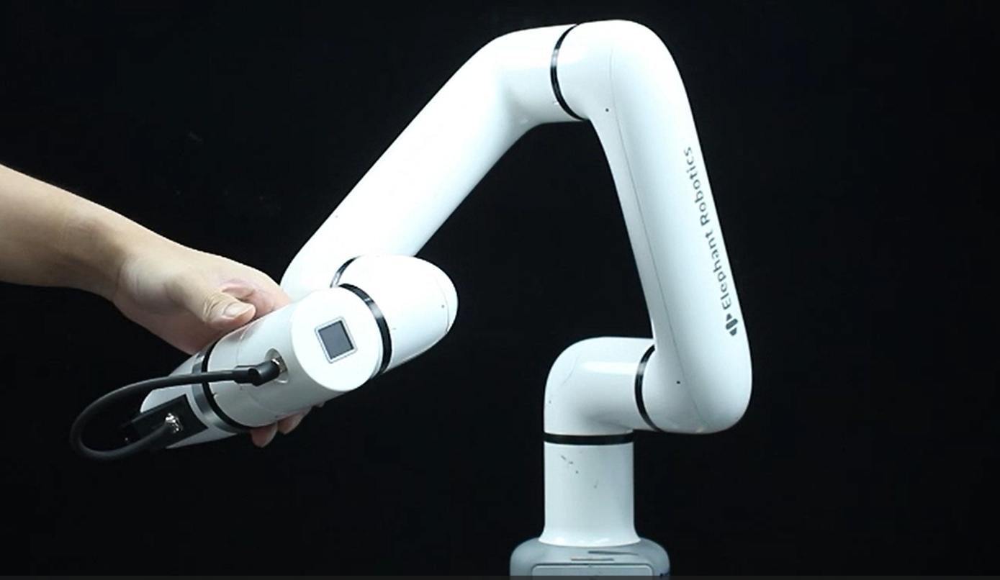
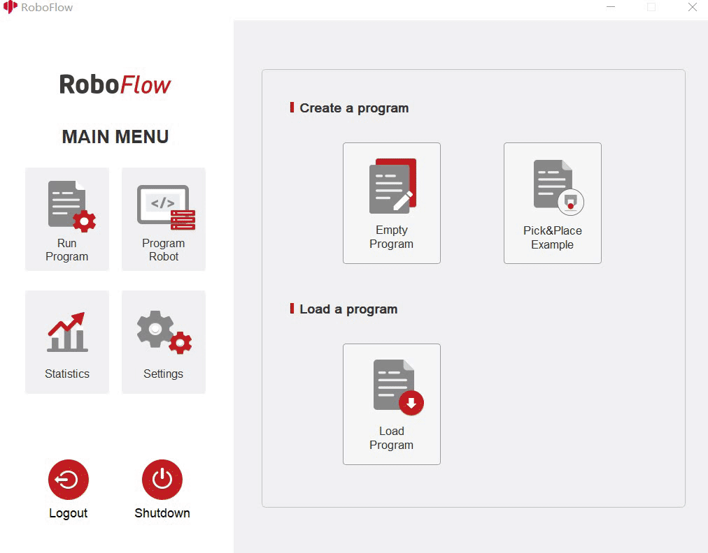

# **Electric Gripper**

> **Compatible models:** myCobot 320, myCobot Pro 630, myCobot Pro 600

## Product images

## Specifications

| **Name** | **mycobotpro Electric Gripper** |
| :----------- | :---------------------------------- |
| Model | myCobotPro_Gripper_PGE_8 |
| Material | Metal + 7500 Nylon |
| Gripping range | 0-14mm |
| Clamping force | 2-5N |
| Drive mode | Electric drive |
| Transmission method | Rack and pinion + cross roller guide |
| Dimensions | 97×62×31mm |
| Weight | 460g |
| Fixing method | Screw fixing |
| Environment requirements | Normal temperature and pressure |
| Control interface | Serial port |
| Applicable equipment | myCobot 320 series, myCobot Pro 630, myCobot Pro 600 |
<!-- | Repeatability accuracy | 1mm |
| Service life | One year | -->

## For gripping objects

**Introduction**

- The PGE series is a thin parallel electric gripper for industrial use, and the number represents the maximum gripping force of the gripper. The gripper is equipped with a pair of parallel fingertips that run symmetrically during movement. The main structure of the gripper is a smooth rectangular structure with a small size and saves installation space. It has 5 mounting holes to meet different installation conditions of the equipment.

- Fast response speed, high grasping frequency, and equipped with 8-core communication interface, mainly realize the clamping or jamming of objects, suitable for relatively light objects.

**Working principle**

- The motor drives the gear rack and cross roller guide to realize the opening or closing action of the gripper. The positioning point of the electric gripper is controllable, and the clamping is also controllable.

**Applicable objects**

- Volume is smaller than the clamping stroke

- Weight is smaller than the maximum clamping weight

- Custom fingertips can expand more applications

## Product parameters

**Operating environment**

| **Surrounding environment** | **Graphical description** |
| :----------- | :----------- |
| Regulations | RS-485 |
| Operating voltage | 24V |
| Rated current | 0.25A |
| Peak current | 0.5A |
| Protection level | IP40 |
| Recommended environment | 0-40℃ |

<!-- ## Purchase link

Purchase link:

- [Taobao](https://shop504055678.taobao.com)

- [shopify](https://shop.elephantrobotics.com/) -->

<!-- ## How to use

1 Install the gripper:  

- For the electric manipulator, plug it into the 485 interface on the top, as shown below:  
   -->
**Installation and Use**

- Check whether the accessories package is complete: screws, hexagonal wrench, gripper with connecting wire, gripper and end-of-arm fixture

- Gripper installation:

- Structural installation:

1. Align the screws with the four screw holes at the end of the robot arm and tighten them:

2. Insert the electric gripper into the fixture and tighten the eight thin screws on both sides:

text](../../../resources/1-ProductIntroduction/1.4/1.4.1-Gripper/2-ElectricGripper/eg3.jpg)

- Electrical connection:

1. Plug the 485 line into the robot control interface:
 

<!-- 
  -->

** Instructions for use:** 

RoboFlow Instructions for use: Before use, you need to start the robot system

- Click **Define New Gripper**, fill in the Gripper Name as "**DH PGE 8**" (must be this name), and then click Save; 
- Select open or close for Saved status. The overall steps are as shown in the figure below: 
 

---
[← Previous page](./1-AdaptiveGripper.md) | [Next page →](./3-PneumaticGripper.md)