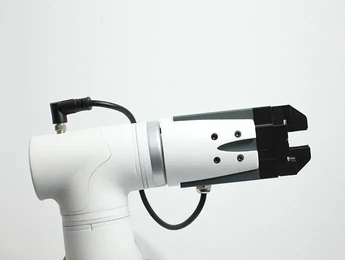

# **Electric Gripper**

> **Compatible models:** myCobot 320, myCobot Pro 630

## Product Image

## Specification

| **Name** | **mycobotpro Electric Gripper** |
| :----------- | :---------------------------------- |
| Model | myCobotPro_Gripper_PGE_8 |
| Materials | Metal + 7500 Nylon |
| Clamping range | 0-14mm |
| Clamping force | 2-5N |
| Repeatability Accuracy | 1mm |
| Service life | One year |
| Drive mode | Electric drive |
| Transmission type | Rack and pinion + Crossed roller guide |
| Size | 97×62×31mm |
| Weight | 460g |
| Fixing method | Screw fixing |
| Usage environment requirements | Normal temperature and pressure |
| Control Interface | Serial Port/IO Control |
| Applicable devices | ER myCobot 320, ER myCobot Pro 630 |

## Used to grab objects

**introduction**

- The PGE series is a thin parallel electric gripper for industrial use. The number represents the maximum clamping force of the gripper. The gripper jaws are equipped with a pair of parallel fingertips that run symmetrically during movement. The main structure of the clamping jaw is a smooth rectangular structure, which is small in size and saves installation space. It has 5 mounting holes to meet different installation conditions of the device.

- It has fast response speed, high grabbing frequency, and is equipped with an 8-core communication interface. It mainly realizes clamping or jamming of objects and is suitable for relatively light objects.

**working principle**

- The motor drives the rack and pinion and the cross roller guide to realize the opening or closing action of the clamping jaw. The positioning point of the electric gripper is controllable, and the clamping is also controllable.

**Suitable**

- Volume smaller than clamping stroke

- Weight less than maximum clamping weight

- Customizable fingertips can be expanded to more applications

## Product parameters

**Operating environment**

| **Surroundings** | **Illustration** |
| :----------- | :----------- |
| Procedures | RS-485 |
| Working voltage | 24V |
| Rated current | 0.25A |
| Peak current | 0.5A |
| Degree of protection | IP40 |
| Recommended environment | 0-40℃ |

## Purchase link

Purchase link:

- [Taobao](https://shop504055678.taobao.com)
- [shopify](https://shop.elephantrobotics.com/)

## how to use

1 Install the jaws:  

- For electric manipulators, plug it into the 485 interface on the top as shown below:  
     

[← Previous page](./1-AdaptiveGripper.md) | [Next page →](./3-PneumaticGripper.md)