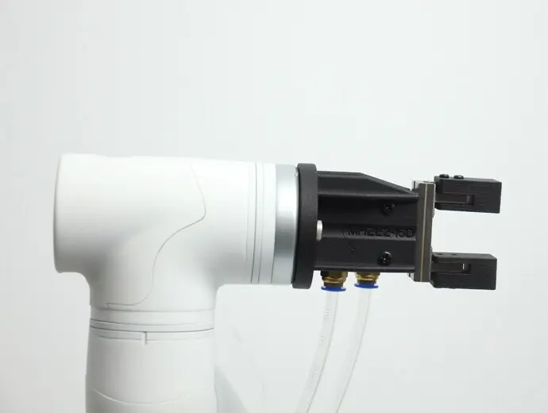
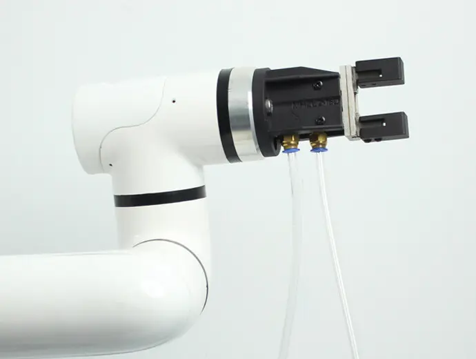

# **Pneumatic Gripper**

> **Compatible models:** myCobot 320, myCobot Pro 630

## Product Image

  

## Specification

| **Name** | **mycobot320 Pneumatic Clamp** |
| :----------- | :----------------------------------------------------- |
| Model | myCobotPro_Gripper_Air_10 |
| Materials | Metal + 7500 Nylon |
| Clamping range | 0-8mm |
| Clamping force | Outer diameter 34N Inner diameter 45N |
| Repeatability accuracy | ±0.01mm |
| Service life | One year |
| Drive Mode | Pneumatic |
| Transmission method | Piston cylinder |
| Size | 67.3×38×23.6mm |
| Weight | 180g |
| Fixing method | Screw fixing |
| Usage environment requirements | Normal temperature and pressure |
| Control interface | Input/output control |
| Applicable devices | ER myCobot 320 M5 ER myCobot 320 Pi ER myCobot Pro 630 |

## Used to grab objects

**introduction**

- Pneumatic gripper, also known as pneumatic finger or pneumatic clamp, is an actuator that uses compressed air as power to grab or grasp workpieces. It is small in size, light in weight and compact in appearance, and can achieve one-way and two-way grabbing, automatic centering, high repeatability and automatic control of magnetic switches.

- Pneumatic gripper kit includes gripper flange, air pump, φ8 air pipe, φ6 air pipe, φ8-6 quick connector, solenoid valve and cable. Its main function is to replace human grabbing work, which can effectively improve production efficiency and work safety. An external suction pump is required.

**working principle**

- Single piston: The shaft drives the crank, and the air gripper is driven to open and close by the piston. Corresponding crank grooves are arranged on the two claw pieces respectively. In order to reduce frictional resistance, a steel ball slide rail structure is used to connect the claw piece and the fuselage.

- Double piston: controlled by two pistons, each piston is connected to a pneumatic finger through a roller and a double crank to form a special drive unit. It should be noted that the pneumatic fingers always move toward the central axis, and each pneumatic finger cannot move independently.

- Parallel clamp cylinder: If the pneumatic fingers move in opposite directions, the previously compressed piston is in the exhaust state, while the other piston is in the compression state.

**Suitable**

- Volume smaller than clamping stroke

- Weight less than maximum clamping weight

- Customizable fingertips can be expanded for more uses

## Purchase link

- [Taobao](https://shop504055678.taobao.com)
- [shopify](https://shop.elephantrobotics.com/)

## how to use

1 Installation fixture:  

  

  

[← Previous page](./2-ElectricGripper.md) | [Next page →](./4-FlexibleGripper.md)