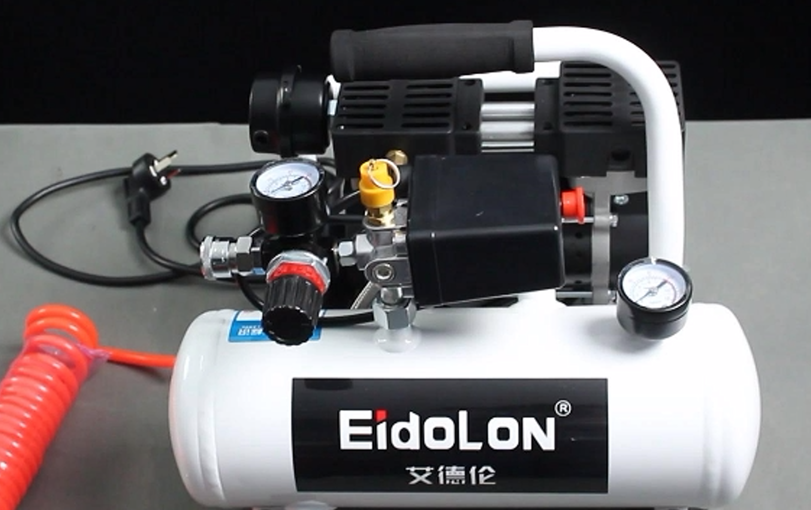

# **Pneumatic Gripper**

> **Compatible models:** myCobot 320, myCobot Pro 630, myCobot Pro 600

## Product images

 <br>

## Specifications

| **Name** | **mycobot Pneumatic Gripper** |
| :----------- | :----------------------------------------------------- |
| Model | myCobotPro_Gripper_Air_10 |
| Material | Metal + 7500 Nylon |
| Gripping range | 0-8mm |
| Clamping force | Outer diameter 34N Inner diameter 45N |
| Drive mode | Pneumatic |
| Transmission method | Piston cylinder |
| Dimensions | 67.3×38×23.6mm |
| Weight | 180g |
| Fixing method | Screw fixing |
| Environment requirements | Normal temperature and pressure |
| Control interface | Input/output control |
| Applicable equipment | myCobot 320 series, myCobot Pro 630, myCobot Pro 600 |
<!-- | Repeatability accuracy | ±0.01mm |
| Service life | One year | -->
## Used for grasping objects

**Introduction**

- Pneumatic grippers, also known as pneumatic fingers or pneumatic clamps, are actuators that use compressed air as power to grasp or grip workpieces. They are small in size, light in weight, compact in appearance, and can achieve unidirectional and bidirectional grasping, automatic centering, high repeatability, and automatic control of magnetic switches.

- The pneumatic gripper kit includes gripper flange, air pump, φ8 air pipe, φ6 air pipe, φ8-6 quick connector, solenoid valve and cable. Its main function is to replace manual grasping work, which can effectively improve production efficiency and work safety. An external suction pump is required.

**Working principle**

- Single piston: The shaft drives the crank, and the air gripper is driven to open and close by the piston. The two claws are respectively arranged with corresponding crank grooves. In order to reduce friction resistance, the claws and the fuselage are connected by a steel ball slide structure.

- Double piston: controlled by two pistons, each piston is connected to a pneumatic finger through a roller and a double crank to form a special drive unit. It should be noted that the pneumatic finger always moves toward the center axis, and each pneumatic finger cannot move independently.

- Parallel clamp cylinder: If the pneumatic finger moves in the opposite direction, the previously compressed piston is in the exhaust state, and the other piston is in the compression state.

**Applicable objects**

- Volume is smaller than the clamping stroke

- Weight is smaller than the maximum clamping weight

- Customized fingertips can expand more uses

**Installation and use**

- Need to be used with an air compressor:


1. Insert the black plug into the power strip;

2. Insert the matching red hose into the interface on the machine:

3. The red button is a switch. Pull it out to turn it on, and press it back to turn it off:


- Gripper installation:

1. Connect the other end of the red hose of the air compressor to the interface of the solenoid valve:

2. Unscrew another interface on the other end of the solenoid valve to start the gripper to control the opening and closing:


3. Use two matching transparent hoses, one end of which is connected to the two interfaces of the solenoid valve:

4. The other end of the transparent hose is connected to the two interfaces of the gripper:

5. Use the matching screws to fix the gripper to the end of the robot arm:


- Electrical connection:

1. Connect the black cable to the GND of the robot base, and the red cable to any one of OUT1~OUT6. Change the pin number of the subsequent program according to the selected interface. Here, use OUT1:


## 3 Through python Control

**The robot system needs to be started before use**


Confirm the IP address of the robot arm: Enter ifconfig in the terminal to obtain


```python
from pymycobot import ElephantRobot
import time

# Change the ip to the real ip of the P600 Raspberry Pi

elephant_client = ElephantRobot("192.168.10.158", 5001)

# Necessary commands to start the robot
elephant_client.start_client()
time.sleep(1)

elephant_client.set_digital_out(0,1)
time.sleep(2)

elephant_client.set_digital_out(0,0)
time.sleep(2)

```
---

[← Previous page](./2-ElectricGripper.md) | [Next page →](./4-FlexibleGripper.md)