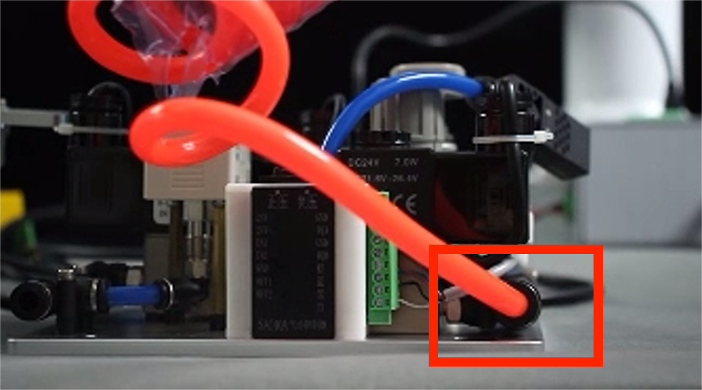
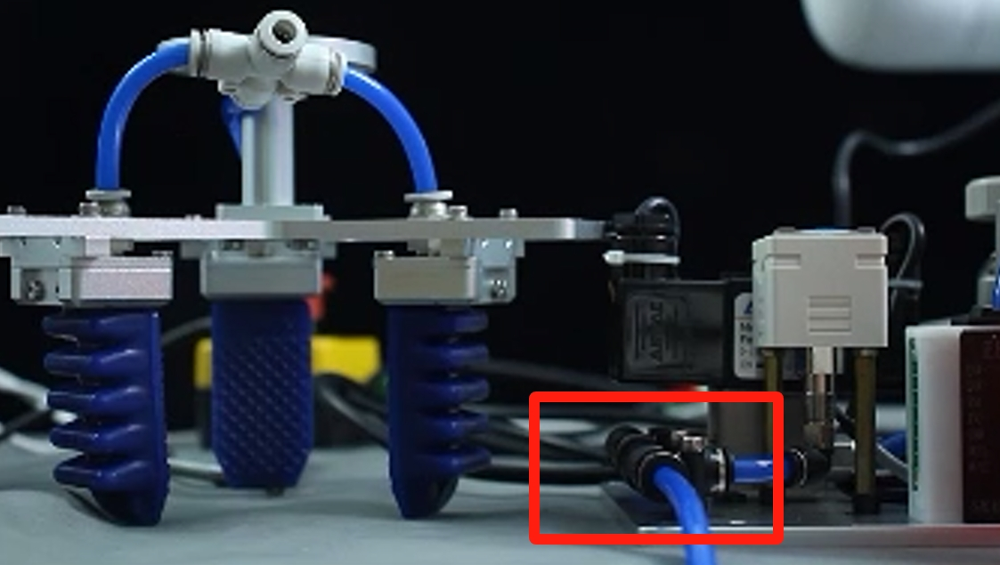
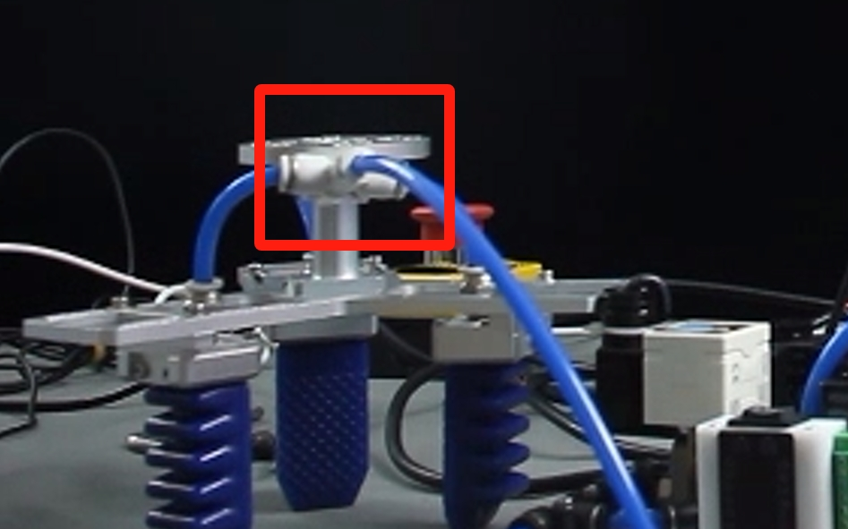
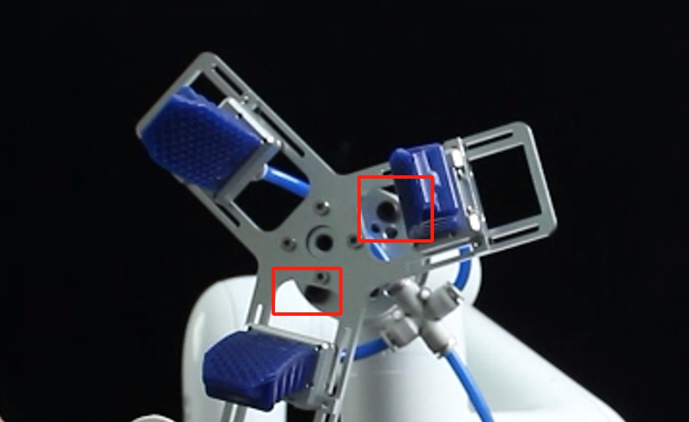
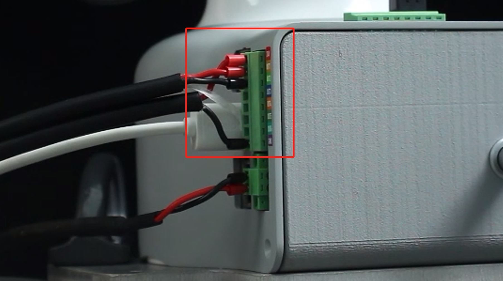
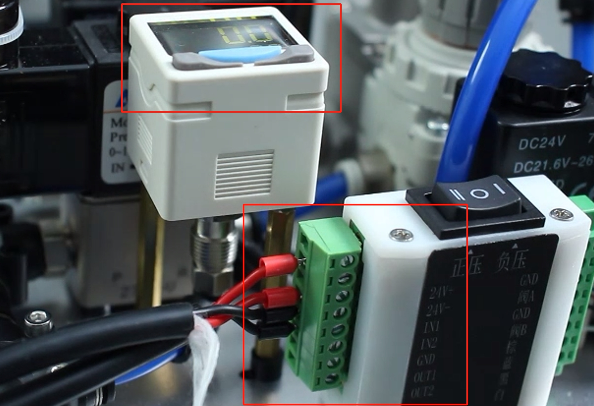

# Flexible Gripper Professional Edition

> **Compatible models:** myCobot 320, myCobot Pro 630

## Product Image

 <br>

**Specifications:**

| Name name | myCobotPro Flexible Gripper |
| ---------------------- | ---------------------------------------- |
| Material | Metal |
| Clamping range clamp size | 36-136 mm |
| Maximum clamp force clamp force | Vertical 600 g Package 1080 g |
| Drive drive | Pneumatic |
| Transmission | Deformation |
| Size size | 170x128x195mm |
| Weight | 365 grams |
| Fixing method fixed | Screw fixing |
| Environment requirements | Normal temperature and pressure |
| Control interface control | IO control |
| Applicable equipment |myCobot 320, myCobot Pro 600, myCobot Pro 630 |
<!-- | Repeatability precision | 0.5 mm |
| Lifetime lifetime | 1 year | -->
**Flexible gripper:** Used to grip objects

**Introduction**

- Traditional industrial suction cups need to suck the flat surface of the material. In more and more working conditions, the suction surface is easy to damage the panel or components. The soft-touch gripper grabs the edge and easily moves the panel without marks or damage, ensuring that the product surface is flawless and improving the yield rate.
- The modular design of the soft-touch gripper is light in weight and can be freely arranged and combined according to the panel size.
- The clamping force of traditional cylinders is generally large and difficult to control. The edge of the clamping panel is easy to be clamped and warped. The single-finger clamping force of the flexible gripper is precisely controllable and will not clamp fragile workpieces.

**Working Principle**

- The flexible gripper is an innovative bionic flexible gripper developed by researchers imitating the shape of the starfish's arms and legs. The "fingers" of the soft gripper are made of polymer silicone flexible material. They are bent and deformed by inflation. They can adaptively cover the target object like a starfish, and can complete the flexible and non-destructive grasping of special-shaped and fragile objects.

**Applicable objects**

- Any object of any shape within a reasonable size

**Installation and use**

- Need to be used with an air compressor:


1. Insert the black plug into the power strip;

2. Insert the matching red hose into the interface on the machine:

3. The red button is a switch. Pull it out to turn it on, and press it back to turn it off:


- Gripper installation:

1. Connect the other end of the red hose of the air compressor to the interface of the pneumatic controller:

2. Use the blue hose that comes with the flexible gripper to connect the interfaces of the gripper and the pneumatic controller respectively:


3. Fix the flexible gripper to the end of the robot arm with the matching screws:


- Electrical connection:

1. Two connecting wires are provided, one for power supply and one for control.

- At the base of the robot arm, the red wire for power supply is connected to the 24V interface and the black wire is connected to the GND interface. For the control wire, red is connected to OUT1 and black is connected to OUT2:

- On the pneumatic controller side, the red power supply wire is connected to the pneumatic controller 24V, and the black is connected to the pneumatic controller's GND. The red control wire is connected to IN1 and the black is connected to IN2:

> Note that it is connected to the "positive pressure" side. If the power supply is successful, the display will light up.
> You can manually test whether the connection is normal. Turn on the air compressor and press the button of the pneumatic controller. Pressing to the left (positive pressure) will shrink the gripper, and pressing to the right (negative pressure) will open the gripper. When using IO control, make sure the three-position toggle switch is set to the middle position.

## 3 Control via Python

** Start the robot system before use**


Confirm the IP address of the robot: Enter ifconfig in the terminal to obtain


```python
from pymycobot import ElephantRobot
import time

# Change the IP address to the real IP address of the P600 Raspberry Pi

elephant_client = ElephantRobot("192.168.10.158", 5001)

# Necessary instructions to start the robot

elephant_client.start_client()
time.sleep(1)

elephant_client.set_digital_out(0,0)#Reset IO
time.sleep(2)

elephant_client.set_digital_out(1,0)#Reset IO
time.sleep(2)

elephant_client.set_digital_out(0,1)#Close
time.sleep(2)

elephant_client.set_digital_out(1,0)#Reset IO
time.sleep(2)

elephant_client.set_digital_out(0,0)#Reset IO
time.sleep(2)

elephant_client.set_digital_out(1,1)#Open
time.sleep(2)

elephant_client.set_digital_out(0,0)#Reset IO
time.sleep(2)

elephant_client.set_digital_out(1,0)#Reset IO
time.sleep(2)

```

---

[← Previous page](./3-PneumaticGripper.md) | [Next page →](../1.4.2-PumpCup/1-ModuleSuctionCup.md)
