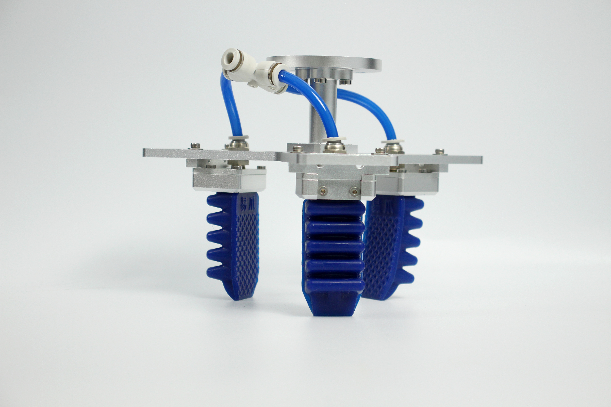
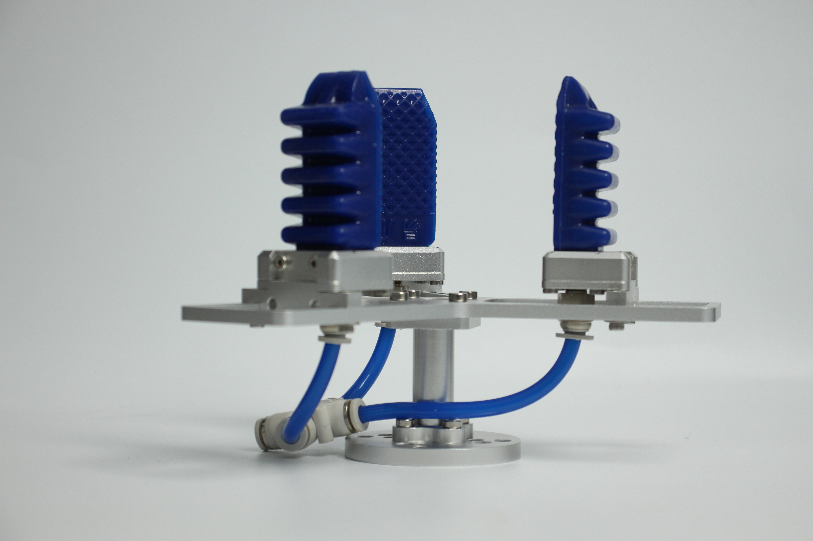
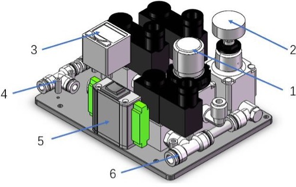
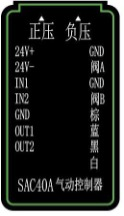

# Flexible Grabber Professional Edition

> **Compatible models:** myCobot 320, myCobot Pro 630

## Product Image

  

## Specification

**Clamp**

| **Picture** |  |
| :----------- | :-----------------------------------|
| Materials | Metal |
| Clamping range | 36-136mm |
| Clamping force | Vertical 600g Packaged 1080g |
| Repeatability Accuracy | 0.5 mm |
| Service life | 1 year |
| Drive Mode | Pneumatic |
| Gearbox Mode | Deformation |
| Size | 170x128x195mm |
| Weight | 365 grams |
| Fixing method | Screw fixing |
| Usage environment requirements | Normal temperature and pressure |
| Control interface | SAC40A pneumatic controller |
| Applicable equipment | ER myCobot 320 series, ER myCobot Pro 630 |

**Controller**

| **Picture** |  |
| :---------- | :---------------------------------- -------------------------------------------------- -------------------------------------------------- ---------- |
| Power supply | 24V 1.5A |
| Control mode | IO |
| Air source pressure | > 0.4 MPA |
| Flow rate | > 40 L/MIN |
| IO |    |
| Value State | IN1: HIGH & IN2: LOW = Close the gripper  IN1: LOW & IN2: HIGH = Open the gripper  Note⚠️: When using IO control, make sure the above three-position toggle switch is set to centre position.              |
| Boat type switch | Three-position toggle switch |
| Positive pressure | Clamp jaws closed |
| Negative pressure | Clamp open |

## Used to grab objects

**introduction**

- Traditional industrial suction cups need to suck the flat surface of the material. Under increasing operating conditions, the suction cup surface can easily damage panels or components. The soft-touch gripper pinches the edges to easily grasp the panel without leaving marks or damaging the panel, ensuring that the product surface is not damaged. Improve yield.

- The flexible clamping jaw adopts a modular design, is light in weight, and can be freely arranged and combined according to the panel size.

- The clamping force of traditional oil cylinders is generally large and the force is difficult to control. The edges of the clamped panels are susceptible to pinching and warping. The single-finger clamping force of the elastic jaws is precisely controllable and will not clamp fragile workpieces.

**working principle**

- Soft Claw is an innovative bionic soft claw developed by researchers that mimics the shape of a starfish's arms and legs. The "fingers" of the soft claw are made of flexible polymer silicone material and can be bent and deformed by inflation. It can adaptively cover target objects like a starfish, and can complete flexible and non-destructive grasping of special shapes and fragile objects.

**Suitable**

- Objects of any shape within a reasonable size range

## Purchase link:

- [Taobao](https://shop504055678.taobao.com)
- [shopify](https://shop.elephantrobotics.com/)

## how to use

1 Installation:  

- Pneumatic circuit connection and pressure adjustment: Before connecting to the soft mechanical handle, adjust the positive pressure first (the outlet can be temporarily blocked with your fingertips to ensure that the positive pressure is strictly less than 100KPA to avoid finger injuries).

- For connecting and adjusting pneumatic circuits: First, set the positive pressure before connecting the soft mechanical handle. Temporarily block the air outlet with your fingertips to prevent air from escaping, and ensure that the positive pressure is strictly controlled below 100KPA to avoid finger injuries.

- **Connect air source**: Connect the air source to port 6 (inlet), make sure the pressure is higher than 0.4MPA and the flow rate is more than 40 L/min.
- **Connect Soft Mechanical Handle**: Connect the soft mechanical handle to port 4 (outlet).
- **Power On**: Powers connection 5.
- **Adjust Positive Pressure**: Use the toggle switch to select positive pressure. Adjust the regulator according to the pressure gauge until the desired pressure is reached.
- **Switch to Negative Pressure**: When adjusting negative pressure, pull up the regulator cover, rotate it to the set value, and then press down to lock.

Special reminder ⚠️: Regarding pressure maintenance, both positive and negative pressure can be maintained 0.5 seconds after startup, allowing the mechanical gripper to maintain its preset pressure. This method is very energy efficient, especially since maintaining negative pressure continuously consumes more air. In addition, it prevents loss of grip on objects in the event of an unexpected power or gas outage, ensuring operational reliability.

---

[← Previous page](./3-PneumaticGripper.md) | [Next page →](../1.4.2-PumpCup/1-ModuleSuctionCup.md)
