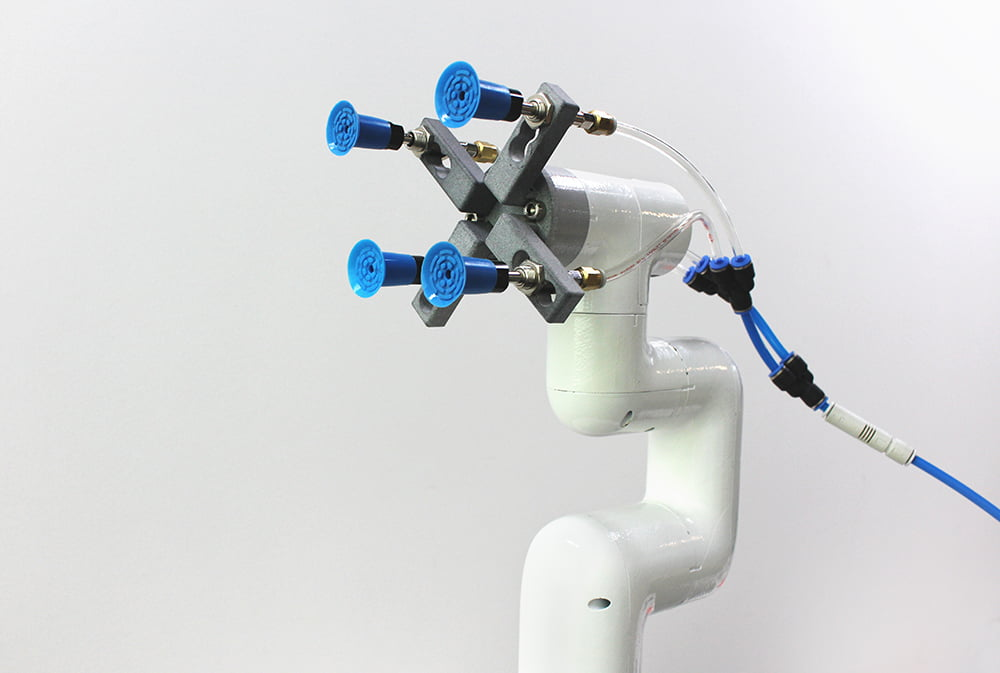

# Suction cup module

> **Compatible models:** myCobot 320, myCobot Pro 630

## Product Image

## Specification

| **Name** | **Suction Cup Module** |
| -------------------------- | ---------------------------------------------- |
| Model | myCobotPro_suctionPump |
| Material | Nylon 7100 |
| Number of suction cups | 1/2/4 |
| Suction cup size | Outer diameter 33mm |
| Suction weight | Maximum 1000g |
| Power equipment | Suction and blowing integrated air compressor |
| Service life | One year |
| Fixing method | Screw fixing |
| Control Interface | I/O Control |
| Usage environment requirements | Normal temperature and pressure |
| Applicable equipment | ER myCobot 320 series, ER myCobot Pro 630 series |

## for objects

**introduction**

- The suction cup type adsorption pump means that the suction port is connected to the adsorbed object through suction cups, suction tubes and other components, and the suction cup is evacuated to change the internal air pressure from normal pressure to negative pressure. The pressure difference between the external atmospheric pressure and this negative pressure is used to achieve the purpose of adsorbing objects.

- The overall structure is a multi-functional expandable suction cup, which can install up to 4 pieces;
   High-pressure resistant hose that can be reused many times;
   An air compressor that integrates air suction and blowing, and can be expanded to other functions.

**working principle**

- Start the vacuum equipment to generate negative air pressure in the suction cup, thereby firmly sucking the object to be sucked and starting to move the object.

- When the object to be sucked is transported to the destination, inflate the vacuum suction cup so that the negative air pressure in the suction cup changes to zero air pressure or slightly positive air pressure. The vacuum suction cup is separated from the object to be sucked, thereby completing the task of lifting and transporting heavy objects.

**Suitable :**

- Suitable for objects with flat surfaces

## Purchase link:

- [Taobao](https://shop504055678.taobao.com)
- [shopify](https://shop.elephantrobotics.com/)

## how to use

For systems that include suction cups, solenoid valves, and vacuum pumps, the connections are typically as follows:

1. **Vacuum pump**: It is the source of vacuum pressure and should be connected to the air inlet of the solenoid valve.
2. **Solenoid Valve**: It controls when and how to pump or inflate the suction cup. The vacuum pump is connected to one side of the solenoid valve and the suction cup is connected to the outlet side.
3. **Suction cup**: This is the end effector that interacts directly with the object being manipulated and is connected to the outlet side of the solenoid valve.

During operation, the solenoid valve opens when energized, allowing the vacuum pressure from the vacuum pump to reach the suction cup, allowing it to suck objects. When the solenoid valve is powered off, the vacuum is cut off and the air flows back to the suction cup, releasing the suction force on the object. This setup works well for automated systems that require precise control over picking and placing items.

[← Previous page](../1.4.1-Gripper/4-FlexibleGripper.md) | [Next page →](../1.4.3-Camera/1-CameraModulePro.md)