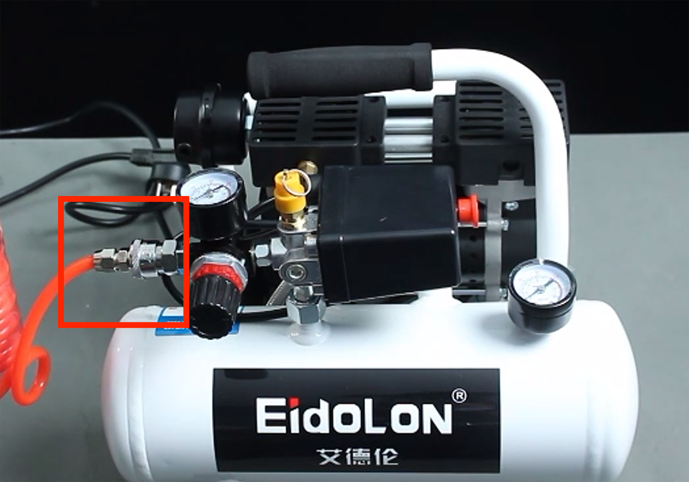

# 吸盘模块

> **兼容型号:** myCobot 320、myCobot Pro 600、myCobot Pro 630


## 产品图片


**规格说明**

| 名称         | 模块吸盘                                      |
| ------------ | --------------------------------------------- |
| 型号         | myCobotPro_suctionPump                        |
| 材料         | 尼龙 7100                                     |
| 吸盘数量     | 1/2/4                                         |
| 吸盘尺寸     | 直径 33mm                                     |
| 吸取重量     | 最大 1000g                                    |
| 动力源设备   | 吸吹一体空压机                                |
| 固定方式     | 螺丝固定                                      |
| 控制接口     | IO 控制                                       |
| 使用环境要求 | 常温常压                                      |
| 适用设备     | myCobot 320、myCobot Pro 600、myCobot Pro 630 |
<!-- | 使用寿命     | 一年                                          | -->
**吸盘吸泵** :吸附物体使用

**简介**

- 吸盘吸泵是抽气口通过吸盘、管子等元件与待吸附物体连接，对吸盘抽真空，造成内部气压由常压变为负压，利用外界大气压和这个负压之间的压差作用，达到吸附住物体的目的。
- 整体结构是多功能可扩展吸盘，最多可安装 4 个；耐高压软管，可多次重复使用；吸吹一体空压机，可扩展其他功能。

**工作原理**

- 起动真空设备抽吸，使吸盘内产生负气压，从而将待提升物吸牢，即可开始搬送待提升物。
- 当待提升物搬送到目的地时，平稳地充气进真空吸盘内，使真空吸盘内由负气压变成零气压或稍为正的气压，真空吸盘就脱离待提升物,从而完成了提升搬送重物的任务。

**适用物体** 适用于带有平面物体

<!-- **外观介绍**

- 多功能可扩展吸盘，可最多安装 4 个 4-p
  

- 耐高压软管，可多次重复使用

  

- 吸吹一体空压机，可扩展其他功能

   -->

**安装使用**

- 需要配合空压机使用：
  

  1. 将黑色插头插入排插；

  2. 将搭配的红色软管插入机器上的接口：  
     
  3. 红色按钮为开关，往外拔即打开，按回去则关闭机器：
     

- 吸盘安装：

 

  1. 将空压机红色软管的另一端接上电磁阀的接口：
     
  2. 用模块吸盘配套的透明软管分别接上电磁阀上方和模块吸盘软管分支的接口：
     
     
  3. 用配套螺丝将模块吸盘固定在机械臂末端：
     
  4. 将软管分支安装在模块吸盘上：
     

- 电气连接：

  1. 连接线黑色接机械臂底座 GND，红色接 OUT1~OUT6 任意一个，根据选择的接口更改后续程序的引脚号，这里使用 OUT1：
     


## 3 通过 python 控制

**使用前需要先启动机器人系统**


确认机械臂的IP地址：终端输入 ifconfig 获取


```python
from pymycobot import ElephantRobot
import time

# 将ip更改成P600树莓派的实时ip

elephant_client = ElephantRobot("192.168.10.158", 5001)

# 启动机器人必要指令
elephant_client.start_client()
time.sleep(1)

elephant_client.set_digital_out(0,1)#吸取
time.sleep(2)

elephant_client.set_digital_out(0,0)#放开
time.sleep(2)


```


[← 上一页](../1.4.1-Gripper/4-FlexibleGripper.md) | [下一页 →](../1.4.3-Camera/1-CameraModulePro.md)
