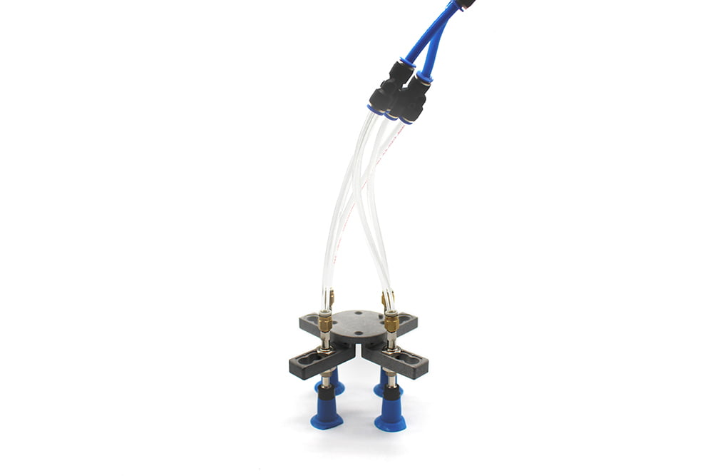
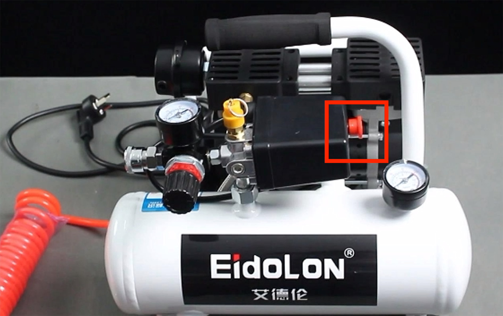

# Suction Cup Module

> **Compatible Models:** myCobot 320, myCobot Pro 600, myCobot Pro 630

## Product Image



**Specifications**

| Name | Module Suction Cup |
| ------------ | --------------------------------------------- |
| Model | myCobotPro_suctionPump |
| Material | Nylon 7100 |
| Number of Suction Cups | 1/2/4 |
| Suction Cup Size | Diameter 33mm |
| Suction Weight | Maximum 1000g |
| Power Source Equipment | Suction and Blowing Air Compressor |
| Fixing Method | Screw Fixing |
| Control interface | IO control |
| Environment requirements | Normal temperature and pressure |
| Applicable equipment | myCobot 320, myCobot Pro 600, myCobot Pro 630 |
<!-- | Service life | One year | -->
**Suction cup suction pump**: Used to adsorb objects

**Introduction**

- The suction cup suction pump is connected to the object to be adsorbed through the suction cup, pipe and other components, and the suction cup is vacuumed, causing the internal air pressure to change from normal pressure to negative pressure, and the pressure difference between the external atmospheric pressure and this negative pressure is used to achieve the purpose of adsorbing the object.
- The overall structure is a multifunctional expandable suction cup, which can be installed up to 4; high-pressure resistant hose, which can be reused many times; suction and blowing integrated air compressor, which can expand other functions.

**Working principle**

- Start the vacuum equipment to suck, so that negative air pressure is generated in the suction cup, so that the object to be lifted is firmly sucked, and the object to be lifted can be transported.
- When the object to be lifted is transported to the destination, air is steadily inflated into the vacuum cup, so that the negative pressure in the vacuum cup changes to zero pressure or slightly positive pressure, and the vacuum cup is separated from the object to be lifted, thus completing the task of lifting and transporting heavy objects.

**Applicable objects** Applicable to flat objects

<!-- **Appearance introduction**

- Multifunctional expandable suction cup, can install up to 4 4-p


- High-pressure hose, can be reused many times


- Suction and blowing integrated air compressor, can expand other functions

 -->

**Installation and use**

- Need to be used with air compressor:


1. Insert the black plug into the power strip;

2. Insert the matching red hose into the interface on the machine:


3. The red button is a switch. Pull it out to turn it on, and press it back to turn it off:



- Suction cup installation:

1. Connect the other end of the red hose of the air compressor to the interface of the solenoid valve:


2. Use the transparent hose that comes with the module suction cup to connect the interfaces above the solenoid valve and the module suction cup hose branch:


3. Fix the module suction cup to the end of the robot arm with the matching screws:

4. Install the hose branch on the module suction cup:


- Electrical connection:

1. Connect the black cable to the base of the robot arm GND, red connects to any one of OUT1~OUT6, change the pin number of the subsequent program according to the selected interface, here use OUT1:


## 3 Control by python

**You need to start the robot system before use**


Confirm the IP address of the robot: Enter ifconfig in the terminal to obtain


```python
from pymycobot import ElephantRobot
import time

# Change the IP address to the real IP address of the P600 Raspberry Pi

elephant_client = ElephantRobot("192.168.10.158", 5001)

# Necessary commands to start the robot
elephant_client.start_client()
time.sleep(1)

elephant_client.set_digital_out(0,1)#Absorb
time.sleep(2)

elephant_client.set_digital_out(0,0)#Release
time.sleep(2)

```
---
[← Previous page](../1.4.1-Gripper/4-FlexibleGripper.md) | [Next page →](../1.4.3-Camera/1-CameraModulePro.md)