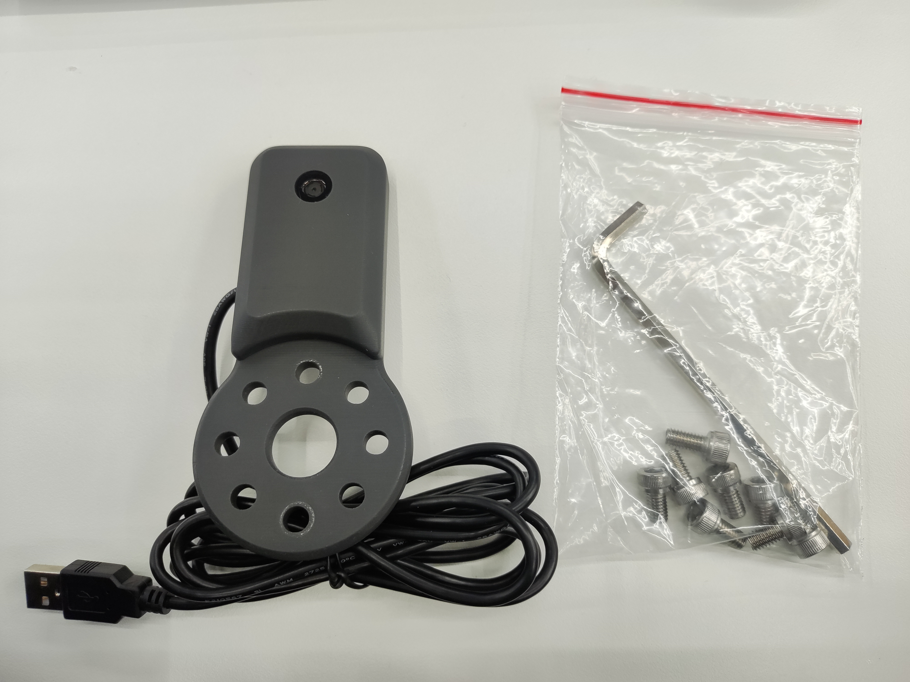
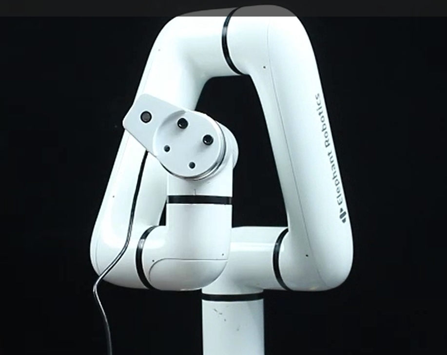
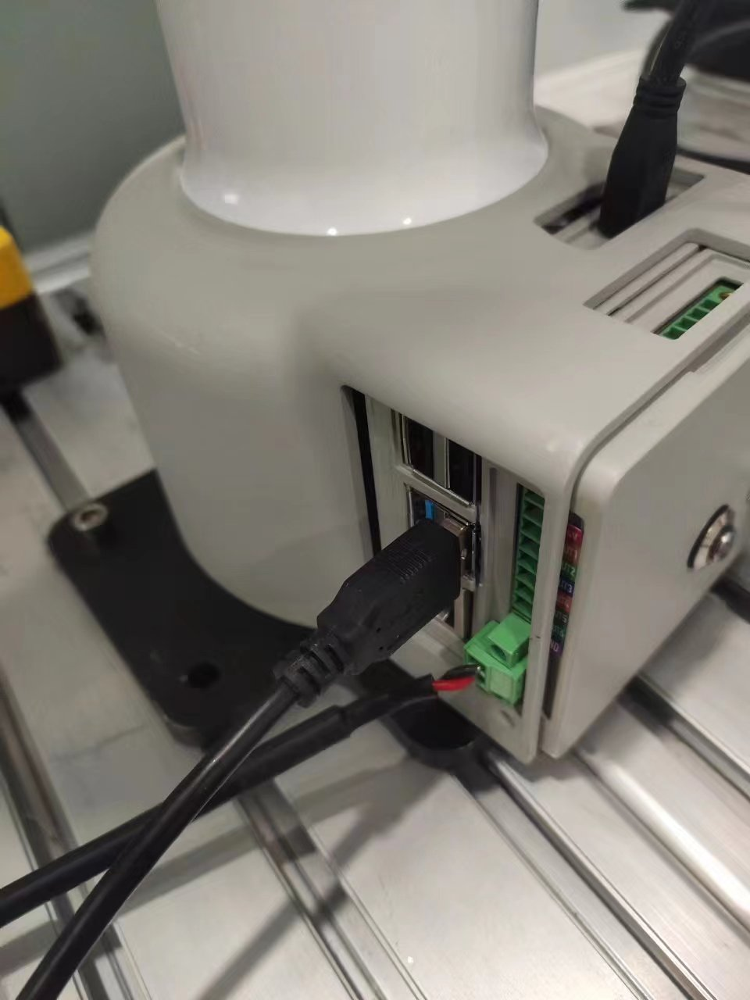
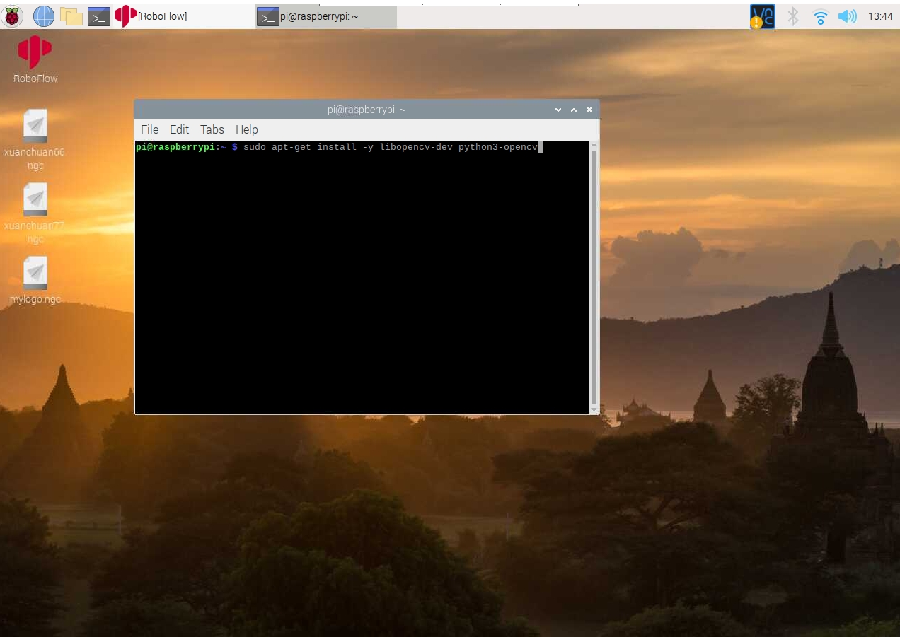
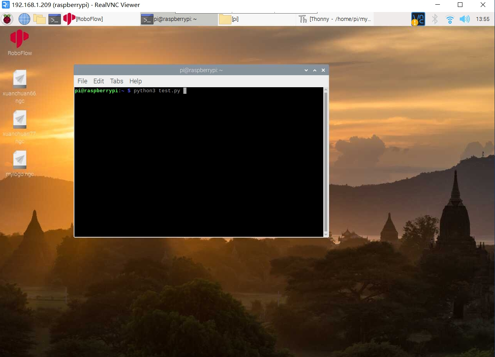

# myCobotPro 摄像头模块

> **兼容型号：** myCobot 320, myCobot Pro 630、myCobot Pro 600

## 产品图片


**规格说明：**

| 名称             | myCobotPro 摄像模组                         |
| ---------------- | ------------------------------------------- |
| 型号             | myCobot_Pro_cameraHolder_J6                 |
| 材料             | 光敏树脂                                    |
| USB 协议         | USB2.0 HS/FS                                |
| 镜头焦距         | 标配 1.7mm                                  |
| 视场角度         | 约 60°                                      |
| 支持的系统       | Win7/8/10、Linux、MAC                       |
| 固定方式         | 螺丝固定                                    |
| 使用环境要求     | 常温常压                                    |
| 适用设备  | myCobot 320、myCobot Pro 600、myCobot Pro 630 |
<!-- | 使用寿命         | 两年                                        | -->
**摄像头法兰 :** 机器视觉

**简介**

- USB 高清摄像头可搭配吸泵、自适应夹爪、人工智能套装等，eye in hand 实现精确定位与标定。

**安装使用**

- 检查配件包东西是否齐全：螺丝及内六角扳手、带 usb 线的摄像头模组
  
- 摄像头安装：

  - 结构安装：

    1. 将摄像头模组根据需要的方向对准机械臂末端，配合内六角扳手拧紧螺丝
       

  - 电气连接：

    1. 将 USB 线插入底座 USB 接口：
       


## python编程控制
进入机器人系统，打开终端输入下列指令安装opencv
```bash
sudo apt-get install -y libopencv-dev python3-opencv
```



新建一个python文件，填入以下代码
```python
#encoding=utf-8
import cv2
import numpy as np

cap = cv2.VideoCapture(0) 

while(True):
    ret, frame = cap.read()

    cv2.imshow('frame', frame)
    # 按下'q'退出
    if cv2.waitKey(1) & 0xFF == ord('q'):
        break

cap.release()
cv2.destroyAllWindows()
```
然后在终端用python3 运行刚刚新建的python文件



<!-- ## 规格

| **名称**     | **myCobotPro 摄像头模块**                            |
| ------------ | ---------------------------------------------------- |
| 模型         | myCobot_Pro_cameraHolder_J6                          |
| 材料         | 光敏树脂                                             |
| USB 协议     | USB2.0 HS/FS                                         |
| 镜头焦距     | 标准 1.7mm                                           |
| 视野         | 约 60°                                               |
| 支持的系统   | Win7/8/10, Linux, MAC                                |
| 使用寿命     | 两年                                                 |
| 固定方式     | 螺丝固定                                             |
| 使用环境要求 | 常温常压                                             |
| 适用设备支持 | ER myCobot 320 Series <br> ER myCobot Pro 630 Series |

## 用于物体

### 引言

- USB 高清摄像头可与吸泵、自适应抓手、人工智能套件等配合使用，手眼并用，实现精确定位和校准。

### 安装使用

- 检查配件包东西是否齐全：螺丝及内六角扳手、带 usb 线的摄像头模组
  

- 摄像头安装：

  - 结构安装：

    1. 将摄像头模组根据需要的方向对准机械臂末端，配合内六角扳手拧紧螺丝
       

  - 电气连接：

    1. 将 USB 线插入底座 USB 接口 -->
   
      

<!-- - 编程开发：

  > 使用 python 对摄像模组进行编程开发
  > [python 环境下载](../../../10-ApplicationBasePython/10.1_320_PI-ApplicationPython/1_download.md)

  - 新建 python 文件：  
     在想要的文件路径下右键新建 python 文件：  
     

    > 文件名字可以根据需要修改

    

  - 进行功能编程：
    

    > 代码如下：

    ```python
    import cv2
    import numpy as np

    cap = cv2.VideoCapture(0) # “0”，根据查询到的摄像设备号来定

    while(True):
        ret, frame = cap.read()

        # gray = cv2.cvtColor(frame, cv2.COLOR_BGR2GRAY)

        cv2.imshow('frame', frame)
        # 按下'q'退出
        if cv2.waitKey(1) & 0xFF == ord('q'):
            break

    cap.release()
    cv2.destroyAllWindows()
    ```

  - 保存文件并关闭，在文件夹空白处右键打开命令行终端

    

    输入：

    ```bash
    python camera.py
    ```

    

    > 可以看到摄像头捕捉到的画面

    运行结果：
    

- 如何查询摄像头设备号

  ```bash
  ls /dev/video* -l
  ```

  > 可以通过插拔设备分别使用命令，观察新增的设备号来确认。

  示例结果：
   -->

<!-- ### 购买链接:

- [淘宝](https://shop504055678.taobao.com)
- [shopify](https://shop-elephantrobotics-com.translate.goog/collections/mycobot-pro-600/products/mycobotpro-cameraflange?_x_tr_sl=auto&_x_tr_tl=zh-CN) -->

---

[← 上一页](../1.4.2-PumpCup/1-ModuleSuctionCup.md) | [下一页 →](../1.4.4-Holder/1-PenHolderPro.md)
