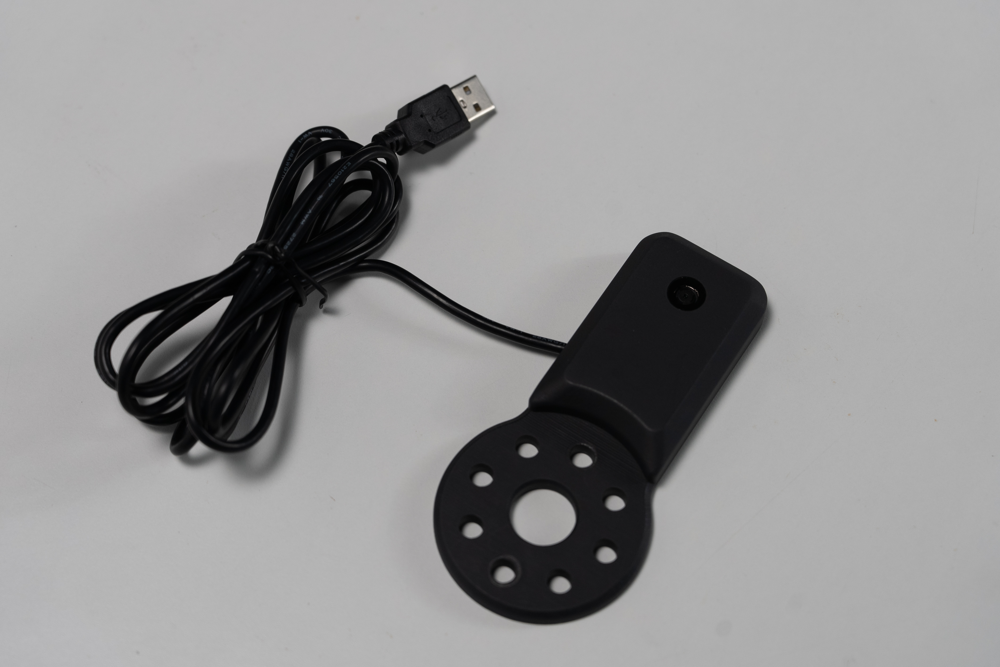
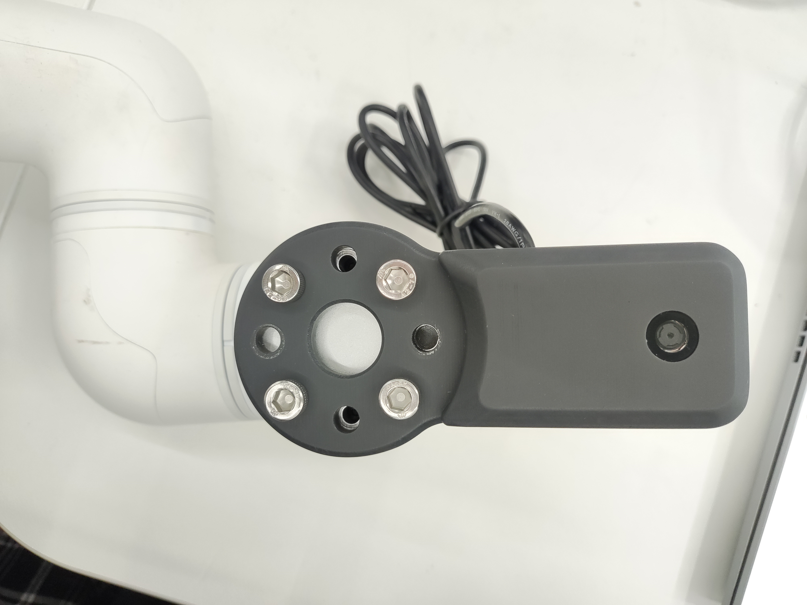

# myCobotPro Camera Module

> **Compatible models:** myCobot 320, myCobot Pro 630

## Product Image



## Specification

| **Name** | **myCobotPro Camera Module** |
| -------------------------- | ---------------------------------------------------- |
| Model | myCobot_Pro_cameraHolder_J6 |
| Materials | Photosensitive resin |
| USB protocol | USB2.0 HS/FS |
| Lens focal length | Standard 1.7mm |
| Field of view | Approx. 60° |
| Supported systems | Win7/8/10, Linux, MAC |
| Service life | Two years |
| Fixing method | Screw fixing |
| Usage environment requirements | Normal temperature and pressure |
| Applicable device support | ER myCobot 320 Series <br> ER myCobot Pro 630 Series |

## for objects

### Introduction

- The USB HD camera can be used with suction pumps, adaptive grippers, artificial intelligence kits, etc., using both hand and eye to achieve precise positioning and calibration.

### Install and use

- Check whether the accessories package is complete: screws and hexagonal wrenches, camera module with USB cable
   

- Camera installation:

   - Structural installation:

     1. Align the camera module to the end of the robotic arm in the desired direction, and tighten the screws with an Allen wrench.
        

   - Electrical connections:

     1. Plug the USB cable into the base USB port:
        

<!-- - Programming development:

   > Use python to program and develop camera modules
   > [python environment download](../../../10-ApplicationBasePython/10.1_320_PI-ApplicationPython/1_download.md)

   - Create a new python file:
      Right-click on the desired file path to create a new python file:
      

     > The file name can be modified as needed

     

   - Perform functional programming:
     

     > The code is as follows:

     ```python
     import cv2
     import numpy as np

     cap = cv2.VideoCapture(0) # "0", determined based on the queried camera equipment number

     while(True):
         ret, frame = cap.read()

         # gray = cv2.cvtColor(frame, cv2.COLOR_BGR2GRAY)

         cv2.imshow('frame', frame)
         # Press 'q' to exit
         if cv2.waitKey(1) & 0xFF == ord('q'):
             break

     cap.release()
     cv2.destroyAllWindows()
     ```

   - Save the file and close it, right-click on a blank space in the folder to open the command line terminal

     

     enter:

     ```bash
     pythoncamera.py
     ```

     

     > You can see the picture captured by the camera

     operation result:
     

- How to check the camera device number

   ```bash
   ls /dev/video* -l
   ```

   > You can confirm by using commands by plugging and unplugging devices and observing the new device number.

   Example results:
    -->

### Purchase link:

- [Taobao](https://shop504055678.taobao.com)
- [shopify](https://shop-elephantrobotics-com.translate.goog/collections/mycobot-pro-600/products/mycobotpro-cameraflange?_x_tr_sl=auto&_x_tr_tl=zh-CN)

---

[← Previous page](../1.4.2-PumpCup/1-ModuleSuctionCup.md) | [Next page →](../1.4.4-Holder/1-PenHolderPro.md)