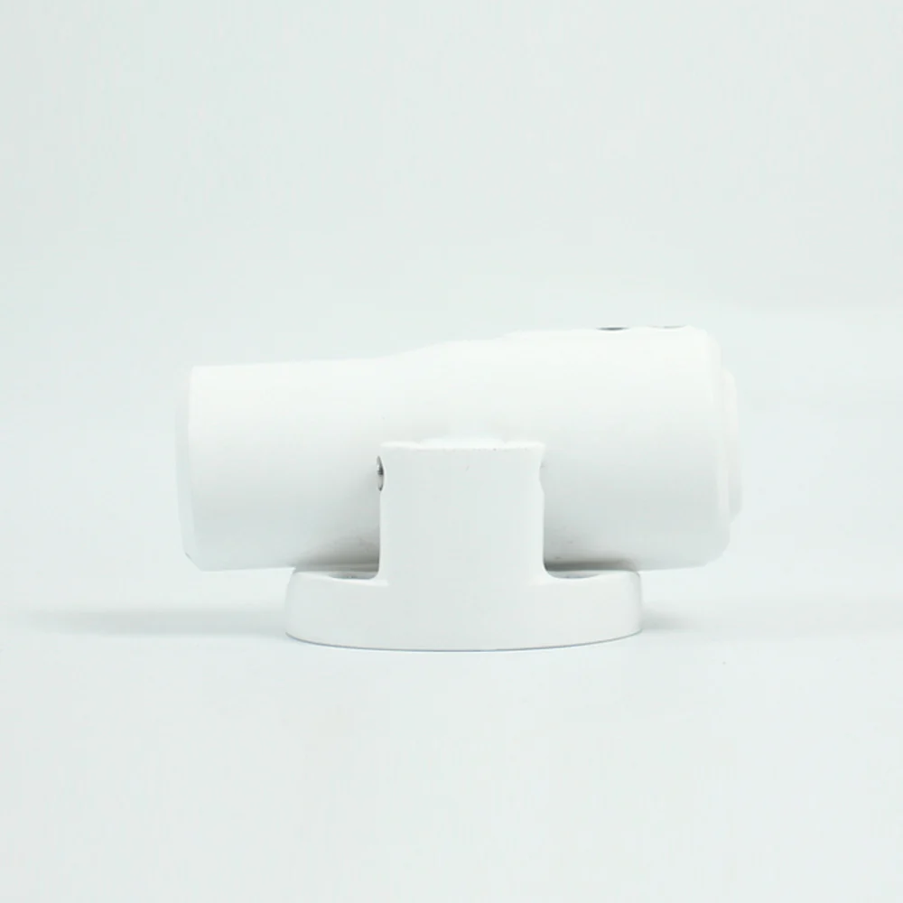
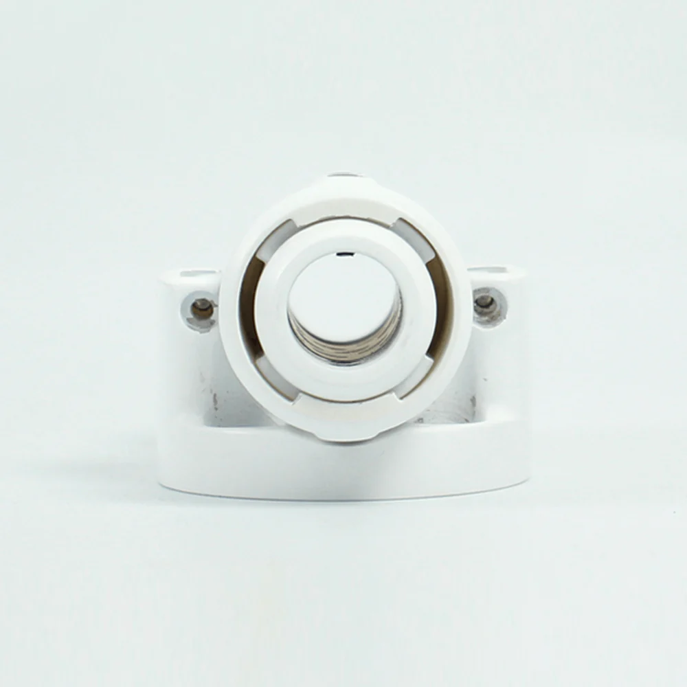
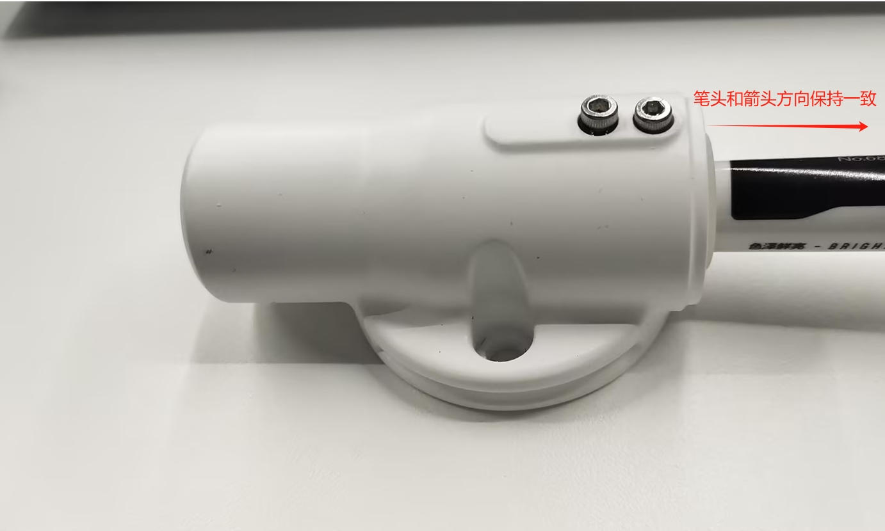
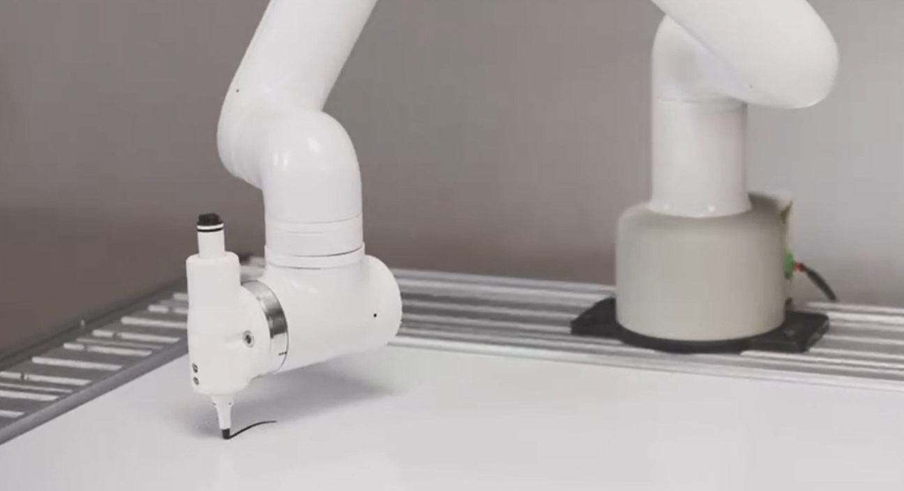

# myCobot Pro Gripper

> **Compatible models:** myCobot 600, myCobot 630

## Product images

**Specifications:**

| Name | myCobotPro Pen Holder |
| ------------ | ----------------------------------------- |
| Model | myCobot_Pro_penHolder_J6 |
| Material | Photosensitive resin |
| Fixing method | Screw fixing |
| Environment requirements | Normal temperature and pressure |
| Applicable equipment | myCobot 600, myCobot 630 |
<!-- | Pen tip virtual position | ±1 mm |
| Service life | Two years | -->
**myCobotPro pen holder:** Used when writing and drawing with a robotic arm

**Introduction**

- Overall solid color design, supports 15mm large stroke extension and retraction, effectively reduces errors, and can be used for writing, drawing and other applications.

**Applicable objects**

- Whiteboard pen

**Installation and use**

- Installation

1. Insert two short screws into the holes of the holder to fix the pen, paying attention to the direction of the pen tip:

2. Use an Allen wrench to fix the holder to the end of the robot arm:

---
[← Previous page](../1.4.3-Camera/1-CameraModulePro.md) | [Next page →](./2-PhoneHolderPro.md)