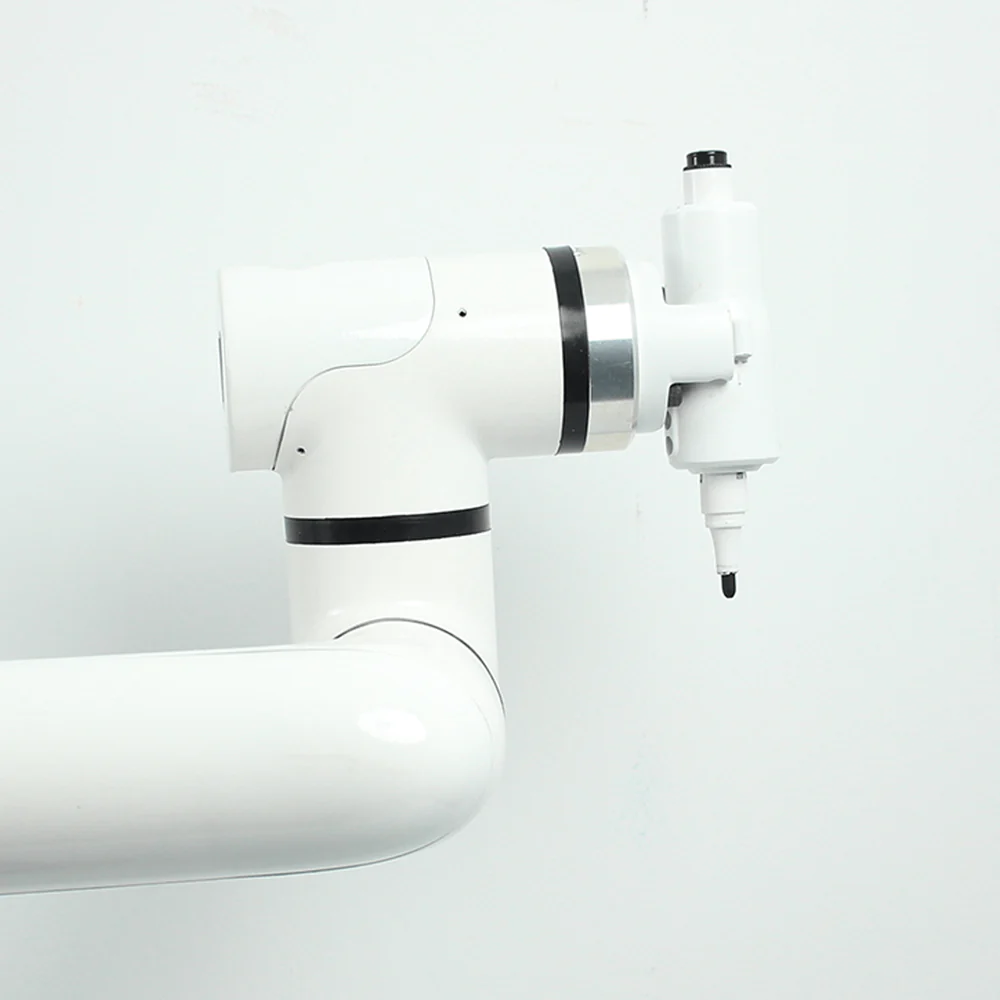

# myCobot Pro Gripper

> **Compatible models:** myCobot 320, myCobot Pro 630

## Product Image

## Specification

| **Name** | **myCobotPro Pen Holder** |
| -------------------------- | ------------------------------------------ |
| Model | myCobot_Pro_penHolder_J6 |
| Materials | Photosensitive resin |
| Empty nib | ±1 mm |
| Service life | Two years |
| Fixing method | Screw fixing |
| Usage environment requirements | Normal temperature and pressure |
| Applicable equipment | ER myCobot 320 series, ER myPalletizer 600 |

## for objects

Used when writing and drawing with a robotic arm

**Introduction**

- The overall solid color design supports the expansion and contraction of 15mm large strokes up and down, effectively reducing errors and can be used for writing, drawing and other applications.

**Suitable**

- Whiteboard pen

## Purchase link

- [Taobao](https://shop504055678.taobao.com)
- [shopify](https://shop.elephantrobotics.com/)

## how to use

1 Installation:  

  

[← Previous page](../1.4.3-Camera/1-CameraModulePro.md) | [Next page →](./2-PhoneHolderPro.md)