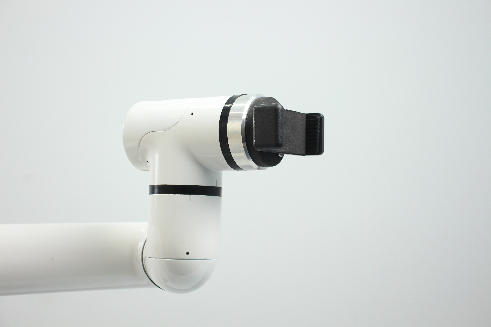

# myCobot Pro Mobile Phone Holder

> **Compatible models:** myCobot 600, myCobot Pro 630

## Product images

  

**Specifications:**

| Name | myCobotPro Phone Holder |
| ------------ | ----------------------------------- |
| Model | myCobot_Pro_PhoneHolder_J6 |
| Material | Photosensitive resin |
| Clamping weight | 200g |
| Fixing method | Screw fixing |
| Operating environment requirements | Normal temperature and pressure |
| Applicable equipment | myCobot 600, myCobot 630 |
<!-- | Service life | Two years | -->
**myCobotPro mobile phone holder:** Used to clamp objects

**Introduction**
- Suitable for equipment that requires physical clamping, such as photography, and can clamp a variety of mobile phones. It has a simple structure and is easy to install and disassemble.

**Applicable objects**
- Photography equipment

## Installation
Fix the mobile phone holder to the flange at the end of the robot arm

---

[← Previous page](./2-PhoneHolderPro.md) | [Next page →](../../../2-ProductFeature/2-ProductFeature.md)