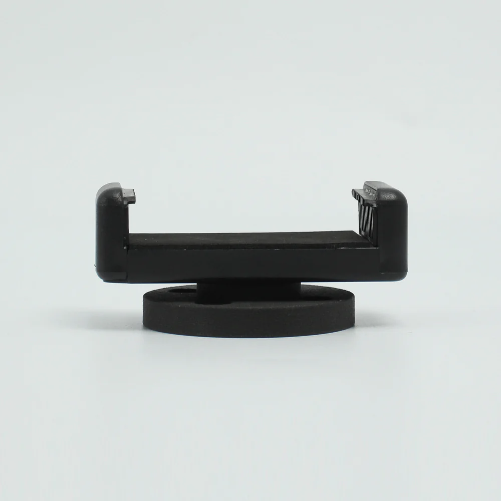
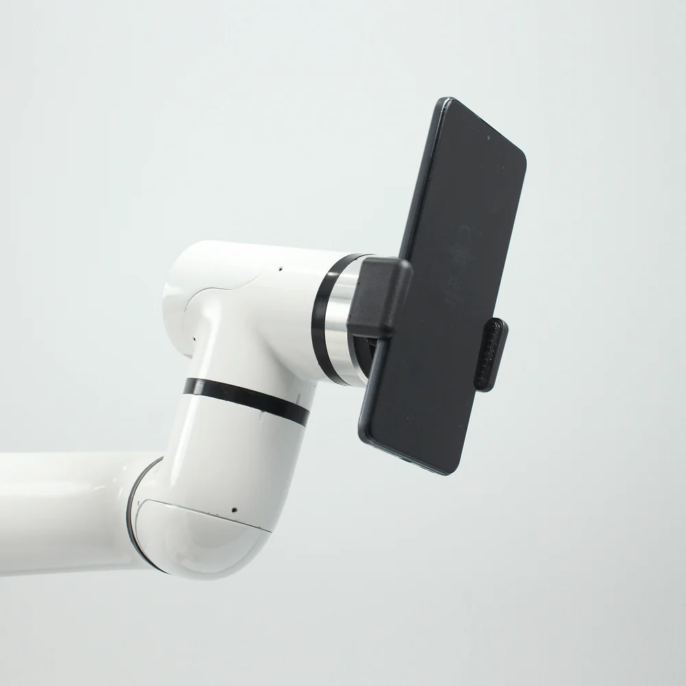

# myCobot Pro Mobile Phone Holder

> **Compatible models:** myCobot 320, myCobot Pro 630

## Product Image

  

<!-- 
 -->

## Specification

| **Name** | **myCobotPro Mobile Phone Holder** |
| -------------------------- | ------------------------------------ - |
| Model | myCobot_Pro_PhoneHolder_J6 |
| Materials | Photosensitive resin |
| Clamping weight | 200g |
| Service life | Two years |
| Fixing method | Screw fixing |
| Usage environment requirements | Normal temperature and pressure |
| Applicable equipment | ER myCobot 320 series, ER myCobot 600 |

## for objects

**introduction**

- Suitable for filming and other equipment requiring physical clamping. It can hold various mobile phones, has a simple structure and is easy to install and disassemble.

**Suitable**

- Shooting equipment

## Purchase link:

- [Taobao](https://shop504055678.taobao.com)
- [shopify](https://shop-elephantrobotics-com.translate.goog/collections/mycobot-pro-600/products/mycobot-pro-adaptive-gripper-black-white-for-mycobot-320-mycobot-pro -600-%E7%9A%84%E5%89%AF%E6%9C%AC?_x_tr_sl=auto&_x_tr_tl=zh-CN)

## how to use

1 Installation:  

  

---

[← Previous page](./2-PhoneHolderPro.md) | [Next page →](../../../2-ProductFeature/2-ProductFeature.md)