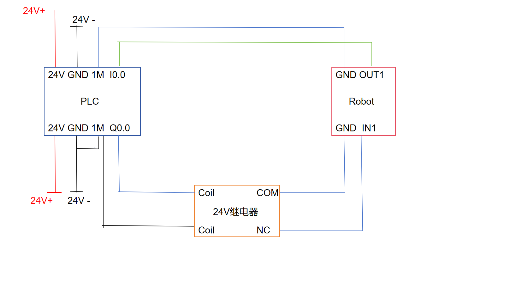
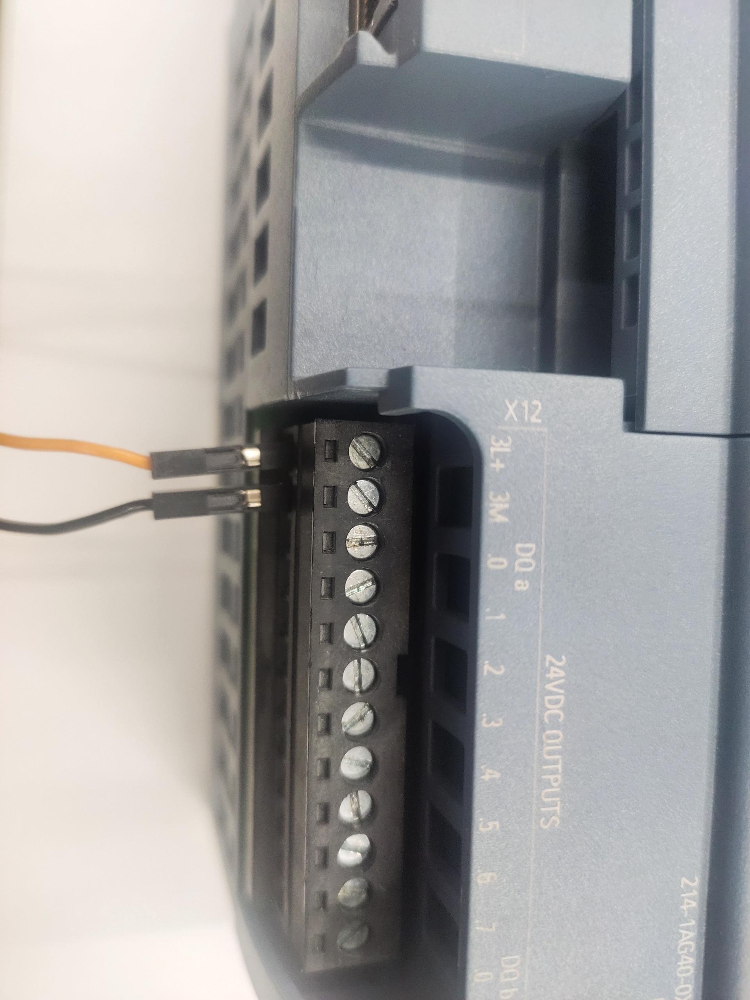
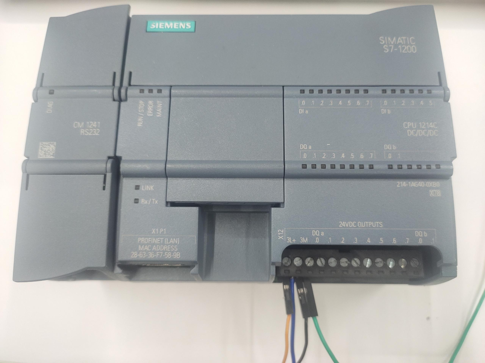
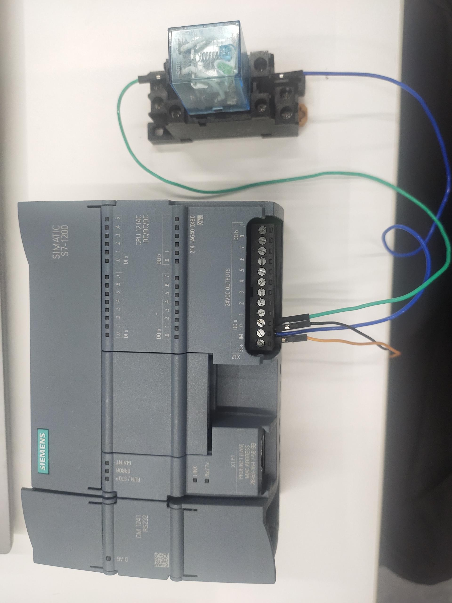
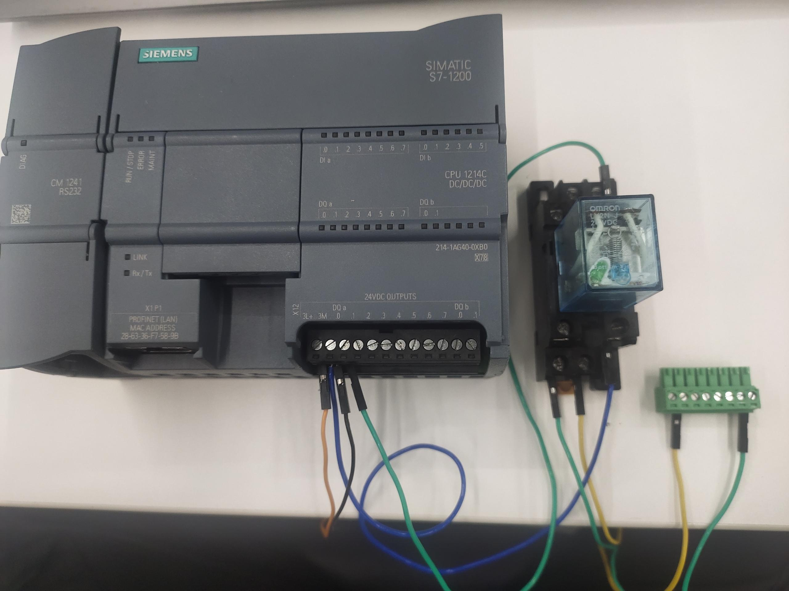
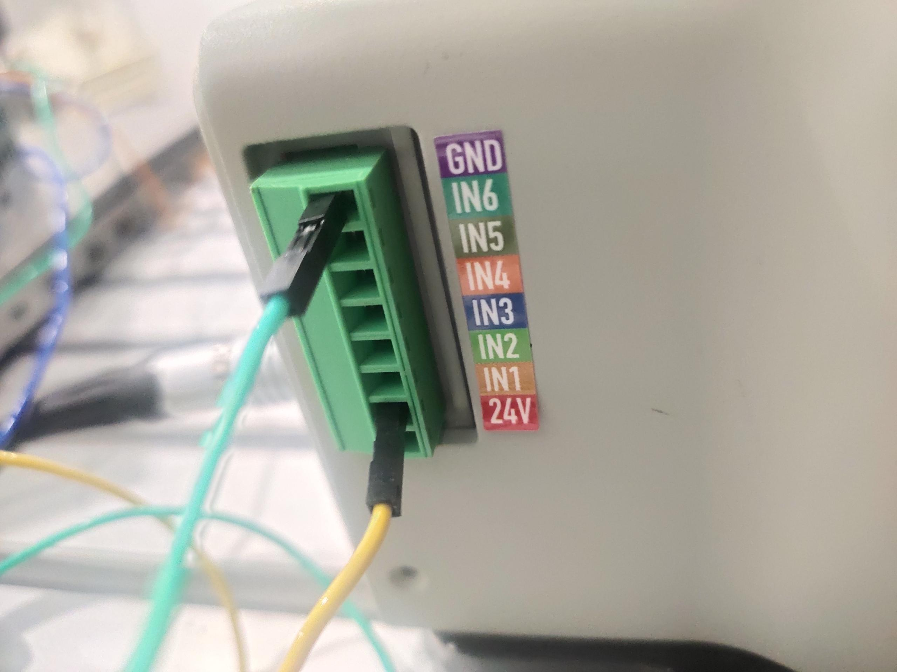
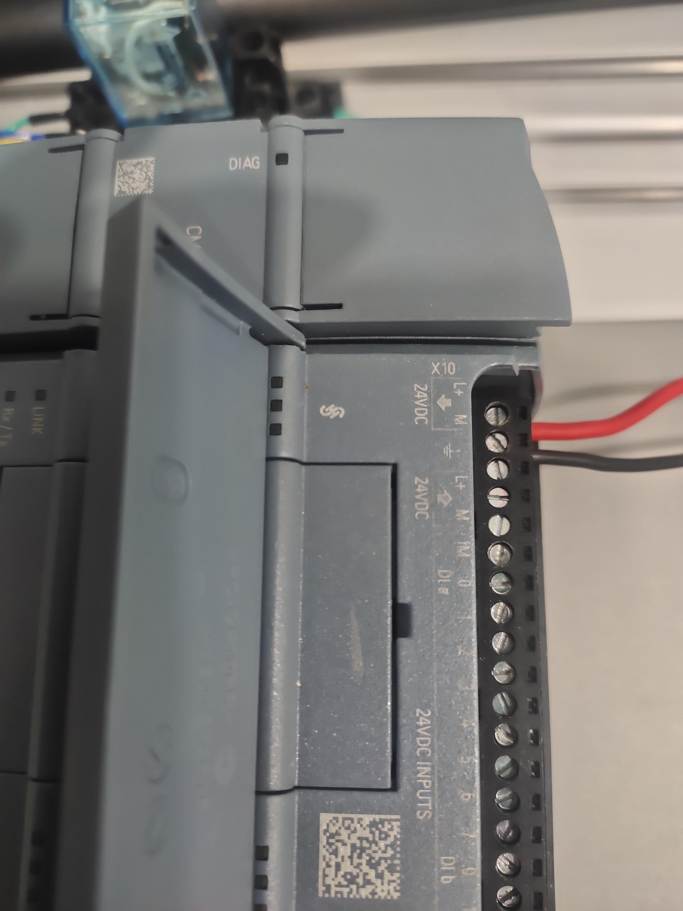
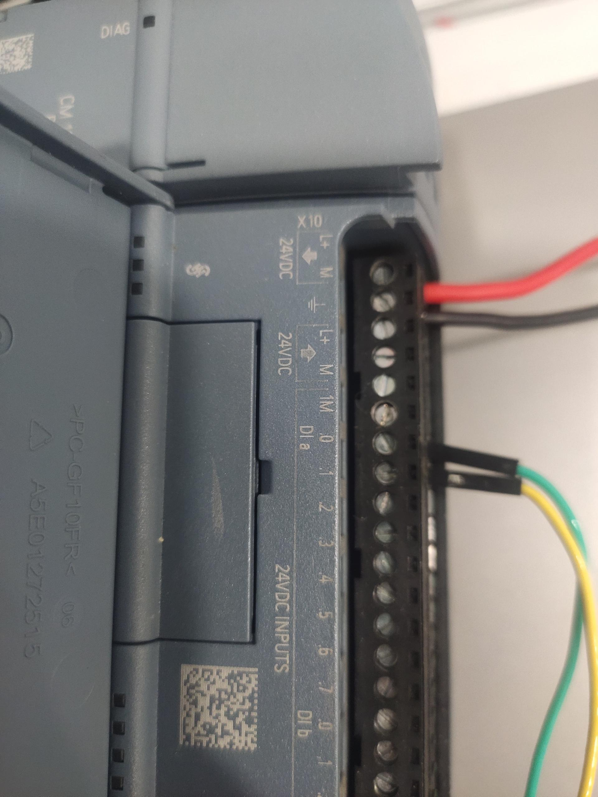
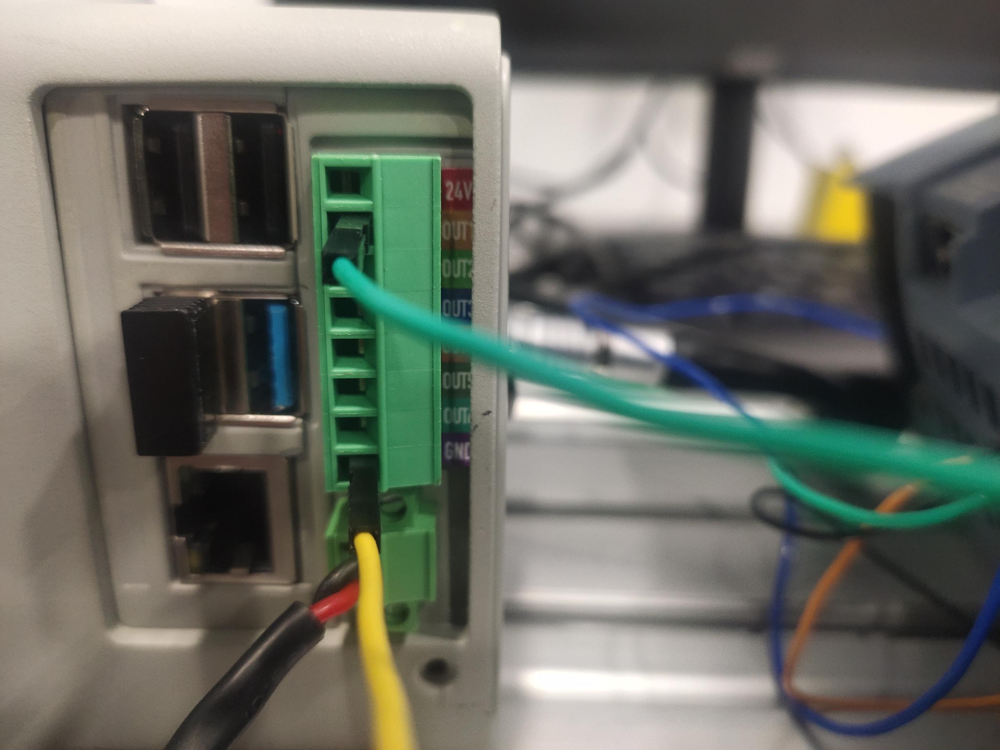

# mycobot630 与 PLC IO交互控制案例

## 1 功能效果说明
机械臂收到PLC的IO信号后，会执行一个各个关节回到零位的动作

## 2 原理说明
机械臂的输出端首先会先输出一个信号，PLC采集到有输入信号后，PLC输出端会输出一个信号，使得24v继电器线圈得电，接通常开触点，将低电平信号传递给机械臂的输入端，机械臂采集到有输入信号后，就会执行一个各个关节回到零位的动作

## 3 硬件链接
**整体连接示意图**



**机械臂的输入与PLC的输出接线**
PLC为西门子1200，PLC的输出类型是PNP，机械臂的输入类型是NPN，所以需要外接一个中间继电器，用来转换信号。

先给PLC输出接入24V

再给将继电器的线圈接入到PLC的公共端和Q0.0上


再将继电器常开触点的线接到端子上

再将端子接入机器人的输入上


**机械臂的输出与PLC的输入接线**
PLC为西门子1200，PLC的输入类型支持PNP或NPN，机械臂的输出类型是PNP，所以PLC的输入采取PNP型接法

先给PLC输入端接入24V

再将机械臂的GND和OUT1接到PLC的公共端和I0.0上

再将端子插入机械臂的输出上


## 4 软件编程

**机械臂程序**

使用前需要先启动机器人系统


确认机械臂的IP地址：终端输入 ifconfig 获取

```python

from pymycobot import ElephantRobot
import time

# 将ip更改成P600树莓派的实时ip

elephant_client = ElephantRobot("192.168.10.158", 5001)

# 启动机器人必要指令
elephant_client.start_client()
time.sleep(1)
elephant_client.set_digital_out(0,1)
time.sleep(1)
while True:
    
    if elephant_client.get_digital_in(0)=='1':
        elephant_client.write_angles([0,-90,0,0,-90,0],1500)
        elephant_client.command_wait_done()
        break
    else:
        pass
```
**PLC端的程序**


## 5 效果展示

