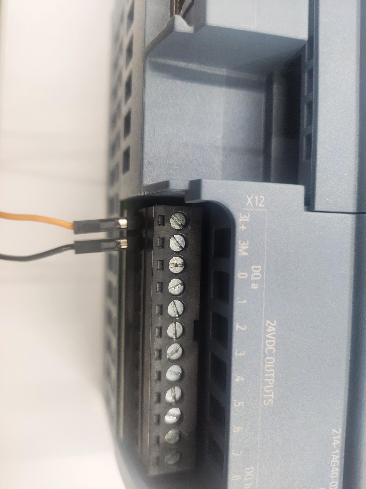
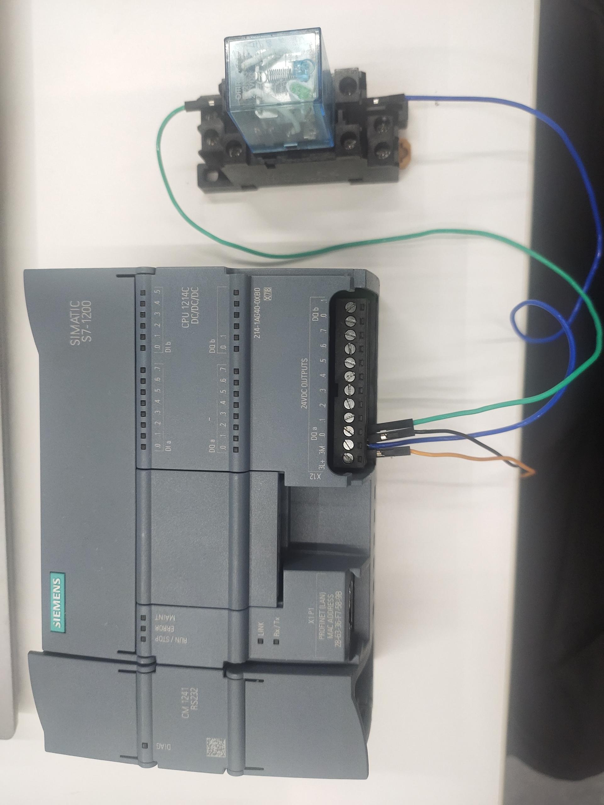
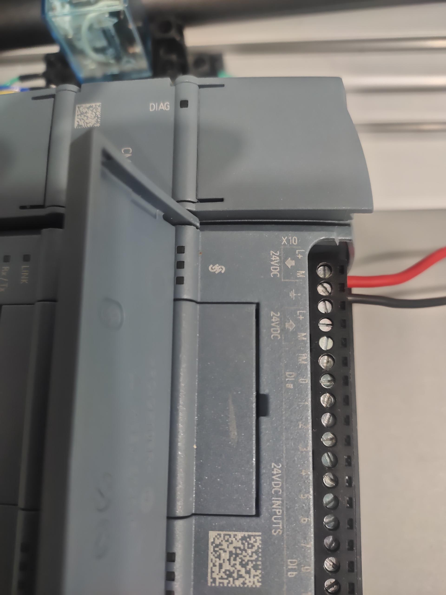
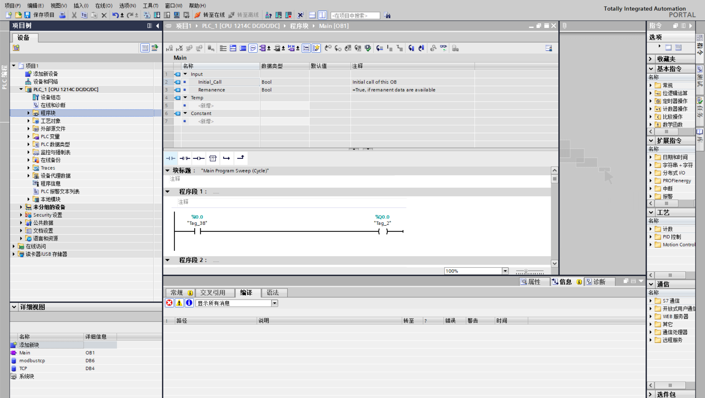

# Mycobot630 and PLC IO interactive control case

## 1 Functional effect description
After the robot receives the IO signal from the PLC, it will perform an action of returning each joint to zero position

## 2 Principle description
The output end of the robot will first output a signal. After the PLC collects the input signal, the PLC output end will output a signal, so that the 24v relay coil is energized, the normally open contact is connected, and the low-level signal is transmitted to the input end of the robot. After the robot collects the input signal, it will perform an action of returning each joint to zero position

## 3 Hardware link
**Overall connection diagram**


**Wiring of the input of the robot and the output of the PLC**
The PLC is Siemens 1200, the output type of the PLC is PNP, and the input type of the robot is NPN, so an external intermediate relay is required to convert the signal.

First, connect 24V to the PLC output

Then connect the relay coil to the common terminal and Q0.0 of the PLC


Then connect the normally open contact wire of the relay to the terminal

Then connect the terminal to the input of the robot


**Wiring the output of the robot arm and the input of the PLC**
PLC is Siemens 1200. The input type of the PLC supports PNP or NPN. The output type of the robot arm is PNP, so the input of the PLC adopts the PNP type connection method

First connect 24V to the input end of the PLC

Then connect the GND and OUT1 of the robot arm to the common end and I0.0 of the PLC

Then insert the terminal into the output of the robot arm


## 4 Software Programming

**Robot Program**

You need to start the robot system before use


Confirm the IP address of the robot: Enter ifconfig in the terminal to obtain

```python

from pymycobot import ElephantRobot
import time

# Change the ip to the real-time ip of the P600 Raspberry Pi

elephant_client = ElephantRobot("192.168.10.158", 5001)

# Necessary commands to start the robot
elephant_client.start_client()
time.sleep(1)
elephant_client.set_digital_out(0,1)
time.sleep(1)
while True:
    if elephant_client.get_digital_in(0)=='1':
        elephant_client.write_angles([0,-90,0,0,-90,0],1500)
        elephant_client.command_wait_done()
        break
    else:
        pass
```
**PLC program**


## 5 Effect display
