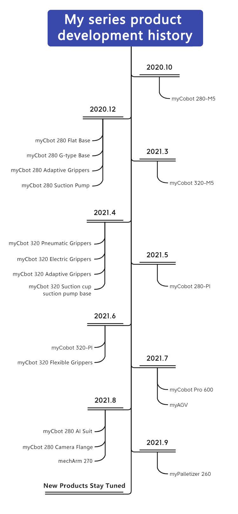

# Development history of my series of products

### Development History

In October 2020, we launched the smallest six-axis cobot named **myCobot**
280-M5 in the world.

In December 2020, **myCobot 280** was put on the market.

In April 2021, **myCobot 320**  products was put on the market.

In May 2021, we published the Raspberry Pi version of **myCobot 280**.

In June 2021, we published the Raspberry Pi version of **myCobot 320**.

In July 2021, we published the commercial version of a babyelephant
coordinative robot arm called **myCobot Pro 600**.

In July 2021, we published the smallest hybrid robot, a baby elephant
moving robot called **myAGV**.

In August 2021,  **AI kits** and the computer vision enabled for visual
machines were put on the market.

In August 2021,The world's most compact and portable small six-axis mechanical **mechArm 270** series came out

In September 2021, launched the world's first type of fully wrapped
four-axis robot arm, a tiny palletizing robot arm called
**myPalletizer**.

---
[← Previous Page](./1.1-introduction.md) | [Next Page → ](./1.3-how_to_read.md)