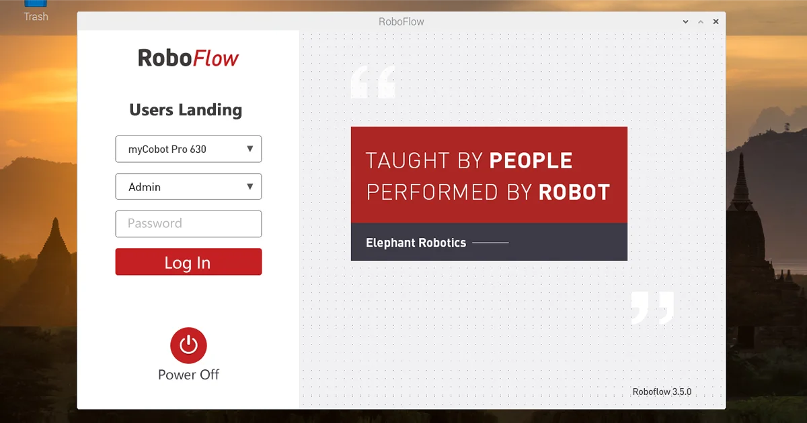

## 机械臂的控制

### 1 开启TCP服务器功能

#### 1.1 登录RoboFlow操作系统

机器人上电开机后，使用VNC Viewer进入树莓派，登录RoboFlow操作系统

<div align=center></div>

#### 1.2 启动机器人

进入配置中心，点击启动机器人按钮

<div align=center></div>
<br>
<div align=center></div>
<br>
<div align=center></div>

#### 1.3 检查TCP服务器是否开启

返回主菜单，点击编写程序后，再点击空白程序，进入程序编辑界面后，点击配置按钮，点击网络/串口选项,检查TCP服务器是否开启，通常情况下，**TCP服务器是默认开启的**，若未开启，则需手动开启，也手动设置IP地址，如设置成**192.168.1.159**。

<div align=center></div>
<br>
<div align=center></div>
<br>
<div align=center></div>
<br>
<div align=center></div>

### 2 滑块控制

>>注意：TCP通信需确保本地虚拟机电脑与MyCobot Pro630系统使用同一网络，同一网段。

打开一个控制台终端，运行命令：

```bash
roslaunch mycobot_630 mycobot_630_slider.launch
```

它将打开 rviz 和一个滑块组件，你将看到如下画面：


接着你可以通过拖动滑块来控制 rviz 中的模型移动。如果你想让真实的 MyCobot Pr630 跟着一起运动，需要再打开一个控制台终端，运行命令：

```bash
# MyCobot Pro 630默认的Socket IP地址为192.168.1.159，端口号为5001，若不一致，可根据实际的IP地址进行修改。
rosrun mycobot_630 mycobot_630_slider.py _ip:=192.168.1.159 _port:=5001
```

**请注意：由于在命令输入的同时机械臂会移动到模型目前的位置，在您使用命令之前请确保rviz中的模型没有出现穿模现象**。
**不要在连接机械臂后做出快速拖动滑块的行为，防止机械臂损坏**。

### 3 Moveit使用

`mycobot_630` 现已集成了 MoveIt 部分。

打开一个控制台终端(快捷键<kbd>Ctrl</kbd>+<kbd>Alt</kbd>+<kbd>T</kbd>)，运行命令：

```bash
roslaunch mycobot_630_moveit mycobot630_moveit.launch
``` 

运行效果如下：  


可以计划并执行，演示效果：

<video id="my-video" class="video-js" controls preload="auto" width="100%"
poster="" data-setup='{"aspectRatio":"16:9"}'>
  <source src="../../resources/11-ApplicationBaseROS/pro630_moveit.mp4" type='video/mp4' >
</video>

如果需要让真实的机械臂同步执行计划，需要再打开一个控制台终端，运行命令：

```bash
# MyCobot Pro 630默认的Socket IP地址为192.168.1.159，端口号为5001，若不一致，可根据实际的IP地址进行修改。
rosrun mycobot_630_moveit sync_plan.py _ip:=192.168.1.159 _port:=5001
```

然后再次计划并执行，演示效果：

<video id="my-video" class="video-js" controls preload="auto" width="100%"
poster="" data-setup='{"aspectRatio":"16:9"}'>
  <source src="../../resources/11-ApplicationBaseROS/pro630_moveit.mp4" type='video/mp4' >
</video>

---

[← 上一页](11.1.3-RvizIntroduction.md) | [下一节 →](../11.2-ROS2/README.md)
