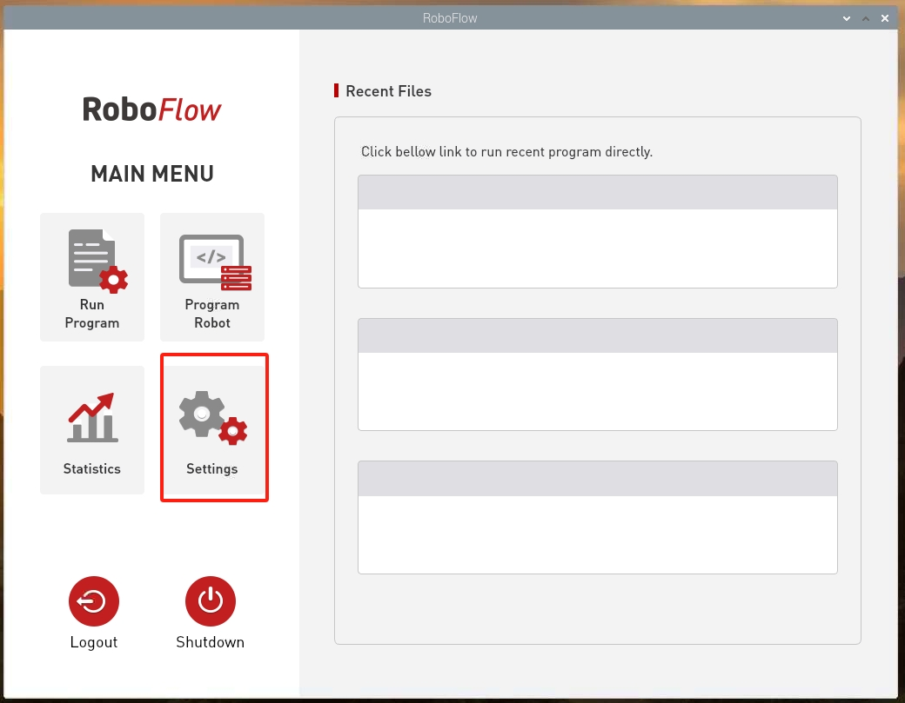
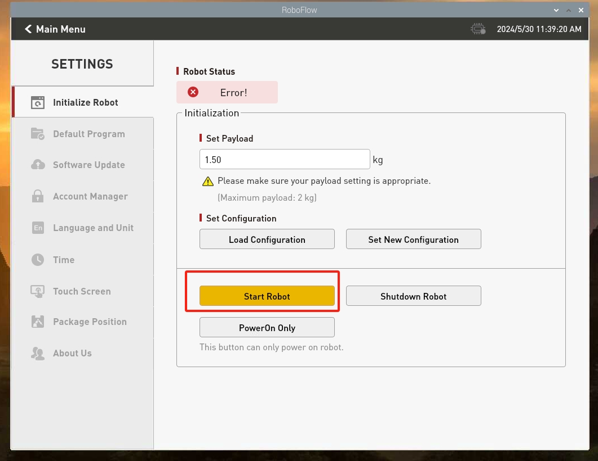
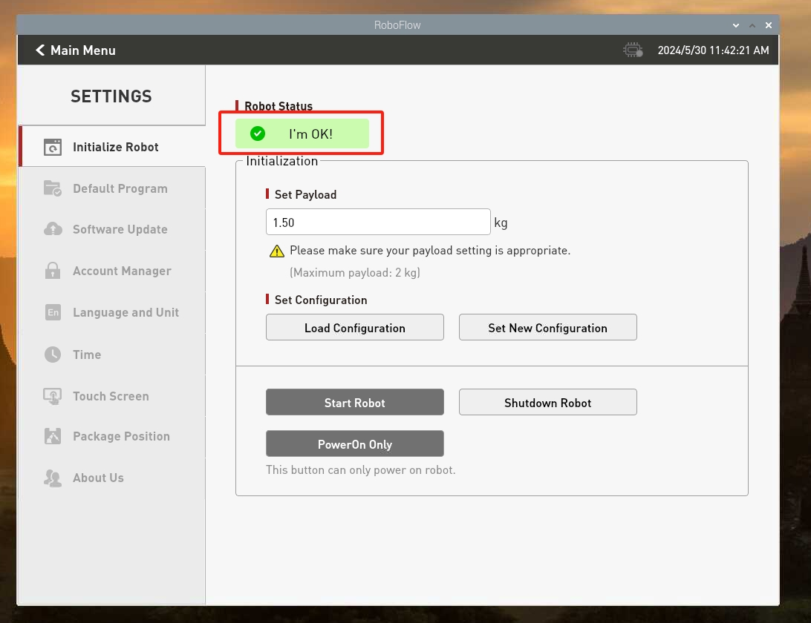
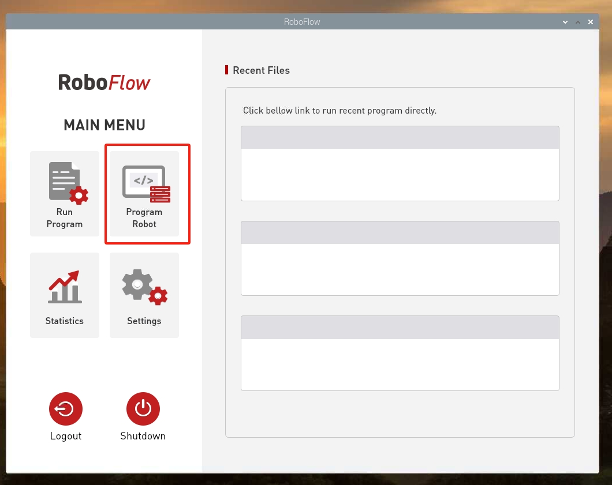
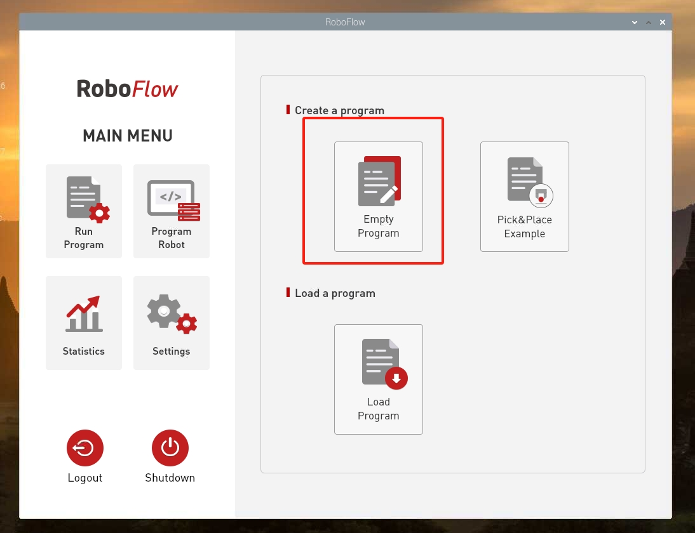
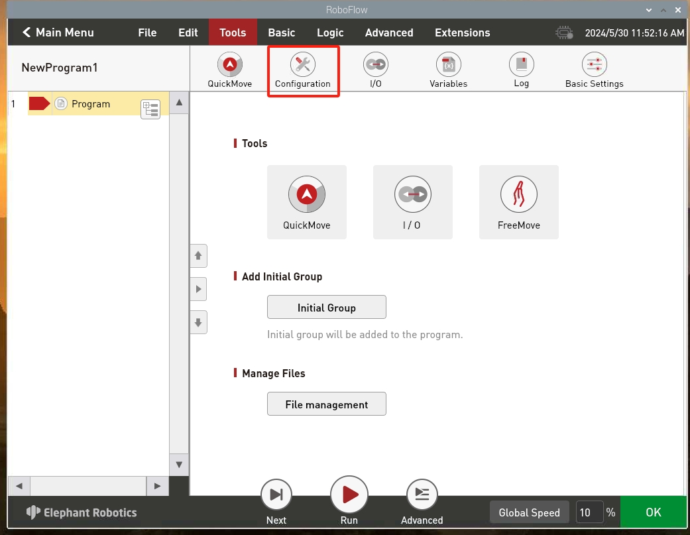

## Control of the robotic arm

### 1 Enable TCP server function

#### 1.1 Log in to RoboFlow operating system

After the robot is powered on, use VNC Viewer to enter the Raspberry Pi and log in to the RoboFlow operating system.

<div align=center></div>

#### 1.2 Start the robot

Enter the configuration center and click the Start Robot button

<div align=center></div>
<br>
<div align=center></div>
<br>
<div align=center></div>

#### 1.3 Check whether the TCP server is open

Return to the main menu, click Write Program, and then click the blank program. After entering the program editing interface, click the Configuration button, click the Network/Serial Port option, and check whether the TCP server is turned on. Normally, **TCP server is turned on by default** , if it is not turned on, you need to turn it on manually and set the IP address manually, such as setting it to **192.168.1.159**.

<div align=center></div>
<br>
<div align=center></div>
<br>
<div align=center></div>
<br>
<div align=center></div>

### 2 Slider control

>>Note: TCP communication needs to ensure that the local virtual machine computer and the MyCobot Pro630 system use the same network and the same network segment.

Open a console terminal and run the command:

```bash
# The default Socket IP address of MyCobot Pro 630 is 192.168.1.159 and the port number is 5001. If it is inconsistent, it can be modified according to the actual IP address.
ros2 launch mycobot_630 slider_control.launch.py ip:=192.168.1.159 port:=5001
```

It will open rviz2 and a slider component, and you will see something like this:


You can then control the movement of the model in rviz by dragging the slider. The real MyCobot Pr630 will move along.

**Please note: Since the robot arm will move to the current position of the model when the command is entered, please make sure that the model in rviz does not have mold penetration before you use the command**.
**Do not quickly drag the slider after connecting the robotic arm to prevent damage to the robotic arm**.

---

[← Previous page](11.2.3-Rviz2Introduction.md) | [Next section →](../../7-ExamplesRobotsUsing/7-ExamplesRobotsUsing.md)