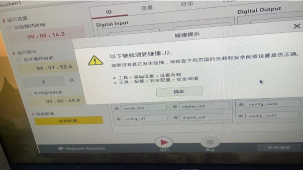

# Others

**Problems that cannot be solved temporarily**

1. The encoder jumps during the use of the robot arm, causing the joint parameters to be disordered

2. The gripper cannot be controlled in transparent mode in RoboFlow, and can only be controlled in full open and full closed mode in IO mode.

3. The hot plug of the gripper causes the end PCB and the gripper PCB to burn out.

4. The gripper connected to the robot arm will become hot and uncontrollable when working for a long time

5. There is no collision when the robot arm moves, but the collision is displayed

