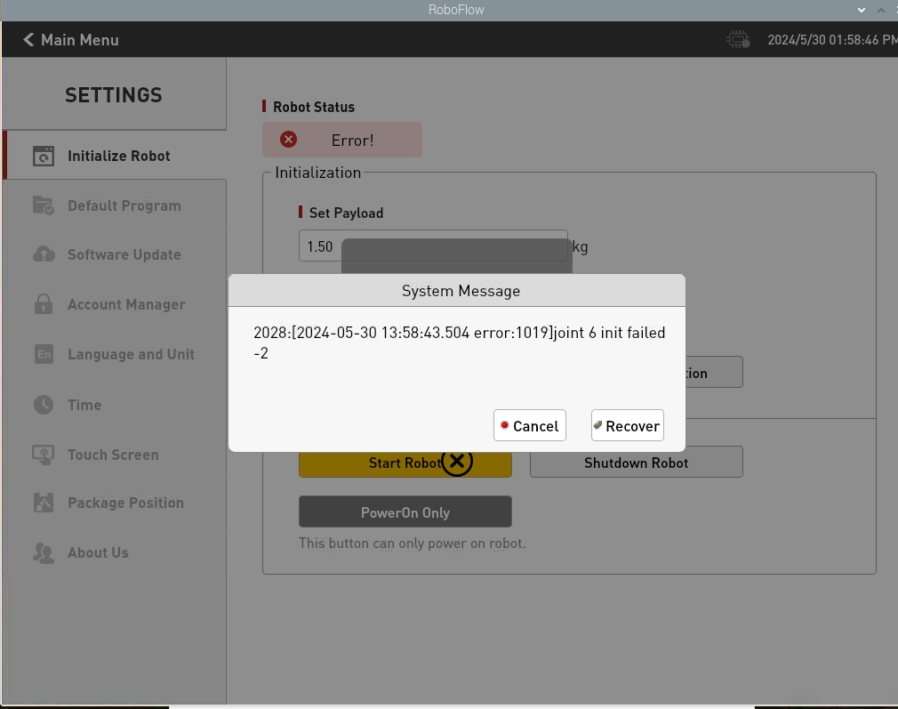
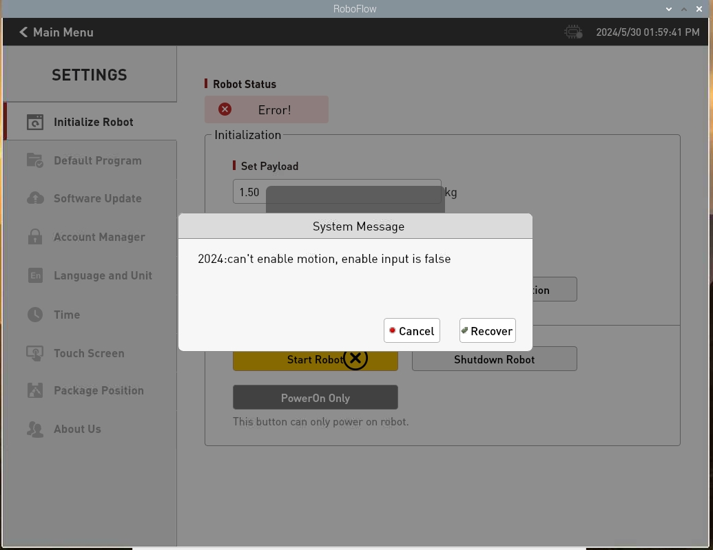
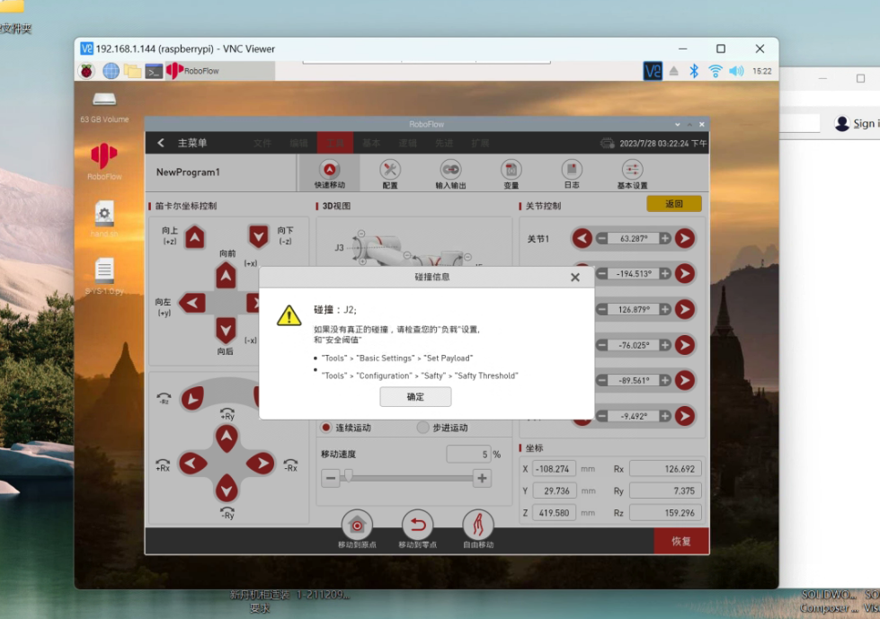
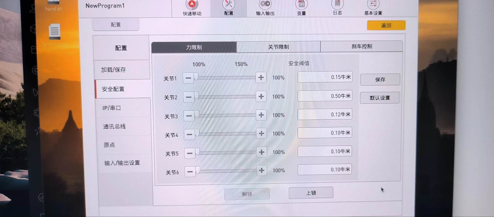

# 软件问题

**Q：为什么我的编译器找不到对应的设备？**
- A：需要先搭建开发环境并安装对应的项目库才可以开发设备。

## 1 关于myStudio

**Q：myStudio是什么？**
- A: 是我们公司自研软件。它是一款给我们公司推出的现有机械臂进行固件烧录或修改的工具。

**Q：为什么我对ATOM终端烧录固件后设备无法正常运转？**
- A：ATOM终端的固件需要使用我们出厂固件，使用中不能更改其他非官方固件，设备如意外烧录其他固件，可以使用“myCobot固件烧录器”选择ATOM终端-选择串口-选择ATOMMAIN固件对ATOM终端进行烧录。

## 2 关于RoboFlow

**Q: 请问robotStudio软件编程能使用吗？**
- A: 我们自己的工业编程软件roboFlow可以使用，robotStudio是ABB公司的，无法和我们互通。

**Q：roboFlow软件快速移动超过限位的原因是？**

- A：可能是某个关节或多个关节超过限位。

**Q：roboflow如何加载已经写好的程序？**

- A：登录后，选择program robot（编写程序），然后点击load program（加载程序）。直接点击run program（运行程序）无法使用，pro630才可以。

**Q：pro600在使用roboflow时，日志中显示456关节停止，这是正常的吗？**

- A：这是正常现象。

**Q：roboflow无法启动机械臂？**

- A:出现上面任意一种情况，大多是是急停异常断开了，机械臂无法正常上电启动，需要检查急停有无松动和有无被按下，若按下需要顺时针旋开急停按钮​，再启动机器人。

**Q：roboflow报碰撞检测的警告？**

- A:修改机器人碰撞关节阈值，往大的调（先调到0.5）若能正常启动，再把碰撞阈值往小的调

---
[← 上一页](./14.1-driver.md) | [下一页 → ](./14.3-hardware.md)