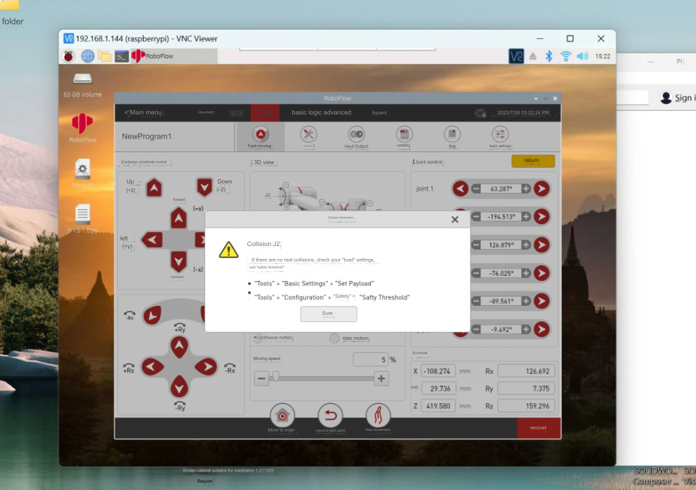
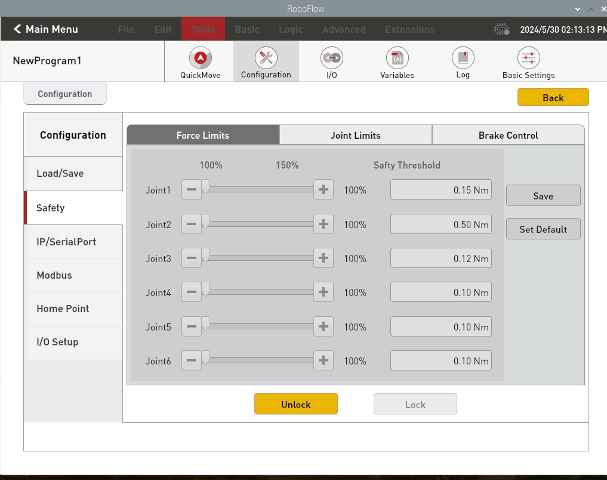

# Software Problems

**Q: Why can't my compiler find the corresponding device?**
- A: You need to build a development environment and install the corresponding project library before you can develop the device.

## 1 About myStudio

**Q: What is myStudio?**
- A: It is our company's self-developed software. It is a tool for burning or modifying the firmware of the existing robot arm launched by our company.

**Q: Why can't the device work properly after I burned the firmware to the ATOM terminal?**
- A: The firmware of the ATOM terminal needs to use our factory firmware. Other unofficial firmware cannot be changed during use. If the device accidentally burns other firmware, you can use "myCobot Firmware Burner" to select ATOM terminal-select serial port-select ATOMMAIN firmware to burn the ATOM terminal.

## 2 About RoboFlow

**Q: Can robotStudio software programming be used?**
- A: Our own industrial programming software roboFlow can be used. RobotStudio is from ABB and cannot communicate with us.

**Q: What is the reason why the roboFlow software moves quickly beyond the limit?**

- A: It may be that one or more joints have exceeded the limit.

**Q: Roboflow cannot start the robot arm?**

- A: If any of the above situations occur, it is mostly because the emergency stop is abnormally disconnected, and the robot arm cannot be powered on and started normally. It is necessary to check whether the emergency stop is loose and whether it is pressed. If it is pressed, turn the emergency stop button clockwise and then start the robot.

**Q: Roboflow reports a warning of collision detection?**

- A: Modify the joint threshold of the robot that triggers the collision warning, adjust it to a larger value (first adjust it to 0.5). If it can start normally, then adjust the collision threshold to a smaller value

**Q: Can't roboflow be started again after a crash?**

- A: After the robot arm is powered off and restarted, roboflow will automatically open

---
[← Previous page](./14.1-driver.md) | [Next page → ](./14.3-hardware.md)