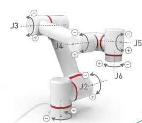

# 硬件问题

**Q：机械臂的底座IO和末端IO输出是多少伏的？**
- A:24V

**Q：机械臂的底座IO和末端IO输出是什么类型的？**
- A:PNP类型，高电平有效

**Q：机械臂的底座IO和末端IO输入是什么类型的？**
- A:NPN类型，低电平有效

**Q：机械臂的底座IO和末端IO输出最大电流是多少？**
- A:200mA

**Q：机械臂走的点位突然不准确？**
- A:利用Roboflow将机械臂恢复到关节零位，看看各个关节是否对齐零位刻度线，若有某个关节的刻度线不对，需要重新零位校准

**Q：机械臂的笛卡尔运动不正常，关节运动正常？**
- A:机械臂在走笛卡尔运动时会有奇异点，所以需要使用关节运动将机械臂调整成如下姿态

---
[← 上一页](./14.2-software.md) | [下一页 → ](../4-FirstInstallAndUse/4-FirstInstallAndUse.md)
