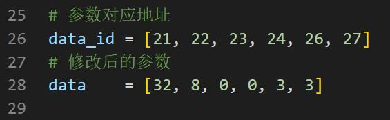

# hardware problem

## 1 About structure

**Q: How to solve the problem of robot arm shaking?**
- A: Enter mystudio and burn the latest version of atommain firmware to the ATOM of the robotic arm.
    Then update the pymycobot version (Win+R and enter cmd to open the terminal), and use pip to update pymycobot.
    (Enter pip install pymycobot --upgrade --user here and press Enter to run).
    Finally, find the pid_read_write.py file in github, download and save it to your computer or Raspberry Pi system.
    Modify each parameter configuration corresponding to the servo number according to the prompts in the code. The parameter serial number corresponds to the serial number displayed in the picture one-to-one, and you can run it after modification.
   
- 
    
    
    
    

It should be noted that all joint parameters of each robot arm are not uniform and need to be compared and modified according to the corresponding robot arm model in the figure below.

The pid_read_write.py file corresponds to the github link: https://github.com/elephantrobotics/pymycobot/tree/main/demo
      

**Q: What are the limits of myCobot’s joints?**
- A: One-axis and five-axis have limited positions. One-axis is about 160° clockwise and about 160° counterclockwise. Five axes can rotate clockwise and counterclockwise about 160°

    Note: When turning the mechanical arm, it should be turned at a small angle and gently. After reaching the limit, do not use force to continue turning.

**Q: What are the six servos controlled by?**

- A: The servo is controlled by the atom on the top.

**Q: What is the role of atoms in the robotic arm?**

- A: Atom mainly controls the kinematic algorithm of the robotic arm in the robotic arm: including forward and inverse kinematics, solution selection, acceleration and deceleration, speed synchronization, multi-power interpolation, coordinate conversion, etc., which requires real-time control and multiple Threads etc. Atom-related programs are not open source yet.

**Q: Why is there no display on the display when the microprocessor-based robotic arm is connected to the HDMI interface? Do I need to download the serial port driver?**
- A: Check whether the wiring is correct and whether the power switch is on. Try changing the HDMI interface. There are two HDMI interfaces on the robotic arm. The interface part must be inserted firmly. No need to download serial port driver.
- Another situation is that you may power on the robotic arm first and then connect the HDMI cable. This will also cause the monitor to have no input signal. You need to completely connect the HDMI cable when the robotic arm is not powered on, and then connect the adapter (or turn on the toggle switch after the adapter is connected).

**Q: What communication interfaces do different versions of robotic arms support?**

- A: The microprocessor-based robotic arm supports socket communication TCP; the microcontroller-based robotic arm can convert USB to serial port communication.

**Q: The motor automatically cuts off power during use. Why?**

- A: Motor overheating protection when used for a long time. This phenomenon is normal and you can continue using it after a few minutes.

**Q: Does the robotic arm support Android development?**

- A: We currently do not have a direct Android development environment and need to develop it ourselves. We provide a serial port protocol, and the serial port can be developed twice.

**Q: What is the function of the USB interface that comes with the Raspberry Pi?**

- A: Raspberry Pi 4B comes with a USB port, which can power the Raspberry Pi. It has no other special function for the time being and cannot be used as a communication interface to connect to a laptop or PC host for communication.

## 2 About parameters

**Q: What is the speed unit of the robotic arm?**
- A: Operating speed 180 degrees/second.

**Q: What is the communication frequency of mycobot280-M5?**

- A: 10-20Hz.

## 3 About the end holder

**Q: Can the adaptive clamping jaw not be fully closed? **
- A: There will be a certain gap between the jaws themselves and they are not completely closed. You can adjust it by increasing the thickness of the spacer between them.

**Q: What is the communication function of mycobot280 adaptive gripper?**

- A: mycobot280 adaptive gripper is ttl communication.

**Q: What kind of communication does the mycobot320 terminal provide?**

- A: The end of mycobot320 provides 485 communication interface.

**Q: How to fix the USB camera at the end of the robotic arm?**

- A: It needs to be fixed with flange, which can be purchased independently.

---
[← Previous page](./14.2-software.md) | [Next page → ](../4-FirstInstallAndUse/4-FirstInstallAndUse.md)