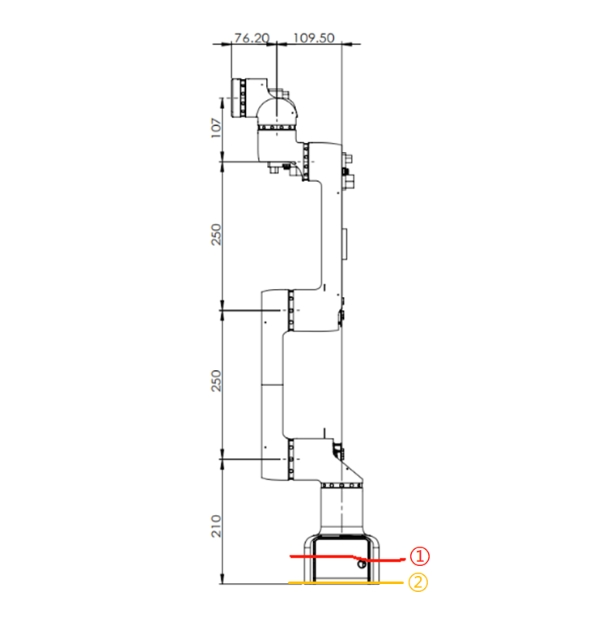
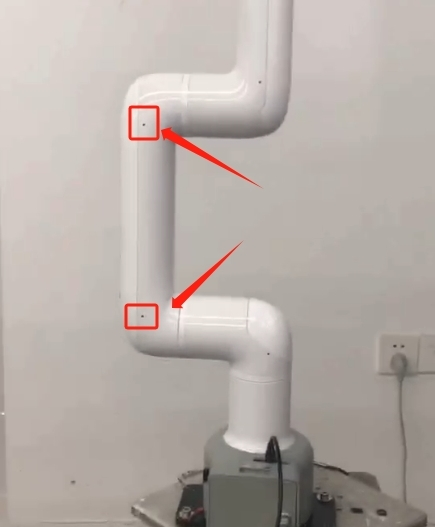
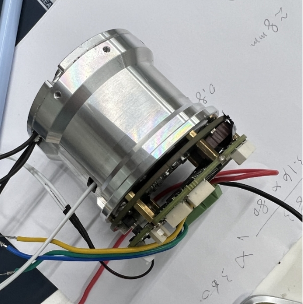
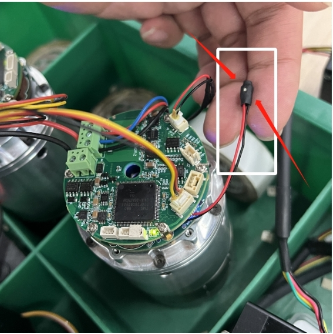
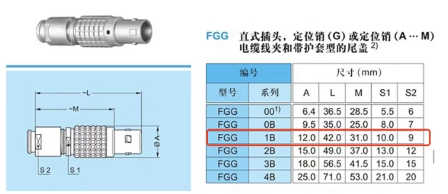

# Hardware problem

**Q: What should I do if the 600/630 connected to the display screen cannot display the picture?**

The robot arm has 2 HDMI interfaces. Currently, only the middle HDMI interface can be used, and the side HDMI interface cannot be used.

**Q: What is the power of the myCobot Pro 600 robot arm when it is working?**

- A: 240W 48V 5A

**Q: Where is the base coordinate origin of 600/630?**

The base coordinate origin of 600/630 is at the position of ② (as shown in the figure), not at the position of ①

**Q: Re-zero calibration in cmd: this is not necessary, (Encoder abnormality troubleshooting-600)**

- A: It may be because it has not been used for a long time before, causing the motor encoder to have an error. Now please disassemble the housing of manipulator J2 and J3, check if there is a red light in the encoder, find the encoder line, press it, and a green light appears in the encoder, and it can be used normally.

**Q: What is the 630 master control? What is the native system?**

- A: Raspberry Pi 4B 8G memory debian system

**Q: Why does Raspberry Pi fail to enter the operating system?**

- A: There are two possibilities. The first is that the instantaneous current causes the TF card and the Raspberry Pi system image to be damaged. It may also be that the TF card capacity is insufficient and the papermaking system is hung up. Because the factory memory left for customers is not much, most of it is occupied by the mycobot_ros folder. Customers can delete the folders other than the model product before the product has a black screen and prompts insufficient memory to reserve product usage space. If there is too much memory data, it cannot be turned on when it is full.

**Q: What are the specifications of the DC interface of the 600/630 charger?**

