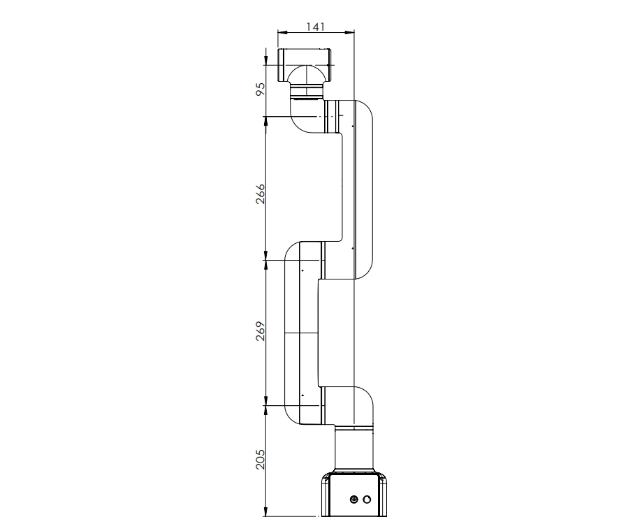
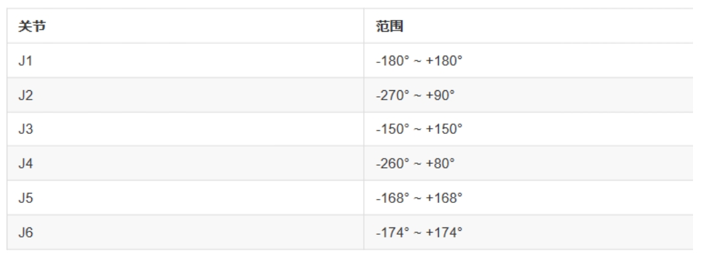

# 机械结构参数

## 1 结构参数

<!-- ### 1.1 机械臂参数

| 指标         | 参数                  |
| ------------ | --------------------- |
| 名称         | 大象协作机械臂 商用版 |
| 型号         | myCobot pro 630       |
| 自由度       | 6                     |
| 最大负载     | 2kg                   |
| 工作半径     | 630mm                 |
| 重复定位精度 | ±0.5mm                |
| 重量         | 8.8kg                 |
| 电源         | AC100-240V ,50/60HZ   |
| IP等级       | IP42                  |
| 材料         | 铝合金、塑料、橡胶    |
| 工作温度     | 0-50℃                 | -->

<!-- ### 1.1 工作空间

 

 -->

### 1.1 规格尺寸

### 1.2 关节运动范围

<!-- | 关节       | 范围 |
| :--------- | :--------------|
| J1        | -180° ~ +180° |
| J2        | -270°  ~ +90° |
| J3  | -150°  ~ +150°           |
| J4        | -260°  ~ +80° |
| J5   | -168°  ~ +168°             |
| J6   | -174°  ~ +174°   | -->

### 2 底板尺寸图

 

### 3 机器人末端安装法兰
机械臂末端螺丝螺纹孔

---
[← 上一页](./2.2-ControlCoreParameter.md) | [下一页 →](./2.4-ElectricalCharacteristicParameter.md)
