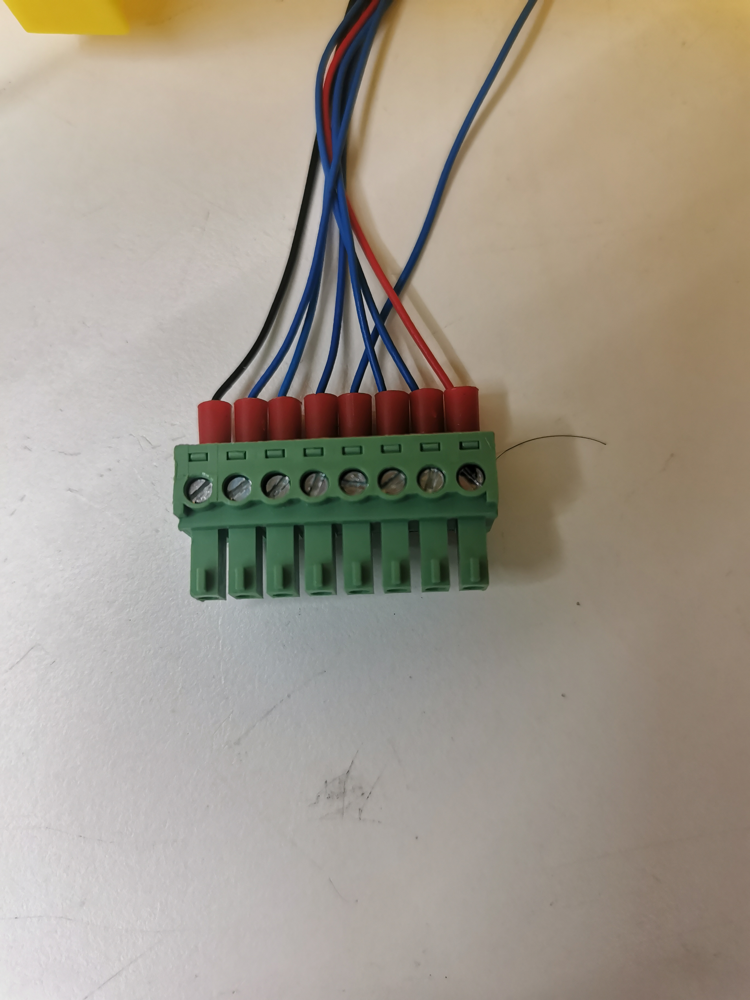
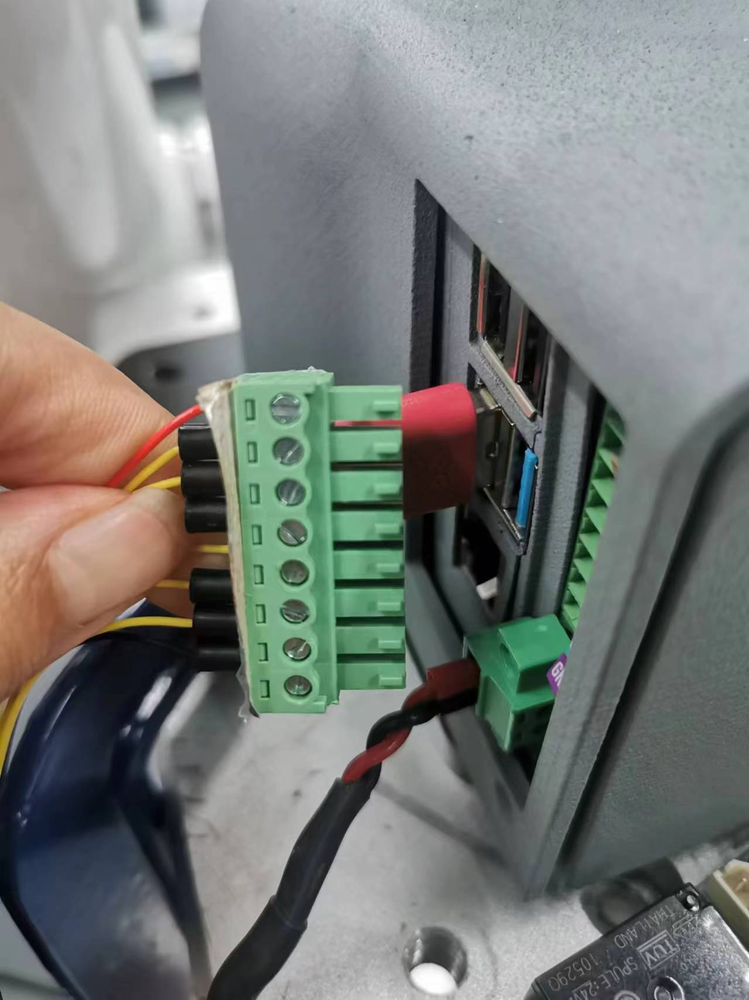
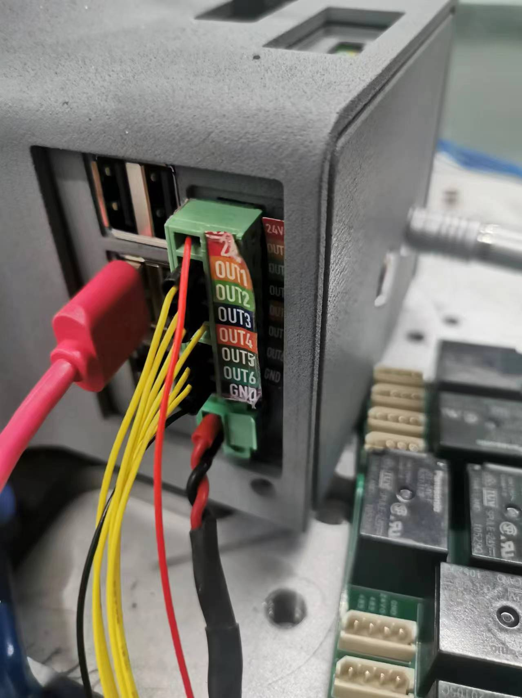

# Electrical characteristic parameters

## 1 Overview of the base interface

Figure 2.4.1 Front view of the base

Figure 2.4.2 Left view of the base

Figure 2.4.3 Right view of the base
## 1.1 Description of the base interface
| Number | Interface | Definition | Function | Remarks |
|:----:|:--------------:|:---------:|:-----------------:|:----------------:|
| 1 | HDMI | HDMI*2 | Used when connecting to a display | |
| 2 | Type C | Communication interface | Communicate with PC | Development and use |
| 3 | RS485 interface | 485 communication interface | Support 1000000 baud rate, support industrial bus protocol, optocoupler isolation | |
| 4 | Switch | Power switch | Control input power on and off | With light (light on when powered on) |
| 5 | Power input interface | DC48V input | DC48V input | |
| 6 | USB2.0 | USB2.0 | External device or U disk | |
| 7 | USB3.0 | USB3.0*4 | External device or U disk | |
| 8 | RJ45 network port | |Specification: Gigabit | |
| 10 | Emergency stop interface | STOP | Emergency stop loop interface | |

#### 1 HDMI display interface: Users can display the operation page to other device terminals by connecting the MicroHDMI display interface

#### 2 Type C: used for communication with the PC, for developers

#### 3 RS485 interface: supports 485 communication, supports 1000000 baud rate, supports industrial bus protocol, optocoupler isolation, this interface can be connected using 4pin plug-in terminal blocks, the wiring method is consistent with the IO interface method below

#### 4 Power switch: controls the on and off of the total power input. When turned off, the controller is also powered off

#### 5 Power input interface: This interface is connected to the DC24V power adapter interface

#### 6 USB-C interface: an interface for data connection using the serial bus standard 2.0; users can use the USB interface to copy program files, or use the USB interface to connect peripherals such as a mouse and keyboard

#### 7 USB3.0 interface: an interface for data connection using the serial bus standard 3.0; users can use the USB interface to copy program files, or use the USB interface to connect peripherals such as a mouse and keyboard

#### 8 RJ45 network port: Gigabit specification

#### 10 Emergency stop circuit terminal: connected to the emergency stop button box, can be used to control the emergency stop of the robot
> **Note**: The emergency stop switch must be connected when the robot is in use, and ensure that the emergency stop switch circuit is connected.

## 1.2 Description of the base IO interface
| Number | Interface | Definition | Function | Remarks |
|:----:|:--------------:|:---------:|:-----------------:|:----------------:|
| 9 | DC/IO interface | 24V | DC24V | DC24V output |
| | | OUT1 | Digital output signal 1~6 | Output supports PNP mode |
| | | OUT2 | | |
| | | OUT3 | | |
| | | OUT4 | | |
| | | OUT5 | | |
| | | OUT6 | | |
| | | GND | GND | |
| 10 | DC/IO interface | GND | GND | |
| | | IN6 | Digital input signal 1~6 | Output supports NPN mode |
| | | IN5 | | |
| | | IN4 | | |
| | | IN3 | | |
| | | IN2 | | |
| | | IN1 | | |
| | | 24V | DC24V | DC24V input, current is usually between 5-20mA |

#### 9 Digital output:
The specification is 24V/0.2A, including 6 digital output signals, which can be used to control relays and solenoid valves, support PNP specifications, and have short circuit, reverse connection, lightning strike, overcurrent, and overvoltage protection.

#### 10 Digital input:
6 digital output signals, used to receive switch signals, such as emergency stop buttons, limit switches, etc., support NPN specifications, and have short circuit, reverse connection, lightning strike, overcurrent, and overvoltage protection.

> **Note**: The IO interface can use 8pin plug-in terminals, use a slotted screw to lock the loose wires into the corresponding terminal port, and then insert the terminal into the IO interface, or insert the 2.54mm DuPont line female head into the IO interface for use (only supports 6 digital inputs and 6 digital outputs, 24V and GND interfaces are not supported), but it is not recommended to use this connection method for a long time.

Figure 2.4.5 Connection terminal diagram

Figure 2.4.6 Connection diagram 1

Figure 2.4.7 Connection diagram 2

## 2 Overview of terminal interface

Figure 2.4.8 Side view of the end of the robot

## 2.1 Description of the terminal interface
| Number | Interface | Definition | Function | Remarks |
|:------:|:----------------:|:-----------:|:-------------------:|:------------------:|
| 12 | M8 aviation socket | End tool IO interface | 24V/2A output, supports short circuit, reverse connection, lightning strike, overcurrent, overvoltage protection | |
| | M8 aviation socket | RS485 interface | Supports baud rate configuration of 9600, 115200 | |
| 13 | Atom | Led + button | Status view/drag teaching | |

#### 1 As shown in the figure, this is the definition of the end tool interface. The MercuryA1 robot provides one input and two outputs.

Figure 2.4.9 Definition of tool interface at the end of the robot

The definition of each tool I/O port is shown in the following table. Note that the tool I/O is of PNP type whether it is input or output, and the wiring method is the same as the bottom output interface.

| Number | Signal | Explanation | Matching M8 line color |
| :------: | :------: | :-----------------------: | :--------------------------: |
| 1 | GND | DC48V negative pole | white |
| 2 | OUT1 | Tool output interface 1 | brown |
| 3 | OUT2 | Tool output interface 2 | green |
| 4 | 485A | 485 standard interface A | yellow |
| 5 | 48V | DC48V positive pole | gray |
| 6 | IN1 | Tool input interface 1 | pink |
| 7 | IN2 | Tool input interface 2 | blue |
| 8 | 485B | 485 standard interface B | purple |

#### 2.1.2 Atom: Atom is used for 5X5 RGB LED, displaying the robot arm status and button functions (used when the robot is dragging and teaching)

---
[← Previous page](./2.3-MechanicalStructureParameter.md) | [Next page →](./2.5-CoordinateSystem.md)