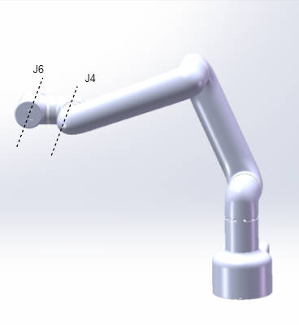
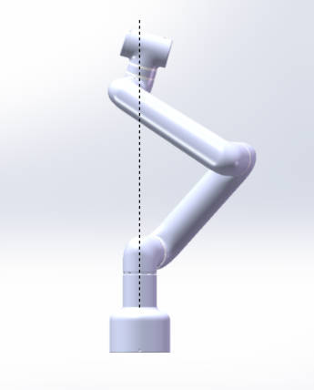
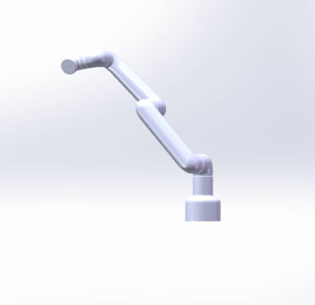

# 坐标系参数

**DH坐标系:**

**MDH参数表:**

---
# 奇异位置
#### 机械臂经过奇异位置时，会在某些方向上无法执行坐标运动，此时建议使用关节运动离开奇异位置

**腕关节奇异:**
   
    腕关节奇异是机械臂常见的奇异位置，当J6旋转轴与J4旋转轴平行时会触发该奇异，此时坐标仅能垂直上下移动

**肩关节奇异:**
    
    当J6坐标系原点(J5与J6旋转轴交点)正好运动到J1旋转轴正上方时触发肩奇异

**肘关节奇异:**
    
    当J2连杆与J3连杆平行时触发肘奇异，此时坐标仅能执行“收臂”动作

[← 上一页](./2.4-ElectricalCharacteristicParameter.md) | [下一节 →](../3-UserNotes/3-UserNotes.md)