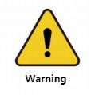

#Safety instructions
## 1 Introduction
&emsp;&emsp;This chapter details general safety information for those performing installation, maintenance, and repair work on the Elephant Robot. Please fully read and understand the contents and precautions in this chapter before transporting, installing and using it.

## 2 Hazard identification
&emsp;&emsp;The safety of collaborative robots is based on the correct configuration and use of the robot. And, even if all safety instructions are followed, operator injury or damage can still occur. Therefore, it is very important to understand the safety hazards of robot use to help prevent problems before they occur.
&emsp;The following tables 1-1~3 are common safety hazards that may exist when using robots:

 <strong>Table 1-1 Dangerous safety hazards</strong>

|
|
| :--- |
| 1. Personal injury or robot damage caused by incorrect operation during robot transportation. |
| 2. The robot is not fixed as required. For example, the screws are missing or not tightened, the locking capacity of the base is insufficient to stably support the robot during high-speed movement, etc., causing the robot to tip over and cause personal injury or damage to the robot. |
| 3. The robot's safety functions are not configured correctly, or safety protection tools are not installed, etc., causing the robot's safety functions to fail to work, thus causing danger. |

 <strong>Table 1-2 Warning level safety hazards</strong>

|
|
| :--- |
| 1. Do not stay within the robot's motion range when debugging the program. Improper safety configuration may not avoid collisions that may cause personal injury. |
| 2. The connection between robots and other equipment may cause new dangers, and a comprehensive risk assessment needs to be conducted again. |
| 3. Scratches and punctures caused by sharp surfaces such as other equipment in the working environment or robot end effectors. |
| 4. The robot is a precision machine, and stepping on it may cause damage to the robot. |
| 5. Failure to remove the clamped object if the clamping is not in place or before turning off the power and air source of the robot (it is not determined whether the end effector is firm and the clamped object falls due to loss of power) may cause danger, such as the end effector Damage, people being injured, etc. |
| 6. There is a risk of accidental movement of the robot. Do not stand under any axis of the robot under any circumstances! |
| 7. The robot is a precision machine. Failure to place it smoothly during transportation may cause vibration and damage to the internal components of the robot. |
| 8. Compared with ordinary mechanical equipment, robots have more degrees of freedom and a larger range of motion. Failure to meet the range of motion may cause unexpected collisions. |

 <strong>Table 1-3 Safety hazards that may cause electric shock</strong>

|
|
| :--- |
| 1. Using non-original cables may cause unknown dangers. |
| 2. Contact with liquid by electrical equipment may cause the risk of electric leakage. |
| 3. There may be a risk of electric shock if the electrical connection is incorrect. |
| 4. Please be sure to turn off the power of the controller and related devices and pull out the power plug before performing replacement work. If work is performed while the power is on, it may cause electric shock or malfunction. |

## 3 Safety precautions
**The following safety rules should be followed when using the robotic arm:**
* The robotic arm is a live device, and non-professionals are not allowed to change the wiring at will, otherwise it may cause harm to the equipment or people.
* When operating the robotic arm, you should strictly abide by local laws and regulations. The safety precautions and the "Danger", "Warning" and "Caution" items described in the manual are only a supplement to the local safety regulations.
* Please use the robotic arm within the specified environmental range. Exceeding the robotic arm specifications and load conditions will shorten the service life of the product or even damage the equipment. 
* Personnel responsible for installing, operating, and maintaining the myCobot robotic arm must undergo strict training, understand various safety precautions, and master correct operation and maintenance methods before they can operate and maintain the robot.
* Do not use this product in a humid environment for a long time. This product is a precision electronic component. Working in a humid environment for a long time will damage the equipment.
* Do not use this device in high temperature environments. The outer surface of this equipment is made of photosensitive resin. Higher temperatures will damage the outer shell of the equipment and cause equipment failure.
* Highly corrosive cleaning is not suitable for cleaning the robot arm, and anodized parts are not suitable for immersion cleaning.
* Please do not use this product without the base installed to avoid damage to the device or accidents. This product should be used in a fixed environment without obstacles around it.
* Do not use other power adapters for power supply. If the device is damaged due to the use of a substandard adapter, the after-sales service will not be covered.
* Do not disassemble, disassemble, or unscrew the screws or casing of the robotic arm. If disassembled, warranty service will not be provided.
* Without professional training, personnel are not allowed to repair faulty products or disassemble the robotic arms without authorization. If a product fails, please contact myCobot technical support engineers in time.
* If this product is scrapped, please abide by relevant laws and correctly handle industrial waste to protect the environment.
* Someone must monitor the device while children are using it, and turn off the device in time when the operation is completed.
* When the robot is in motion, please do not extend your hands into the movement range of the robot arm to avoid injury.
* It is strictly prohibited to change or remove and modify the nameplates, instructions, icons and marks of the robotic arm and related equipment.
* Please be careful during transportation and installation. You should handle it with care according to the instructions on the packaging box and place the robot correctly in the direction of the arrow, otherwise the machine will be easily damaged.
* Please do not burn other product drivers without authorization, or use unofficial recommended methods to burn firmware. If the device is damaged due to the user's personal burning of other firmware, the after-sales service will not be covered.

**If you have any questions or suggestions about the content, you can log in to the official website of Elephant Robot to submit relevant information: **

https://www.elephantrobotics.com

**Please do not use the robotic arm for the following purposes:**
*In medical and life-critical applications.
* In potentially explosive environments.
* Direct use without risk assessment.
* Use with insufficient safety function level.
* Use that does not meet robot performance parameters.

---
[← Previous page](3-UserNotes.md) | [Next page →](./3.2-TransportandStorage.md)