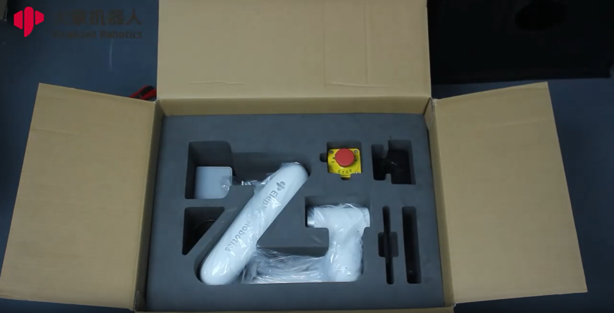

# Shipping and Storage
## 1 Packing and packaging

## 2 Logistics and transportation
&emsp;&emsp;During transportation, mycobot pro630 should be shipped in its original packaging. During transportation, it should be ensured that the mycobot pro630 as a whole is stable and protected by appropriate measures. During transportation and long-term storage, the ambient temperature should be maintained within the range of -20 to +55°C, the humidity ≤95% and no condensation.

&emsp;&emsp;Since the robot is a precision machine, you should handle it with care when taking out the mycobot pro630 from the package. During transportation, if it cannot be placed stably, it may cause vibration and damage the internal parts of the robot.

## 3 Equipment Storage
&emsp;&emsp;After transportation is completed, the original packaging should be properly stored in a dry place, the ambient temperature should be maintained in the range of -20 to +55°C, the humidity should be ≤95% and no condensation, in case of future repackaging and transportation need. Do not stack other items on the original packaging box of the robotic arm to prevent deformation of the packaging box and damage to the robotic arm.

---
[← Previous page](3.1-SafetyInstruction.md) | [Next page→](3.3-MaintenanceandCare.md)