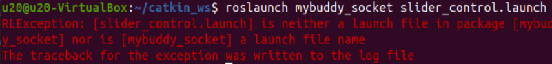

# 常见问题解决


## 1 关于ROS1
**Q：终端切换到~/catkin_ws/src中使用git安装并更新mycobot_ros时，出现目标路径"mycobot_ros"已经存在，原因是什么？**
- A：说明`~/catkin_ws/src`中已经存在一个`mycobot_ros`程序包，需要提前将其删掉，再重新执行git操作即可。

**Q：rosrun运行时，终端报错显示`counld not open port /dev/ttyUSB0：Permission: '/dev/ttyUSB0'`，是为什么？**

- A：串口权限不够，终端输入`sudo chmod 777 /dev/ttyUSB0`赋予权限。

**Q：ros程序为什么不能在vscode运行？**

- A：因为vscode终端不能加载到ros环境，所以需要在系统终端运行。

**Q：rosrun运行时，终端提示`Unable to register with master node [http://localhost:11311]: master may not be running yet. Will keep trying`的原因是？**

- A：运行ros程序前，需开启ros节点，终端输入`roscore`。


**Q：在Ubuntu18.04中进行`catkin_make`构建代码失败,终端提示`Project 'cv_bridge' specifies '/usr/include/opencv' as an include dir, which is not found.`等报错信息**

- A：配置文件中的opencv路径与系统实际路径不相符。需使用sudo修改配置文件（路径为`/opt/ros/melodic/share/cv_bridge/cmake/cv_bridgeConfig.cmake`），系统实际opencv路径位于`/usr/include/`路径下。


**Q：刚克隆下来的mycobot_ros程序包，然后直接运行rosrun程序，出现`package 'mycobot_280' not found`的错误或者找不到该文件之类的错误？**

- A：刚克隆下来的mycobot_ros需要构建代码进行ros环境编译。终端输入
  
```bash
cd ~/catkin_ws/
catkin_make
source devel/setup.bash
```

**Q：编译完成后，新开终端运行launch指令时，为什么会出现下面的错误？**



 - A1：系统没有添加ros环境变量，所以每次开启新终端都要source：
  
```bash
cd ~/catkin_ws/
source devel/setup.bash
``` 

- A2：系统添加ros环境变量，每次开启新终端后无需执行source：

```bash
# noetic为Ubuntu20.04系统
echo "source /opt/ros/noetic/setup.bash" >> ~/.bashrc
source ~/.bashrc
``` 

- A3：可能是指令中的文件名与实际中mycobot_ros包里面的文件名不一致，请仔细检查指令是否有误。

---
[← 上一页](../3.3-MaintenanceandCare.md3.3-MaintenanceandCare.md) | [下一页 → ](../../4-FirstInstallAndUse/4-FirstInstallAndUse.md)