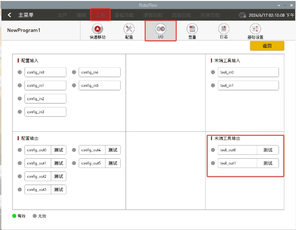
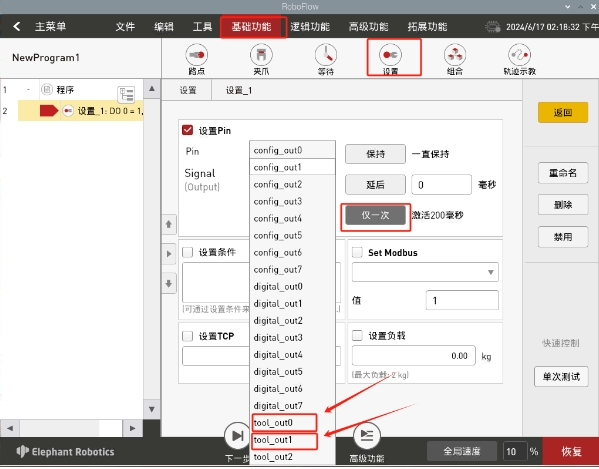

# 配件相关问题

**Q：630的roboflow如何使用电动夹爪教程：**

A：电动夹爪一定要初始化确保灯位蓝色才能正常使用，闪烁红灯这是不正常的
https://docs.google.com/document/d/1CVKVcCJSCgD87TlGKCsp2q1sG6oHwWit/edit


**Q：630&600的电动夹爪如何使用？**

第一步更新pymycobot为3.6.3

```bash
pip3 install pymycobot==3.6.3
```

```python
import time
from pymycobot import Phoenix
#Phoenix和roboflow是冲突的只能使用一个，使用roboflow就不能使用phoneix，反之亦然

#ip地址要填自己的，debug不是必填项
#mg = Pro630("192.168.1.5",115200,debug=True)


mg = Phoenix()
#机械臂上电
mg.start_robot()

time.sleep(0.5)

mg.tool_set_gripper_electric_init()
time.sleep(0.5)

while True:
    mg.tool_set_gripper_electric_open()
    time.sleep(3)
    mg.tool_set_gripper_electric_close()
    time.sleep(3)

```

**Q:600/630使用pro自适应夹爪？**

- A: 在启动机械臂之前，需要将夹爪手动拉到最大
启动机械臂后，按图所示点开，测试夹爪是否正常工作：
tool_out0:闭合夹爪
tool_out1:张开夹爪




首先，点击tool_out0旁边的测试，测试夹爪是否张开，若点击后夹爪正常张开则正常，再次点击tool_out0关闭
点击tool_out1旁边的测试，测试夹爪是否闭合，若点击后夹爪正常张开则正常，再次点击tool_out1关闭

**Q: 使用RoboFlow编写程序时如何控制夹爪？**

如图所示，选择基础功能--设置，选择末端工具引脚输出，选择仅一次，可控制夹爪的一次闭合/打开。



**Q: 使用RoboFlow能否使用透传模式控制夹爪？**
- A: 不能。RoboFlow目前只支持IO模式控制全开全闭，使用透传模式需要用python或串口助手控制机械臂。


**Q;如何在p600上使用摄像头法兰？**

A：可以参考此案例：https://blog.csdn.net/qq_29225913/article/details/101077821


**Q：关于夹持物体与机械臂运动之间有什么需要注意的吗？**

当负载 > 500g时，速度需要低于 50%。

**Q：请问有320与气缸和模块化吸盘的使用视频吗？**

参考链接：https://drive.google.com/file/d/1Ei0JRjXn_YWDyYPPZeBVrAW_VzPUlx6e/view?usp=sharing 

**Q：请问有320与气动夹爪的使用视频吗？**

参考链接：https://drive.google.com/file/d/1nL4mgUf0OYOyCJPf4d5GNkWmbkuWBoup/view?usp=sharing 

**Q：请问有320与pro自适应夹爪的使用视频吗？**

参考链接：https://drive.google.com/file/d/1nL4mgUf0OYOyCJPf4d5GNkWmbkuWBoup/view?usp=sharing 


