# 软件问题

**Q：如何查看机械臂的IP地址、连接VNC？**
WIFI连接:                         
连接wifi后，将鼠标放置到wifi图标上

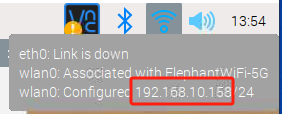

或者点击右上角图标（如图所示）后2所指向的位置查看

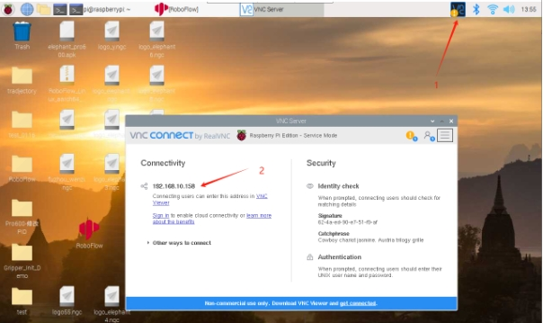

**Q: 有p600将笛卡尔坐标系换算成六自由度的角度坐标的公式吗**

- A： 没有，但是可以用send_coords移动到目标位置，然后读当前关节角度

**Q:使用程序控制机械臂时，无法读取机械臂角度或坐标，执行第一个运动指令后无法继续控制机械臂运动怎么办？**

- A: 可能是由于编写程序控制机械臂时没有添加延时或等待完成指令。使用python控制时可添加command_wait_done()，使机械臂完成上一步运动再往下执行

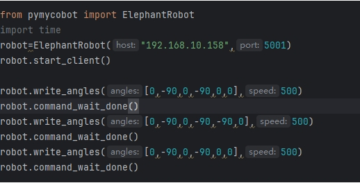

使用RoboFlow时，可以添加延时确保机械臂完成运动后再执行下一步命令：

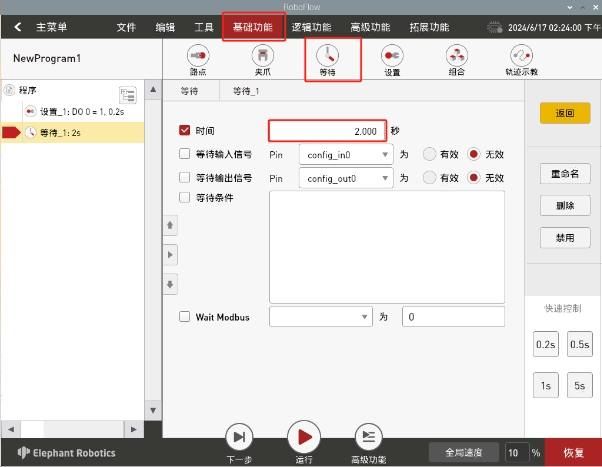

**机械臂运动后，command_wait_done()返回-1是为什么？**

- A: 是由于机械臂运动的时间过长，若运行时间超过1分钟，command_wait_done()则会返回-1

**解决方法**：替换RoboFlow版本为：630的roboflow最新版本和更新教程：

A：关闭roboflow，然后使用U盘将文件复制到树莓派上，并按照视频进行操作
视频：
https://drive.google.com/file/d/1KD1VxhzFYXEFF-3paO-ntMfGQMvjjLc2/view?usp=sharing
文件：
https://drive.google.com/file/d/1lV2fTM-rNeZbccjJInpbKVhSzSXJGf4c/view?usp=sharing

**启动机械臂报错是为什么？**

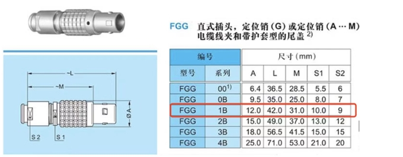

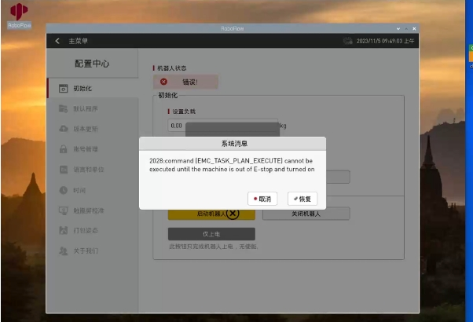

若出现以上报错：
1. 检查急停是否处于释放状态，若没有，需要将急停旋钮往顺时针拧，使其弹起。
2. 若急停处于释放状态，检查急停与机械臂的连接是否松动，可将连接按紧。

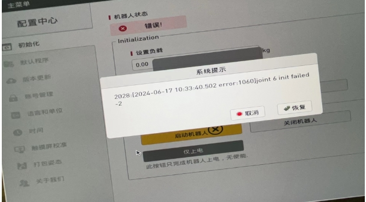

若出现以上报错：
检查系统提示的关节是否到达限位，需要断电将关节调整至零位。
如果是456关节超限，请按下急停开关，将456关节移动回到正常姿态后再启动机器人
如果是123关节超限，可按照下面的步骤将超限的关节姿态调整回来:

① 在roboflow中进入配置中心，在初始化栏点击仅上电
② 点击开始编程，进入配置栏，选择安全配置，依次打开 1，2，3 关节的刹车（如仅某一关节超限，打开对应的超限关节即可，不必123刹车全打开）。
③ 打开刹车后关节是可手动移动的，请手动调整关节到正常姿态，调整结束之后再关闭刹车
④ 在roboflow重启机器人即可，后续注意关节姿态不要超限

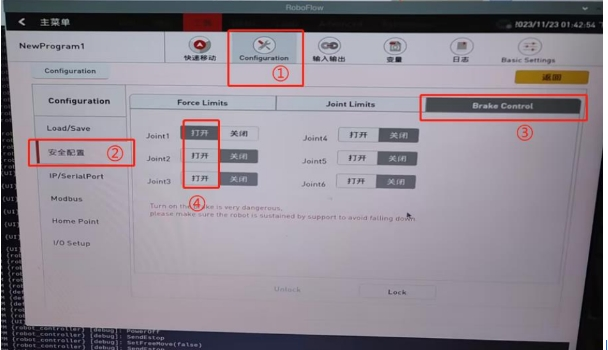

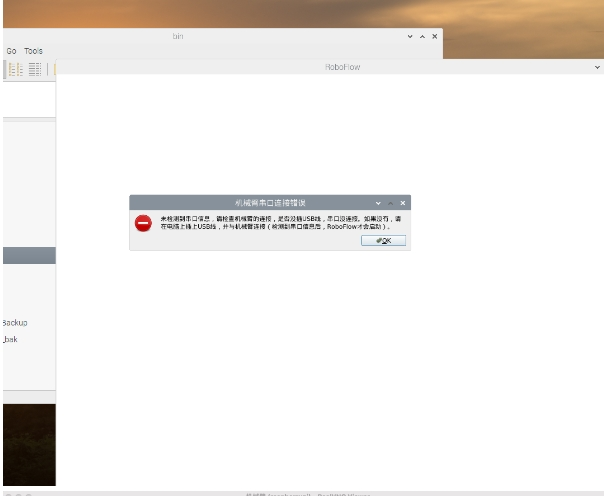

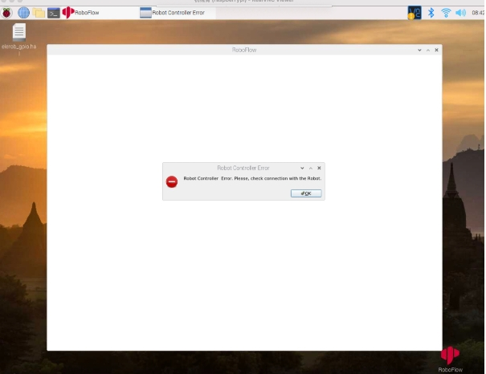


若出现以上报错：
关闭Roboflow，打开命令行输入elerob -l

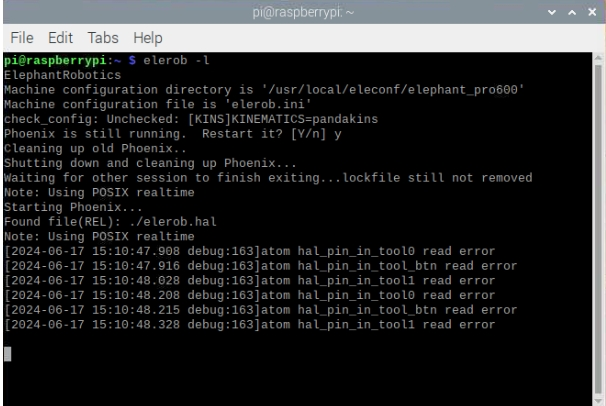

再次启动RoboFlow可解决问题

**Q:600两个关节同时运动后的时候，出现运动速度很快的情况，怎么处理？**

A:关于你提到的这个关节1在0和0.0001的情况下，J4运动速度不一致问题请参考下面的解释
首先这个现象是正常的
你设定的这两组角度值中，J1的变化非常小，而J4的运动范围相对较大，当这组指令下发的时候，机械臂内部电机有一个同步执行机制，这意味着两个点位之间，J1前后运动的时间和J4关节前后运动的时间相同，由于J1的关节角度变化过小，运行时间自然也相对较短，这就导致了同步执行的情况下，J4关节需要在同样相对较短的运动时间内完成角度相对较大变化，这就导致了J4的速度较快的结果
为了如果你想将机器的运行速度调节到比较慢的状态，那么我们建议你在仅需要控制一个关节的情况下，使用控制单个关节的API: write_angle
如果你想控制多个关节同时运动的，请注意使用write_angles尽量让不同关节之间的角度差值缩小一点，像J1的0变化到0.00001，差值为0，而J4关节的-150到，-100差值为40，这个相差实在太大了，如果你将J1的变化更改成0到100，这个运动速度基本是正常的，不会太快，你可以测试看看


**Q：630的roboflow最新版本和更新教程：**

- A：关闭roboflow，然后使用U盘将文件复制到树莓派上，并按照视频进行操作
视频：
https://drive.google.com/file/d/1N_lDCe4H-Oyy0yGGVttszHlmmVVN-K94/view?usp=sharing
文件（2024.10.10）：
https://drive.google.com/file/d/1h6UIe9G9Mum_dutInfaqH_oVjJHSrqn6/view?usp=sharing


**Q：P600在按下急停之后，无法继续使用python进行控制，这个如何处理？**

- A：正常情况下在按下急停仍然可使用python进行控制，无法控制的原因为没有使用power_off()给P600彻底断电,在启动机器人前添加power_off()即可

**Q：600运行超限后机械臂报错无法继续移动的情况下如何处理？**

- A:如果是456关节超限，请按下急停开关，将456关节移动回到正常姿态后再启动机器人
如果是123关节超限，可按照下面的步骤将超限的关节姿态调整回来

①在roboflow中进入配置中心，在初始化栏点击仅上电

②点击开始编程，进入配置栏，选择安全配置，依次打开 1，2，3 关节的刹车（如仅某一关节超限，打开对应的超限关节即可，不必123刹车全打开）。

③打开刹车后关节是可手动移动的，请手动调整关节到正常姿态，调整结束之后再关闭刹车

④在roboflow重启机器人即可，后续注意关节姿态不要超限


**Q：630是否带碰撞检测功能，如果带，那么碰撞检测阈值是否可以调整？**

- A：我们的机器有碰撞检测设计，在收到较大碰撞时机器会自动停止运动，如果你希望可以检测到比较小的力也产生碰撞检测，你可以尝试调整下面的碰撞检测参数，建议单次调整幅度为0.01

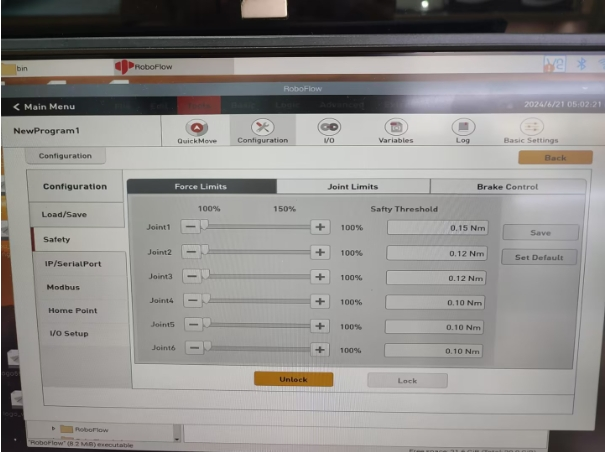


**Q：630&600的坐标控制无法使用如何解决wait_command_done:-1？**

检查机械臂是否姿态为下图这种

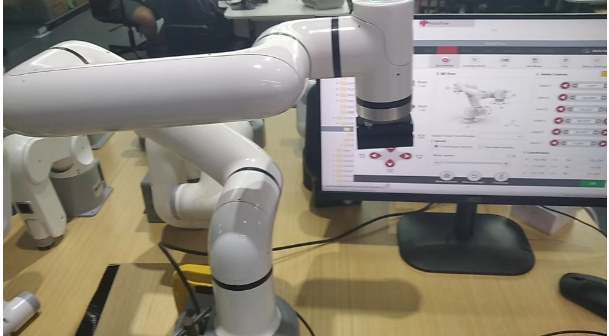

然后使用get_angles和get_coords这两个api获取坐标和角度


在获取坐标和角度后修改write_angles和write_coords的角度和坐标

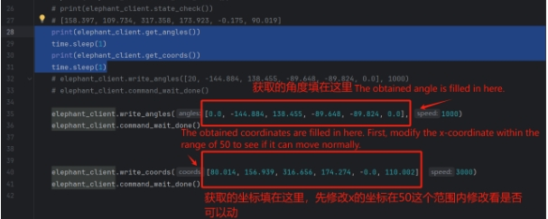


```python
from pymycobot import ElephantRobot
import time

# 这个代码没上电，你要确保你已经上电。
if __name__=='__main__':

#    "将ip更改成P600树莓派的实时ip"
    elephant_client = ElephantRobot("192.168.1.153", 5001,debug=True)

    elephant_client.start_client()

    print(elephant_client.get_angles())
    time.sleep(1)
    print(elephant_client.get_coords())
    time.sleep(1)

    elephant_client.write_angles([0.0, -144.884, 138.455, -89.648, -89.824, 0.0], 1000)
    elephant_client.command_wait_done()


    elephant_client.write_coords([80.014, 156.939, 316.656, 174.274, -0.0, 110.002], 3000)
    elephant_client.command_wait_done()

```

**Q：什么的是正向运动学和逆向运动学？**

- A：正向运动学（Forward Kinematics）是指已知机器人各个关节的角度（或位移），求解机器人末端执行器（如机械臂的手爪）在笛卡尔空间中的位置和姿态。 get_coords()的API中实现了，但是具体的算法不公开。
逆运动学（Inverse Kinematics）与正向运动学相反，它是指已知机器人末端执行器在笛卡尔空间中的位置和姿态，求解机器人各个关节的角度（或位移）write_coords()、send_coords()

**Q：为什么选择某个com口的时候会被拒绝连接？或者说怎么找到对应的com口是什么？**


被拒绝连接的原因是由于com口选择错误，当你有多个设备连接在电脑usb上的时候，在myblockly中也会显示有多个串口，比如上图的com4和com5，但是其中只有一个是机械臂的，需要选择机械臂的串口才能正常连接使用机械臂，显然能正常连接的com4是当前的机械臂对应串口号。
关于如何在多个串口中找到机械臂对应的串口，对应的方法是：尝试拔插与机械臂连接的串口线，查看是哪个串口号在断开机械臂与电脑的usb连接之后也消失在myblockly的串口号选项中，当重新使用usb连接机械臂与电脑之后，这个串口号又出现在myblockly的串口号选项中，这个伴随机械臂与电脑的断开及连接而同步消失及再现在myblockly中的串口号就是机械臂对应的串口号。
注意机械臂com口数字的选项并不是一直固定的，接在不同电脑的usb端口或者同一电脑的不同usb端口上，都有可能发生变化，建议以上述方法查看实时的com口号。


**Q:  myblockly的快递移动工具无法显示实时角度怎么处理？**

- A:这个一般是由于设备串口信息选择错误、pymycobot异常导致的，建议根据本文的"首次使用自查"方案进行排查，如未能正常控制机械臂，请尝试更新pymycobot，对应更新方案是在cmd或者终端中输入指令`pip install pymycobot --upgrade --user`
最后如果仍然无法正常控制，请尝试更新myblockly软件，更新方法请参考下面的链接：
https://drive.google.com/file/d/1yBWzhbSBUYsZPBl7PBdZKRwk3al71Dc7/view?usp=sharing 

**Q：运行程序结果显示 child process exited with code 1，正常吗？**

- A: 这个不是报错。是全部的程序都运行结束返回了二进制数字1。代表已经全部顺利运行完成。

**Q：如何在myblockly中预设代码块内容，包括进入系统后机型、波特率等信息都是对应接入的机型的？**

- A：目前在myblockly中初次启动默认的机型是mycobot、波特率115200，暂时没有更改初始波特率的方法，但是你可以自己制作保存一个初始化的json文件，下次进入myblockly后加载此文件可得到预设的代码块。
制作及保存json文件的方法请参考下文：https://drive.google.com/file/d/1g_dd933TK1tptnisUad4PBfwSRsWWFeQ/view?usp=sharing 


## 3 RoboFlow相关

**Q：无法下载Roboflow软件，Roboflow无法正常控制机器如何处理？**

- A：目前Roboflow软件仅支持600/630这两款Pro 专业协作，不再支持mycobot协作型或其他型号机器，mycobot系列机器建议使用的控制方式是myblockly、python及ros，值得一提的是，myblockly是一款与Roboflow图形化界面相似的软件，如果您需要使用可视化图形编程可优先考虑使用myblockly软件。
	​				
## 4 Python相关

**Q：运行提示缺少库文件Q:遇到报错信息：ModuleNotFoundError: No module named “pymycobot”，如何处理？**

- A1：没有安装pymycobot，对应的解决方法是重新安装pymycobot，指令是`pip3 install pymycobot --upgrade --user`

- A2: 在安装python的过程中没有勾选下图的“Add Pythonxx to PATH”，需要卸载python后重新安装python，并将此选项勾选。
  
- 
  
- A3: 如是M5或AR系列机器，请确认PC中是否有多个python版本，建议卸载PC内所有python版本重新安装一个python3.8以上的版本，注意保持在PC中有且仅有一个python3.8以上版本。如实际使用需要多个python版本，请指定pymycobot使的python版本并在调用pymycobot库时指定python运行的版本。

- A4：建议使用3.9版本的pyhton，pyhton12会出现不兼容的情况。

**Q: 坐标控制怎么有时写入坐标后无响应？**

1. 在关节运动前后需要加延时，去确保机械臂有足够的响应时间
2. 坐标运动首先要确保该坐标可以通过关节运动抵达，一般是通过关节运动到指定点后读取坐标值用作控制，人为编写的坐标大部分都是无效的，建议是不要自己直接写坐标，而是采用释放关节后手动转动关节到目标位置后，使用get_coords()记录改目标位置坐标，再使用send_coords()将进行坐标设置
可参考如下代码：

```python
# 导入官方python API
from pymycobot import MyCobot320
# 导入时间模块
import time

# 设置串口连接，串口，波特率
# PI版本
mc = MyCobot320('/dev/ttyAMA0', 115200)
# M5版本，具体串口号还需查看设备管理器
mc = MyCobot320('COM0', 115200)
# 设置稍许等待时间，0.5秒
time.sleep(0.5)
# 释放机械臂所有关节，请用手扶好机械臂
mc.release_all_servos()
# 设置等待时间，可根据需要改动，此时可将机械臂移动到目标位置。
time.sleep(5)
# 使机械臂重新上电，在目标位置固定
mc.power_on()
# 读取当前位置的坐标信息和角度信息，并且输出到控制台
print('coords:'，mc.get_coords())
print('angles:'，mc.get_angles())

```


**Q：send_coords(coords, speed, mode)中的mode有没有通俗一点的解释？**

- A：线性1代表机械臂末端以直线的方式抵达目标位置，如果因为限位、结构等原因无法走直线，那指令就不会完全执行；
线性0表示末端以任意姿态抵达目标位置，由于没有直线的限制，不容易出现指令不执行的现象。

**Q：set_fresh_mode(mode) 的插补和刷新模式有什么区别？**

- A: 插补0是指起始点和终止点之间规划了很多密集的点位，从而达到控制中间段轨迹的效果。
如何达到程序并行的效果：非插补1就是没有中间段的规划，控制不了轨迹，但是运动会相对平滑。

**Q：在仅改变Z轴的情况下，轨迹不是直上直下的，但是最后落点是只改了Z轴，这个正常吗，如何确保中间轨迹也是直线？**


- 开插补走直线就能确保轨迹了
  ```python
  set_fresh_mode(0) # 开插补
  send_coords(coords, speed, mode=1) # 走直线
  ```

注意一定要开插补之后，在send_coords设置的智能规划路线才有用。
插补是指起始点和终止点之间规划了很多密集的点位，从而达到控制中间段轨迹的效果。
非插补就是没有中间段的规划，控制不了轨迹。

**Q：get_error_information()的返回值为-1是什么意思？**

- A：`get_error_information()`的返回值为-1，表示无法正常通讯，你需要检查电源适配器及usb线是否连接，检查LCD屏幕是否停留Atom：ok界面，如果线路未连接成功，且未显示ok均会出现通讯异常的情况，需要重新连接再测试。

**Q：用280机器的绘制案例是发现形状轨迹不是很直，能优化吗？**

- A1：使用签字笔硬质文具等来用这个绘制案例，得到轨迹有偏差这是正常 的。这种偏差主要有2个原因造成，一是由于mycobot使用的是伺服舵机，有一定的精度偏差（如果是使用时间较长的机器，由于关节老化，其关节的偏差会更大），二是在使用硬笔在绘画时跟桌面接触距离比较苛刻，距离过高轨迹容易产生轨迹中断，距离过低会出现笔尖阻力过大卡顿的问题，所以绘制出来的效果并不理想。目前建议使用软质文具进行绘画，例如毛笔毛刷等工具，这对改善绘画效果有一定帮助。

- A2：另外，你可以将机械臂的运动模式更改成插补模式，这样运动轨迹会相对平直。

  ```python
  set_fresh_mode(0) # 开插补
  send_coords(coords, speed, mode=1) # 走直线
  ```

  注意一定要开插补之后，在send_coords设置的智能规划路线才有用。
插补是指起始点和终止点之间规划了很多密集的点位，从而达到控制中间段轨迹的效果。

**Q:识别到的目标位置，末端无法到达，怎么判断这个坐标是否可以到达然后处理？**

- A：solve inv kinematics(target coords, current_angles)用这个接口看是否有解就可以了。
  solve_inv_kinematics(target_coords, current_angles)
  - 功能 : 将坐标转为角度。
  - 参数：
    - target_coords: list 所有坐标的浮点列表。
    - current_angles: list 所有角度的浮点列表，机械臂当前角度
  - 返回值: list 所有角度的浮点列表。

## 5 ROS相关

**Q：有没有配置好环境的虚拟机镜像？**

- A：我们有提供一个配置好ROS1及ROS2环境且内置ROS源码的虚拟机环境，用户可以通过下面这个链接下载，并将虚拟机文件导入VirtualBox，省去自己配置环境的麻烦，当测试ROS案例时建议使用我们已经配置好的虚拟机环境进行验证，避免由于环境配置的原因导致的一些案例运行报错
请参考虚拟机文件导入虚拟机软件的操作步骤视频：https://drive.google.com/file/d/1KeYk_CUgDE46rVn7zbd0EhraIbgt3qZt/view?usp=sharing

  [ROS1虚拟机文件下载](http://download-elephantrobotics.oss-cn-shenzhen.aliyuncs.com/system_images/ubuntu20.04_ROS1_V20230731.ova.zip) 

  [ROS2虚拟机文件下载](https://download-elephantrobotics.oss-cn-shenzhen.aliyuncs.com/system_images/ubuntu20.04_ROS2_V20240228.zip)

  [虚拟机软件VirtualBox下载](https://www.virtualbox.org/wiki/Downloads)

**Q：导入ROS2虚拟机文件的时候报错怎么处理？**


- A: 这是因为虚拟机软件Oracle VM VirtualBox版本过低导致的，需更新虚拟机软件版本。

**Q：如何重新下载ROS源码包？**

- A：使用指令拉取：
  
  ```bash
  git clone https://github.com/elephantrobotics/mycobot_ros.git
  ```

  或着手动下载，下载方法进入到ROS源码包地址按照下图进行操作，源码包地址：https://github.com/elephantrobotics/mycobot_ros

  


**Q: 运行ROS moveit案例发现报错ImprotError：No module named yaml咋办？**


- A：在这个脚本开头第一行，把Python解释器改为python3

**Q：运行虚拟机找不到串口怎么处理？**

- A:使用USB线将M5机械臂与PC连接，打开虚拟机设置→USB设备→添加USB设备→选择串口号QinHeng xxxxx，这个就是机器的串口设备。
如果没有这个设备号，可以通过重新拔插设备获取对应的USB设备号，拔插有串口变化的即对应的机器串口设备号

  

**Q:使用基于mujoco的环境进行仿真训练，因此需要机器人的xml文件**

- A:目前GitHub上只有280JN的xml文件：[280JN](https://github.com/elephantrobotics/mycobot_mujoco) 
- 提供给客户如何将dae、urdf类型的文件转换成xml文件的方法给客户，让客户用[meshlab自行转换]([https://blog.csdn.net/qq_43309940/article/details/128292151?spm=1001.2101.3001.6650.1&utm_medium=distribute.pc_relevant.none-task-blog-2defaultCTRLISTRate-1-128292151-blog-131092562.235^v38^pc_relevant_yljh&depth_1-utm_source=distribute.pc_relevant.none-task-blog-2defaultCTRLISTRate-1-128292151-blog-131092562.235^v38^pc_relevant_yljh&utm_relevant_index=2)。

**Q：终端切换到~/catkin_ws/src中使用git安装并更新mycobot_ros时，出现目标路径"mycobot_ros"已经存在，原因是什么？**
- A：说明`~/catkin_ws/src`中已经存在一个`mycobot_ros`程序包，需要提前将其删掉，再重新执行git操作即可。

**Q：rosrun运行时，终端报错显示`counld not open port /dev/ttyUSB0：Permission: '/dev/ttyUSB0'`，是为什么？**

- A：串口权限不够，终端输入`sudo chmod 777 /dev/ttyUSB0`赋予权限。

**Q：rosrun运行时，终端提示`Unable to register with master node [http://localhost:11311]: master may not be running yet. Will keep trying`的原因是？**

- A：运行ros程序前，需开启ros节点，终端输入`roscore`。

**Q：rosrun运行时，终端报错显示`counld not open port /dev/ttyUSB0：No such file or directory: '/dev/ttyUSB1'`，是为什么？**

- A：串口有误。需确认当前机械臂的实际串口。可通过`ls /dev/tty*`查看。

## 6 C++相关

**Q：找不到各种dll文件怎么处理？**

- A1：如果myCobotCpp.dll缺失，将之前放到lib目录下的myCobotCpp.dl放到mycobotcppexample.exe所在目录下.
- A2: 如果报缺少QT5Core.dll，打开qt command (菜单栏搜索QT) ，选择msvc2017 64-bit，执行windeployqt--release myCobotCppExample.exe所在目录(如: windeployqt --release D:lvs2019myCobotCpploutlbuildlx64-Releaselbin) 此处执行命令后如果报找不到vs安装路径，请检查vs环境变量的设置.

以上步骤执行后，如果报缺少qt5serialport.dll文件，将gt安装目录处的此文件(路径如: D:lgt5.12.1015.12.10msvc2017 64bin)，拷贝到myCobotCppExample.exe所在目录

**Q：生成myCobotCppExample.exe可执行文件，这个有可能是什么问题？**

选择下图中的启动

