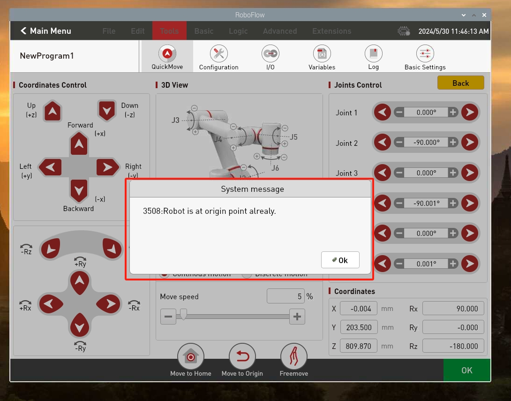

# 开机检测指南

## 1 安装机械臂
安装M6X16螺丝将底板固定在台面上

 

安装完成的效果图

 

将机械臂底座放置到固定好的底板上

 

拆卸机械臂底座上的罩壳固定螺丝

 

打开机械臂底座的罩壳，并使用M6X16的螺丝将机械臂底座和底板固定

 

安装完成后，将机械臂底座的罩壳扣上

 

安装机械臂底座的罩壳固定螺丝

 
安装机械臂底座的罩壳固定螺丝
   

## 2 电源连接
在电源适配器断电的情况下，将适配器输出端与机械臂电源处连接

然后将急停旋钮接入后，顺时针旋开急停旋钮

然后按下电源开关即可

## 3 显示模块连接

### 3.1 显示屏连接

准备好配件中的显示器连接线，如图2-1所示，一端为HDMI接头，一端为micro HDMI接头。

 

图2- 1 显示屏连接线

HDMI接头与电脑相连，micro HDMI接有与机器人相连，机器人接口位置如图2-2所示。连接好后给机器人上电即可显示。

 

图2- 2 机器人micro HDMI接口

### **3.2 远程连接**
使用远程连接，必须先下载[VNC Viewer](https://www.realvnc.com/en/connect/download/viewer/)
[安装教程](https://blog.csdn.net/yushaoyyds/article/details/133926519)
#### 有线连接
给机器人上电，使用网线连接机械臂和PC。机械臂的有线网卡静态IP为：192.168.1.159，PC的IP网段要改成1网段，在远程端打开软件“VNC Viewer”，如图2-3所示，在输入框输入机器人的IP地址，按下回车键进行连接.
[网段修改教程](https://blog.csdn.net/qq_40116418/article/details/120471097)

   

图2- 3 打开VNC软件

如图2-4所示，在弹出的认证窗口中，输入机器人端的账号和密码，默认账户名为“pi”，密码为“elephant”。输入完成后点击“OK”按钮即可连接.

   

图2- 4 远程连接机器人

### 无线连接
若要使用无线连接，必须先使用外接显示器或有线连接的方式先进入机器人系统，然后选择你要连接的wifi热点，输入密码连接后，查看机器人的无线IP，客户使用的电脑必须连接和机器人同一个wifi热点，打开vnc，输入机械臂的无线IP及用户名和密码后，即可远程进入机械臂的操作系统。

鼠标点击WiFi图标，即可连接需要的WiFi

鼠标只需移动到WiFi图标，即可显示无线IP

## 4 零位检查

机器人上电开机后，使用VNC登录RoboFlow操作系统，密码为elephant

进入配置中心，点击启动机器人按钮

 

 

 

 
长按住回零按钮，机械臂每个关节会回到对应的零点

 
机械臂的每个关节到位后会有弹窗提醒，此时可松开回零按钮

 
机械臂回零后的参考姿态

 

<!-- ### 3.1 关节运动
进入RoboFlow系统后，在快速移动界面下，可通过关节控制，控制机器人到达目标位置后，记录操作面板上显示的机器人6个关节的角度

### 3.2 笛卡尔运动
主要用于实现智能规划路线让机械臂从一个位置到另一个指定位置。分为[x,y,z,rx,ry,rz]，其中[x,y,z]表示的是机械臂头部在空间中的位置（该坐标系为直角坐标系），[rx,ry,rz]表示的是机械臂头部在该点的姿态(该坐标系为欧拉坐标) 
使用VNC Viewer进入RoboFlow系统后，在快速移动界面下，可通过笛卡尔坐标控制，控制机器人到达目标位置后，记录操作面板上显示的机器人6个坐标值

 -->

---
[← 上一页](./4.2-ProductUnboxingGuide.md) | [下一页 → ](../5-BasicApplication/5-BasicApplication.md)