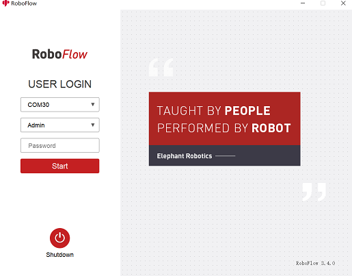

# 基础功能使用

## 1 RoboFlow
RoboFlow 操作系统是 大象协作型机器人 的操作系统，提供了人机交互界面（它的功能有坐标控制、角度控制、io控制、轨迹录制、夹爪控制等）。由于 RoboFlow 操作系统在已经内嵌在我们的机械臂系统中运行，用户可以利用屏幕或者远程连接作为载体，进行手动操作机器人、编程和其他操作。

## 2 RoboFlow首次使用

### 2.1 前提条件

- 检查机械臂完好无损坏
- 安装固定机械臂
- 连接电源适配器并提供合适的电压
- 连接可视化设备（显示器/PC远程连接）
- 连接键盘鼠标（连接显示器使用时）
- 急停开关处于打开状态

### 2.2 流程图

如图2-5所示即为程序编辑流程图。

 

图2- 5 程序编辑流程图

---
[← 上一页](../4-FirstInstallAndUse/4.3-Power-onTestGuide.md) | [下一页 → ](./5.2-ApplicationUse.md)