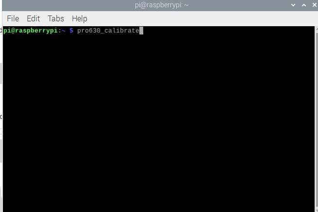

# RoboFlow

## 1 Log in to the system

When the system starts successfully, it will enter the login interface of the RoboFlow operating system as shown in Figure 2-6.

Figure 2- 6 Login interface

Select the login username "Admin" or other administrator username (only administrator rights are allowed to edit and debug the program), click the password box, and the pop-up window shown in Figure 2-7 will appear.

Figure 2- 7 Input keyboard

The default login password corresponding to the administrator user "Admin" is "elephant" (if you select another administrator username, enter the corresponding login password). Enter the password and click "OK" to return to the interface in Figure 2-6. Click "Login" again to log in successfully.

### 1.1 System power on

After successful login, you will enter the main menu interface as shown in Figure 2-8.

Figure 2- 8 Main Menu

In the main menu interface, select "Configuration Center" and you will enter the interface shown in Figure 2-9 (it has not yet been powered on).

Make sure the emergency stop knob is not pressed, and click the "Start Robot" button as shown in Figure 2-9. At this time, the interface will change, and the "Powering on" icon will appear as shown in Figure 2-10. If the power on is successful, the "normal" state shown in Figure 2-11 will appear. If it fails, check if any steps are missing.

After completing the previous step, click the "<Main Menu" button in the configuration center to return to the main menu.

Figure 2-9 Not powered on

Figure 2- 10 During power-on process

Figure 2- 11 Power-on completed

### 1.2 Create a new blank program

As shown in Figure 2-12, click "Write Program" and then select "Blank Program".

Figure 2- 12 Select “Blank Program”

After performing the previous step, you will enter the program editing interface as shown in Figure 2-13.

Figure 2- 13 Entering the program editing interface

### 1.3 Fast movement

As shown in Figure 2-13, click "Quick Move" and the window shown in 2-14 will pop up. The control methods are divided into Cartesian coordinate control and joint control. Moving motion modes include continuous motion and step motion.

Cartesian coordinate control refers to linear motion on the xyz axis. By clicking the button corresponding to the direction of the Cartesian coordinate system, you can control the robot to move along the direction of the Cartesian coordinate system. Note that before using Cartesian control, you need to ensure that the second joint and the third joint present a certain angle.

Joint control provides the buttons used by operators to manually operate the robot using visualization software and control the robot's joint movements. The control buttons of each joint are divided into 2 directions, and the angle data of each axis can be seen.

Figure 2- 14 Entering the fast movement interface

### 1.4 Add and edit instructions

As shown in Figure 2-15, add two waypoints: absolute point instructions, and teach two points (that is, use the rapid movement tool to manually operate the robot, control the robot to move to a certain posture, return, and click "Save Current Point". The teaching steps for the two points are the same. If you need to verify the saved point, long press the "Move to this point" button to manually control the robot to move to the teaching point.).  

Figure 2- 15 Program Editing

### 1.5 Debugging program

As shown in Figure 2-16, in addition to the "Next" and "Run" functions provided in the program running control bar, click "Advanced Functions" to enter the interface for more settings.

Among them, the "Next" function corresponds to executing the program step by step. Clicking once will only run one step. If you want to continue running, continue to click "Next". The "Run" function corresponds to automatically running the program once.

In "Advanced Functions", you can set the number of loop runs or infinite loop runs. You can also control whether the program runs in automatic running mode or manual running mode. "Next", "Run" and loop running are available in automatic run mode. Select "Manual Run Mode" on the interface shown in Figure 2-17, and then select "Run" or "Infinite Loop" in the loop run. You can enter the running interface in manual running mode as shown in Figure 2-16.

Figure 2- 16 Debugging program

Figure 2- 17 Manual mode debugging program

If you use manual mode to debug the program, you need to hold down the "Press Down" button to continue running. If you release the button, the program will pause, and if you press it again, it will continue running.

### 1.6 Free movement

As shown in Figure 2-18, click the free movement button, and you need to press and hold the end ATOM button to make the robot arm enter free movement mode. At this time, you can move joint one, shutdown two, joint three, joint four, joint five, and joint six, such as Figure 2-19.

Figure 2- 18 Free movement

Figure 2- 19 End ATOM button

### 1.7 Zero calibration

After we start the robotic arm, we can see the RoboFlow login interface, which means that our Raspberry Pi system starts normally.

We need to move the robotic arm freely, and the tick marks of each joint need to be aligned

Adjust the calibration positions of the six joints, and the robotic arm will be in the following posture

Move the mouse to the top of the interface, click the Terminal terminal in the upper left corner of the top menu bar, and enter pro630_calibrate in the terminal (if there is no menu bar, move the mouse to the top of the interface, the menu bar will be unhidden and displayed)

<!--  -->

After the calibration is completed, the following message will be printed, indicating that the calibration is successful. But at this time you can see that the RoboFlow software has been closed and needs to be restarted.

<!--  -->

The first way to restart the software is to restart the robotic arm system (just wait for the system to restart):

The second way to restart the software is to enter the command in the terminal to start:

Enter: elerob -l (note the lowercase L here)

Then open the Terminal terminal in the upper left corner of the motor and open another terminal interface.

Input: cd RoboFlow && ./RoboFlow (note that all are lowercase L here)

Finally successfully restarted the RoboFlow visual programming software

---
[← Previous page](./5-BasicApplication.md) | [Next page → ](../6-SDKDevelopment/6-SDKDevelopment.md)