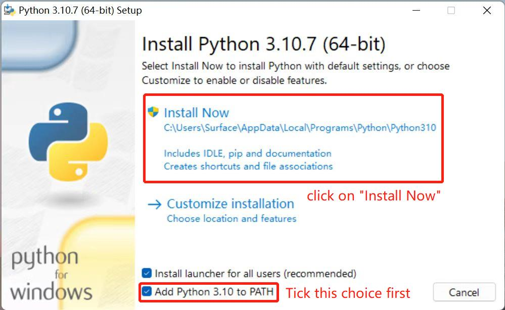
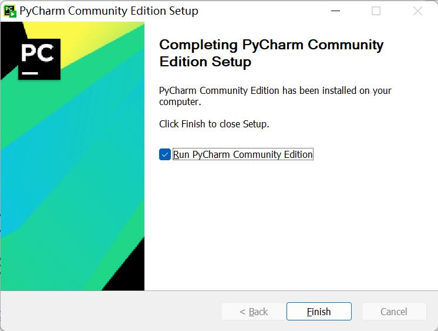

# Environment configuration

> pymycobot is a python library developed by Elephant Robot and is used for robot control.

## Linux

The system has Python 3.7 installed by default at the factory, and the `pymycobot` control library has been installed, so users do not need to install it themselves.

### pymycobot installation

You can install pymycobot by entering commands through the terminal
```shell
pip install pymycobot
```

### pymycobot uninstall

You can uninstall pymycobot by entering commands through the terminal

```shell
pip uninstall pymycobot
```

### pymycobot update

You can update pymycobot by entering commands through the terminal

```shell
pip install pymycobot -U
```

## Windows

### 1.1 Installing Python

> **Notice:** Before installation, check the operation system of PC. Press right button on the `My Computer` icon and  then select `Properties`. Install the corresponding Python.
>
> 
>
> 


* **Go to http://www.python.org/download/ to download Python.**
* **Click on `Downloads`, and then download begins. Tick `Add Python 3.10 to PATH`. Click on `Install Now`, and then installation begins.**





* **Download and installation complete.**

  


### 1.2 Running Python
Open the command prompt window (Win+R, input `cmd` and press `Enter`). Type `Python`.

**Successful Installation:**


This on-screen instruction means that Python is successfully installed. The prompt `>>>` means Python interactive environment. If you input a Python code to get the execution result immediately.


**Error Report:** 

If a wrong instruction is typed, for example "pythonn", the system may report an error.


> **Notice:** Generally, the error results from lack of environment configuration. Refer to **1.3 Environment Configuration** to solve problems.


### 1.3 Environment Variable Configuration 
Windows follows the path set by a Path environment variable in search of **python.exe** . Otherwise, an error will be reported. If you fail to tick `Add Python 3.9 to PATH` during installation, you need to manually add the path where python.exe is located into environment variable or download python again. Remember to tick `Add Python 3.9 to PATH` .

Follow the steps below to add python into environment variable manually.

* Right click on `My Computer` icon -->Properties ->Advanced System Settings ->Environment Variables


* The environment variables include user variables and system variables. For user variables, users can utilize their own downloaded programs via `cmd` command. Write the absolute path of the target program into the user variables.


* After the configuration, open the command prompt window (Win+R; input `cmd` and press `Enter`), and type `Python`.


### 2 Installation of PyCharm

PyCharm is a powerful python editor with the nature of cross-platform. Follow the steps below to download and install PyCharm.

Go to **[PyCharm](http://www.jetbrains.com/pycharm/download/#section=windows)** to download PyCharm.

#### 2.1 Download and Installation

Official website view:


It is recommended to install the free version.

* Click on `Next`:


* Select options according to your needs and then select `Next`:


* Tap `Install`:


* Installing:


* Tap `Finish`

  


#### 2.2 Create a new project

* Click `+New Project` :


*  The `Interpreter` is used to interpret python programs. Select  `Add Interpreter` ->`New`to add base interpreter.

  

  

* `Location` refers to the place where to save python file. Choose a file to put your programs.

  

* Click on `Create` and a sample appears:
  

* Right click on the selection that the red arrow points, and create a new python file.

  

* Type name for the new file.

  


### **3 Preparations**

* pymycobot installation. Type `pip install pymycobot --upgrade --user` via terminal (Win+R) `cmd` command.

  ```python
  pip install pymycobot --upgrade --user
  ```

  

  

* Source code installation. Open a terminal (Win+R, input `cmd` ), and type the command below to install.

  ```python
  git clone https://github.com/elephantrobotics/pymycobot.git <your-path>   
  #Fill in your installation address in <your-path>, do not choose the current default path.
  								
  cd <your-path>/pymycobot	
  #Go to the pymycobot folder of the downloaded package.
  
  #Run one of the following commands according to your python version.
  # Install
   python2 setup.py install	
  # or
   python3 setup.py install
  ```

* Update pymycobot

```bash
pip install pymycobot --upgrade
```


> **Notice:**
>
> 1. If no red wavy line appears below the codes, pymycobot is successfully installed.
> 2. if a red wavy line appears, got to the address **https://github.com/elephantrobotics/pymycobot** to download pymycobot manually and put it into python library.
>
> 


## Basic usage of Python

```python
from pymycobot import Phoenix

m = Phoenix()

m.start_robot()

print(m.get_angles())
```

----
[← System introduction](../../5-BasicApplication/README.md) | [Python API →](./6.1.2-ApplicationBasePython.md)