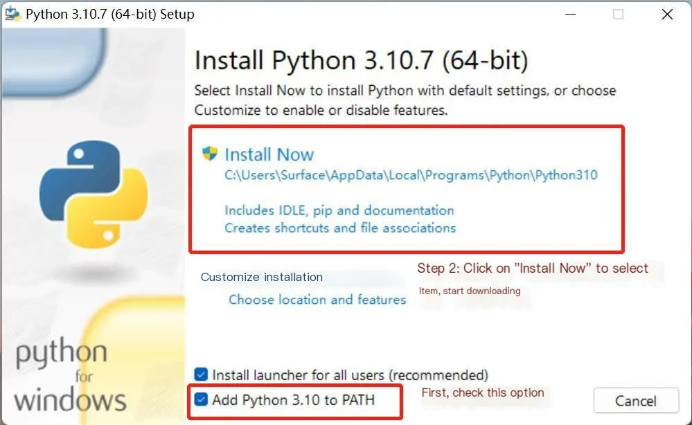
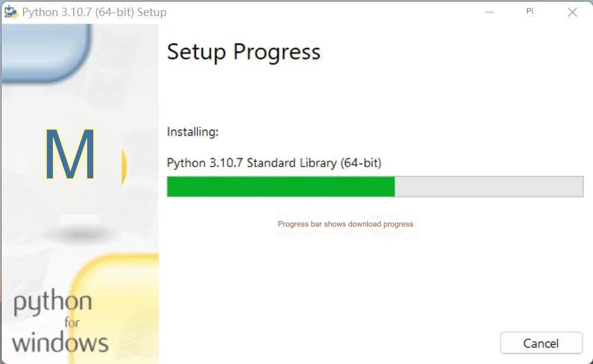
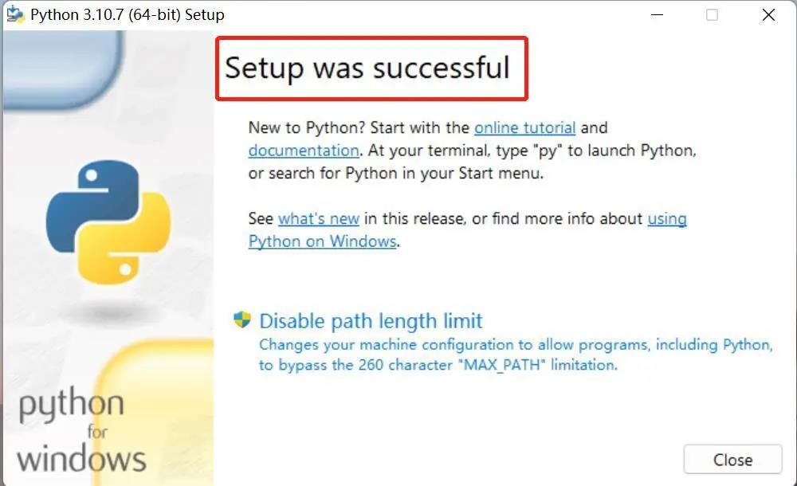
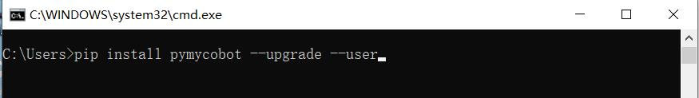

# **Developed based on Python API**
&ensp;&ensp;Elephant provides Python API to remotely control the robot. We use TCP protocol to communicate between the client and the robot, so before using our API, you need to follow the documentation and operate the following.

## **1 Environment setup**
### 1.1 Install Python


* **Python official download address: https://www.python.org/downloads/**
* **It is recommended to install version 3.7 and above**
* **Click the `Downloads` option to start downloading Python, click `Add Python 3.10 to PATH`, click `Install Now` to start installing Python**







* **The prompt "Setup was successful" appears, indicating that the installation is complete**




### 1.2 pymycobot installation
* pymycobot installation. Open a console terminal (shortcut key Win+R, enter cmd to enter the terminal), enter the following command and press the Enter key on the keyboard to install:

```python
pip install pymycobot --upgrade
```




## 2 **Enable TCP server function**


### **2.1 Log in to RoboFlow operating system**

&ensp;&ensp;After the robot is powered on, use VNC Viewer to enter the Raspberry Pi and log in to the RoboFlow operating system.
<div align=center></div>

### **2.2 Start the robot**
&ensp;&ensp;Enter the configuration center and click the Start Robot button
<div align=center></div>
<br>
<div align=center></div>
<br>
<div align=center></div>

### **2.3 Check whether the TCP server is open**
&ensp;&ensp;Return to the main menu, click Write Program, and then click the blank program. After entering the program editing interface, click the Configuration button, click the Network/Serial Port option, and check whether the TCP server is turned on. Normally, **TCP server is the default If it is turned on**, if it is not turned on, it needs to be turned on manually.

<div align=center></div>
<br>
<div align=center></div>
<br>
<div align=center></div>
<br>
<div align=center></div>

## 3 **Python API interface description**
### 3.1 ElephantRobot class instantiation
```
"Import ElephantRobot class from pymycobot library"
from pymycobot import ElephantRobot

"Connect to robot server"
elephant_client = ElephantRobot("192.168.137.182", 5001)

"Start TCP communication"
elephant_client.start_client()
```
**Using the Python API, you must first instance the ElephantRobot class before calling the functional functions of mycobot pro630**
- **Required parameters**:
&ensp;&ensp; **Parameter 1**: Actual IP address of the robot
&ensp;&ensp; **Parameter 2**: Robot port (**API function port is fixed at 5001**)
### 3.2 Function introduction
**def start_client()**:
- **Function**: Open TCP connection (**If you want to use Python API to control the robot, you must call this API**)
- **Parameters**: None
  
**def stop_client()**:
- **Function**: Close TCP connection
- **Parameters**: None

**def send_command(command)**:
- **Function**: Send instructions to the server
- **Parameter**: instruction (string type)

**def string_to_coords(data)**:
- **Function**: Convert string type data to list type data
- **Parameter**: String type data

**def string_to_double(data)**:
- **Function**: Convert string type data to double precision floating point data
- **Parameter**: String type data

**def string_to_int(data)**:
- **Function**: Convert string type data to integer type data
- **Parameter**: String type data
  
**def invalid_coords()**:
- **Function**: Return an invalid Cartesian coordinate to the server
- **Parameters**: None

**def get_angles()**:
- **Function**: Request the current joint angle information from the server
- **Parameters**: None

**def get_coords()**:
- **Function**: Request the current Cartesian pose information from the server
- **Parameters**: None
  
**def get_speed()**:
- **Function**: Request the robot movement rate from the server
- **Parameters**: None

**def _power_on()**:
- **Function**: Power on the robot
- **Parameters**: None

**def _power_off()**:
- **Function**: Power off the robot
- **Parameters**: None

**def check_running()**:
- **FEATURE**: Check if the bot is running
- **Parameters**: None

**def state_check()**:
- **Function**: Get robot status
- **Parameters**: None

**def read_next_error(data)**:
- **FEATURE**: Robot error detection
- **Parameters**: None
  
**def write_coords(coords,speed)**:
- **Function**: Send the overall coordinates and attitude to move the robot arm head from the original point to the designated point
- **Parameters**: Robot Cartesian pose (list type), robot arm movement speed: [0-6000]

**def write_coord(axis, value, speed)**:
- **Function**: Send a single coordinate value to the robot arm for movement
- **Parameters**: Cartesian position of the robot [0 represents x, 1 represents y, 2 represents z, 3 represents rx, 4 represents ry, 5 represents rz], the coordinate value to be reached, the speed of the robot arm movement: [ 0-6000]

**def write_angles(angles,speed)**:
- **Function**: Send all angles to all joints of the robotic arm
- **Parameters**: joint angle (list type), speed of robot arm movement: [0-5999]
  
**def write_angle(joint, value, speed)**:
- **Function**: Send the specified single joint motion to the specified angle
- **Parameters**: Specify the joint [0 represents j1, 1 represents j2, 2 represents j3, 3 represents j4, 4 represents j5, 5 represents j6], joint angle, and the speed of the robot arm movement: [0-5999]

**def set_speed(percentage)**:
- **FEATURE**: Set speed
- **Parameter**: target speed

**def set_carte_torque_limit(axis_str, value)**:
- **Function**: Set the torque limit of the robot
- **Parameters**: x/y/z/rx /ry/rz, torque
  
**def set_payload(payload)**:
- **FEATURE**: Set the robot's payload
- **Parameter**: Range 0.0 ~ 2.0

**def start_robot()**:
- **Function**: Turn on the robot enable
- **Parameters**: None

**def _state_off()**:
- **Function**: Disable Enable
- **Parameters**: None

**def task_stop()**:
- **Function**: Task Pause
- **Parameters**: None

**def jog_angle(joint_str, direction, speed)**:
- **Function**: Control the robot to continuously move at a specified angle
- **Parameter**: The joint of the robot arm [J1/J2/J3/J4/J5/J6], mainly controls the direction of movement of the robot arm [-1=negative direction, 0=stop, 1=positive direction], robot speed of movement

**def jog_coord(axis_str, direction, speed)**:
- **Function**: Control the robot to continuously move in the specified coordinate axis direction
- **Parameter**: Cartesian direction [x/y/z/rx/ry/rz], mainly controls the direction of movement of the robot arm [-1=negative direction, 0=stop, 1=positive direction], robot speed of movement
  
**def get_digital_in(pin_number)**:
- **Function**: Get input pin signal
- **Parameter**:Pin number [0 ~ 5 corresponds to the base electrical interface OUT 1 ~ 6; 16 ~ 17 corresponds to the end of the robot electrical interface OUT 1 ~ 2]

**def get_digital_out(pin_number)**:
- **Function**: Get output pin signal
- **Parameter**: Pin number [0 ~ 5 corresponds to the base electrical interface OUT 1 ~ 6; 16 ~ 17 corresponds to the end of the robot electrical interface OUT 1 ~ 2]

**def set_digital_out(pin_number, pin_signal)**:
- **Function**: Set output pin signal
- **Parameters**: Pin number [0 ~ 5 corresponds to the base electrical interface OUT 1 ~ 6; 16 ~ 17 corresponds to the end of the robot electrical interface OUT 1 ~ 2], pin status [0=low level, 1=high level]
  
**def get_acceleration()**:
- **Function**: Get the acceleration of the robot
- **Parameters**: None

**def set_acceleration(acceleration)**:
- **Function**: Set the acceleration of the robot
- **Parameter**: Acceleration

**def command_wait_done()**:
- **Function**: Wait until the last motion command is completed (**This API function must be added after all motion API functions**)
- **Parameters**: None

**def wait(seconds)**:
- **Function**: Waiting time (in seconds)
- **Parameters**: None
  
**def assign_variable(var_name, var_value)**:
- **Function**: Assign values to defined variables
- **Parameters**: variable name (string type), target value

**def get_variable(var_name)**:
- **Function**: Get the value of a variable
- **Parameter**: variable name (string type)

**def jog_relative(joint_id, angle, speed, mode)**:
- **Function**: relative movement from the current position to a certain coordinate axis direction, or relative movement from the current joint angle to a certain joint angle
- **Parameter**: relative movement direction or angle ['J1'——'J6', 'X', 'Y', 'Z', 'RX', 'RY', 'RZ'], relative movement distance or angle, movement speed, movement mode [0 or 1]

**def set_gripper_mode(mode)**:
- **Function**: set the adaptive gripper control mode
- **Parameter**: 0 or 1, 0 represents transparent mode, 1 represents IO control mode

**def set_gripper_calibrate()**:
- **Function**: calibrate the adaptive gripper servo potential value
- **Parameter**: None

**def set_gripper_state(state, speed)**:
- **Function**: set the adaptive gripper to be fully open or closed
- **Parameter**: 0 or 1 [0 for fully open, 1 for fully closed], speed [1-100]

**def set_gripper_value(value, speed)**:
- **Function**: Set the adaptive gripper opening stroke
- **Parameter**: Stroke [0-100], speed [1-100]

**def get_joint_current(joint)**:
- **Function**: Get the current of each joint
- **Parameter**: Joint [0-5]

**def force_get_firmware(ID)**:
- **Function**: Obtain the firmware version of the force control gripper
- **Parameter**: Claw ID [1-254]

**def force_get_modified(ID)**:
- **Function**: Obtain the updated firmware version of the force control gripper
- **Parameter**: Claw ID [1-254]

**def force_set_id(ID, value)**:
- **Function**: Set the ID of the force control gripper
- **Parameter**: Claw ID [1-254], modify value [1-254]

**def force_get_id(ID)**:
- **Function**: Obtain the ID of the force control gripper
- **Parameter**: Claw ID [1-254]

**def force_set_enabled(ID, value)**:
- **Function**: Set force control gripper enable
- **Parameter**: Claw ID [1-254], enable value [0 or 1, 0 represents disable, 1 represents enable]

**def force_set_angle(ID, value)**:
- **Function**: Set the motion angle of the force control gripper
- **Parameter**: Claw ID [1-254], angle [0-100]

**def force_get_angle(ID)**:
- **Function**: Obtain the motion angle of the force control gripper
- **Parameter**: Claw ID [1-254]

**def force_get_angle(ID)**:
- **Function**: Obtain the motion angle of the force control gripper
- **Parameter**: Claw ID [1-254]

**def force_get_gripper(ID)**:
- **Function**: Obtain the motion status of the force control gripper
- **Parameter**: Claw ID [1-254]

**def force_set_torque(ID，value)**:
- **Function**: Set the torque of the force control gripper
- **Parameter**: Claw ID [1-254], torque [0-100]

**def force_get_torque(ID)**:
- **Function**: Obtain torque of force control gripper
- **Parameter**: Claw ID [1-254]

**def force_set_open(ID，value)**:
- **Function**: Set the opening angle of the force control gripper IO
- **Parameter**: Claw ID [1-254], angle [0-100]

**def force_set_close(ID，value)**:
- **Function**: Set the closing angle of the force control gripper IO
- **Parameter**: Claw ID [1-254], angle [0-100]

**def force_set_speed(ID，value)**:
- **Function**: Set the movement speed of the force control gripper
- **Parameters**: Claw ID [1-254], Speed [0-100]

**def force_get_speed(ID)**:
- **Function**: Set the movement speed of the force control gripper
- **Parameter**: Claw ID [1-254]

**def force_get_open(ID)**:
- **Functio**: Obtain the opening angle of the force control gripper IO
- **Paramete**: Claw ID [1-254]

**def force_get_close(ID)**:
- **Function**: Obtain the closing angle of the force control gripper IO
- **Parameter**: Claw ID [1-254]

**def force_set_absangle(ID，value)**:
- **Function**: Set the absolute angle of the force control gripper
- **Parameter**: Claw ID [1-254], angle [0-100]

**def force_set_absangle(ID，value)**:
- **Function**: Set the absolute angle of the force control gripper
- **Parameter**: Claw ID [1-254], angle [0-100]

**def hand_get_modified(ID)**:
- **Function**: Get updated versions of the three finger dexterous hand
- **Parameter**: Claw ID [1-254]

**def hand_set_id(ID，value)**:
- **Function**: Set three finger dexterous hand ID
- **Parameter**: Claw ID [1-254], modify value [1-254]

**def hand_get_id(ID)**:
- **Function**: Read the ID of a three finger dexterous hand
- **Parameter**: Claw ID [1-254]

**def hand_set_enabled(ID，value)**:
- **Function**: Set three commands to enable
- **Parameter**: Claw ID [1-254], enable [0 or 1, 0 not enabled, 1 enabled]

**def hand_set_joint_angle(ID，jiont，value)**:
- **Function**: Set single joint movement of three finger dexterous hand
- **Parameters**: 
  - Claw ID [1-254]
  - Joint [1-6]
  - Angle:    
    - Joint 1: Range 0~60°
    - Joint 2: Range 0~100°
    - Joint 3: Range 0~100°
    - Joint 4: Range 0~100°
    - Joint 5: Range 0~37°
    - Joint 6: Range 0~37°

**def hand_get_joint_angle(ID，jiont，value)**:
- **Function**: Read the joint angle of a three finger dexterous hand
- **Parameters**: Claw ID [1-254], Joint [1-6]

**def hand_set_joint_calibrate(ID，jiont)**:
- **Function**: Set three finger dexterous hand joint calibration
- **Parameters**: Claw ID [1-254], Joint [1-6]

**def hand_get_state(ID)**:
- **Function**: Obtain the movement status of the three finger dexterous hand
- **Parameter**: Claw ID [1-254]

**def hand_set_torque(ID，jiont，value)**:
- **Function**: Set three finger dexterous hand torque
- **Parameters**: Claw ID [1-254], Joint [1-6], Torque [0-100]

**def hand_get_torque(ID，jiont)**:
- **Functio**: Obtain three finger dexterous hand torque
- **Parameter**: Claw ID [1-254], Joint [1-6]

**def hand_set_speed(ID，jiont，value)**:
- **Function**: Set the speed of the three finger dexterous hand
- **Parameters**: Claw ID [1-254], Joint [1-6], Speed [0-100]

**def hand_get_speed(ID，jiont)**:
- **Function**: Obtain the speed of a three finger dexterous hand
- **Parameters**: Claw ID [1-254], Joint [1-6]

**def hand_set_fullangles(ID，angles, speed)**:
- **Function**: Set the full joint movement of the three finger dexterous hand
- **Parameters**: Claw ID [1-254], angle [{0,0,0,0,0,0}, range 0-100], velocity [0-100]

**def hand_get_fullangles(ID)**:
- **Function**: Obtain the total joint angle of a three finger dexterous hand
- **Parameter**: Claw ID [1-254]

**def hand_set_catch(ID，pose, value, num=0)**:
- **Function**: Set three finger dexterous hand gesture movements
- **Parameters**: Claw ID [1-254], mode [0-4], threshold [0-5, threshold [0-20]] when mode is 4, idle flag [When the num parameter is added to the function, the joint of the gesture motion will move along with other joints, and only the joint of the corresponding mode will move without the num parameter]

**def hand_get_model(ID)**:
- **Function**: Obtain three finger dexterity type
- **Parameter**: Claw ID [1-254]

**def get_end_firmware()**:
- **Function**: Obtain the firmware version of the 630 terminal ATOM
- **Parameter**: None

**def get_end_modify()**:
- **Function**: Obtain the updated firmware version of the 630 terminal ATOM
- **Parameter**: None

**def get_end_bt_status()**:
- **Function**: Retrieve the button status of the 630 terminal ATOM firmware
- **Parameter**: None

---
[← Previous page](../6-SDKDevelopment.md) | [Next page →](./python_demo.md)
