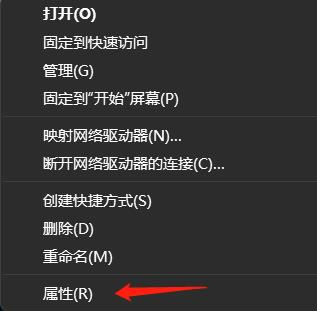
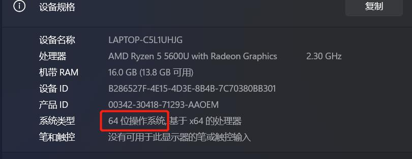

# **基于Python API开发**
&ensp;&ensp;大象提供了Python API来远程控制机器人，我们使用TCP协议来在客户端和机器人之间进行通信，因此在使用我们的API之前，您需要按照文档操作以下内容。

## **1 环境搭建**
### 1.1 安装Python

<!-- > **注意：**安装之前，请先确认您的电脑是64位还是32位。右键点击`我的电脑`，选择`属性`。如下图显示是64位的操作系统，所以选择64位的Python安装包。
>
> 
>
>  -->


* **Python官方下载地址： https://www.python.org/downloads/**
* **建议安装3.7及以上版本**
* **点击`Downloads`选项，开始下载Python，点击`Add Python 3.10 to PATH`,点击`Install Now`，开始安装Python**


* **出现“Setup was successful”提示，说明安装完成**


<!-- ### 1.2 运行Python
安装成功后，打开命令提示符窗口（Win+R，输入cmd回车），敲入`python`后，会出现两种情况。

**情况一：**


出现图片中的提示表示Python安装成功。

出现提示符`>>>` 就表示我们已经在Python交互式环境中了，可以输入任何Python代码，回车后会立刻得到执行结果。

**情况二：** 

假如输入错误（比如输入pythonn），则会出现错误提示：


>  **注意：**出现错误的信息一般都是没有配置环境变量导致的，可以参考**1.3 配置环境变量**修改环境变量。


### 1.3 配置环境变量
由于Windows会根据一个Path的环境变量设定的路径去查找python.exe，如果没找到，就会报错。因此，如果安装时漏掉了勾选`Add Python 3.10 to PATH`，则需要手动把python.exe所在的路径添加到Path中，或者重新安装一遍Python，记得勾选上`Add Python 3.10 to PATH`选项即可。

以下是手动添加python.exe所在的路径步骤。

* 右键我的电脑–>选择属性–>选择高级系统设置–>选择右下角的环境变量：


* 环境变量主要有包括用户变量和系统变量，需要设置的环境变量就在这两个变量中。如下图所示：


* 用户变量是将自己的下载的程序可以在cmd命令中使用。把程序的绝对路径写到用户变量中即可使用，如下图所示：


* 以上步骤完成后，打开命令提示符窗口（Win+R，再输入cmd，回车），敲入Python，出现下图中的提示表示成功：

 -->

### 1.2 pymycobot安装
* pymycobot安装。打开一个控制台终端(快捷键Win+R,输入cmd进入终端)，输入以下命令后按键盘回车键进行安装：

```python
pip install pymycobot --upgrade 
```


## 2 **开启TCP服务器功能**


### **2.1登录RoboFlow操作系统**

&ensp;&ensp;机器人上电开机后，使用VNC Viewer进入树莓派，登录RoboFlow操作系统
<div align=center></div>

### **2.2启动机器人**
&ensp;&ensp;进入配置中心，点击启动机器人按钮
<div align=center></div>
<br>
<div align=center></div>
<br>
<div align=center></div>

### **2.3检查TCP服务器是否开启**
&ensp;&ensp;返回主菜单，点击编写程序后，再点击空白程序，进入程序编辑界面后，点击配置按钮，点击网络/串口选项,检查TCP服务器是否开启，通常情况下，**TCP服务器是默认开启的**，若未开启，则需手动开启

<div align=center></div>
<br>
<div align=center></div>
<br>
<div align=center></div>
<br>
<div align=center></div>

## 3 **Python API接口说明**
### 3.1 ElephantRobot类实列化
```
"从pymycobot库导入ElephantRobot类"
from pymycobot import ElephantRobot

"连接机器人服务器"
elephant_client = ElephantRobot("192.168.137.182", 5001)

"开始TCP通信"
elephant_client.start_client()
```
**使用Python API必须先将ElephantRobot类实例后才可调用mycobot pro630的功能函数**
- **必填参数**：
&ensp;&ensp;  **参数1**：机器人实际IP地址
&ensp;&ensp;  **参数2**：机器人端口（**API函数端口固定为5001**）
### 3.2功能函数介绍
**def start_client()**:
- **功能**：开启TCP连接（**若要使用Python API控制机器人，必须调用此API**）
- **参数**：无
  
**def stop_client()**:
- **功能**：关闭TCP连接
- **参数**：无

**def send_command(command)**:
- **功能**：发送指令给服务器
- **参数**：指令(字符串类型)

**def string_to_coords(data)**:
- **功能**：字符串类型数据转列表类型数据
- **参数**：字符串类型数据

**def string_to_double(data)**:
- **功能**：字符串类型数据转双精度浮点型数据
- **参数**：字符串类型数据

**def string_to_int(data)**:
- **功能**：字符串类型数据转整型数据
- **参数**：字符串类型数据
  
**def invalid_coords()**:
- **功能**：给服务器返回一个无效的笛卡尔坐标
- **参数**：无

**def get_angles()**:
- **功能**：向服务器请求当前各个关节角度信息
- **参数**：无

**def get_coords()**:
- **功能**：向服务器请求当前笛卡尔位姿信息
- **参数**：无
  
**def get_speed()**:
- **功能**：向服务器请求机器人运动速率
- **参数**：无

**def power_on()**:
- **功能**：机器人上电
- **参数**：无

**def power_off()**:
- **功能**：机器人下电
- **参数**：无

**def check_running()**:
- **功能**：检查机器人是否在运行
- **参数**：无

**def state_check()**:
- **功能**：获取机器人状态
- **参数**：无

**def read_next_error(data)**:
- **功能**：机器人错误检测
- **参数**：无
  
**def write_coords(coords,speed)**:
- **功能**：发送整体坐标和姿态,让机械臂头部从原来点移动到指定点
- **参数**：机器人笛卡尔位姿（列表类型），机械臂运动的速度:[0-6000]

**def write_coord(axis, value, speed)**:
- **功能**：发送单个坐标值给机械臂进行移动
- **参数**：机器人笛卡尔位置[0代表x,1代表y,2代表z,3代表rx,4代表ry,5代表rz]，要到达的坐标值，机械臂运动的速度:[0-6000]

**def write_angles(angles,speed)**:
- **功能**：发送所有角度给机械臂所有关节
- **参数**：关节角度(列表类型)，机械臂运动的速度:[0-5999]
  
**def write_angle(joint, value, speed)**:
- **功能**：发送指定的单个关节运动至指定的角度
- **参数**：指定关节[0代表j1,1代表j2,2代表j3,3代表j4,4代表j5,5代表j6],关节角度,机械臂运动的速度:[0-5999]

**def set_speed(percentage)**:
- **功能**：设置速度
- **参数**：目标速度

**def set_carte_torque_limit(axis_str, value)**:
- **功能**：设置机器人的扭矩限制
- **参数**：x/y/z/rx /ry/rz,扭矩
  
**def set_payload(payload)**:
- **功能**：设置机器人的有效负载
- **参数**：范围 0.0 ~ 2.0

**def state_on()**:
- **功能**：启动系统
- **参数**：无

**def state_off()**:
- **功能**：关闭系统
- **参数**：无

**def task_stop()**:
- **功能**：任务暂停
- **参数**：无

**def jog_angle(joint_str, direction, speed)**:
- **功能**： 控制机器人按照指定的角度持续移动
- **参数**：机械臂的关节[J1/J2/J3/J4/J5/J6]，主要控制机器臂移动的方向[-1=负方向 ，0=停止，1=正方向]，机器人运动的速度

**def jog_coord(axis_str, direction, speed)**:
- **功能**： 控制机器人按照指定的坐标轴方向持续移动
- **参数**：笛卡尔的方向[x/y/z/rx/ry/rz],主要控制机器臂移动的方向[-1=负方向 ，0=停止，1=正方向],机器人运动的速度
  
**def get_digital_in(pin_number)**:
- **功能**：获取输入引脚信号
- **参数**：引脚序号[0 ~ 5 对应底座电气接口 OUT 1 ~ 6 ; 16 ~ 17 对应机械臂末端电气接口 OUT 1 ~ 2]

**def get_digital_out(pin_number)**:
- **功能**：获取输出引脚信号
- **参数**：引脚序号[0 ~ 5 对应底座电气接口 OUT 1 ~ 6 ; 16 ~ 17 对应机械臂末端电气接口 OUT 1 ~ 2]

**def set_digital_out(pin_number, pin_signal)**:
- **功能**：设置输出引脚信号
- **参数**：引脚序号[0 ~ 5 对应底座电气接口 OUT 1 ~ 6 ; 16 ~ 17 对应机械臂末端电气接口 OUT 1 ~ 2]，引脚状态[0=低电平，1=高电平]
  
**def get_acceleration()**:
- **功能**：获取机器人的加速度
- **参数**：无

**def set_acceleration(acceleration)**:
- **功能**：设置机器人的加速度
- **参数**：加速度

**def command_wait_done()**:
- **功能**：等待到上一个运动命令完成为止
- **参数**：无

**def wait(seconds)**:
- **功能**：等待时长(以秒为单位)
- **参数**：无
  
**def assign_variable(var_name, var_value)**:
- **功能**：给定义好的变量赋值
- **参数**：变量名（字符串类型）,目标值

**def get_variable(var_name)**:
- **功能**：获取一个变量的值
- **参数**：变量名（字符串类型）

**def jog_relative(joint_id, angle, speed, mode)**:
- **功能**：以当前位置往某个坐标轴方向进行相对运动，或是以当前关节角度往某个关节的角度进行相对运动
- **参数**：相对运动的方向或角度['J1'——'J6', 'X', 'Y', 'Z', 'RX', 'RY', 'RZ'],相对移动的距离或角度,移动速度,运动模式[0 或 1 ]

**def set_gripper_mode(mode)**:
- **功能**：设置自适应夹爪控制模式
- **参数**：0或1，0代表透传模式，1代表IO控制模式

**def set_gripper_calibrate()**:
- **功能**：校准自适应夹爪舵机电位值
- **参数**：无

**def set_gripper_state(state, speed)**:
- **功能**：设置自适应夹爪完全张开或闭合
- **参数**：0或1[0代表完全张开，1代表完全闭合],速度[1-100]

**def set_gripper_value(self, value, speed)**:
- **功能**：设置自适应夹爪张开行程
- **参数**：行程[0-100],速度[1-100]

<!-- **def get_variable(var_name)**:
- **功能**：获取一个变量的值
- **参数**：变量名（字符串类型） -->


---
[← 上一页](../6-SDKDevelopment.md) | [下一页 → ](./python_demo.md)