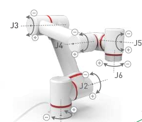

# **Python API use case**
Before using the python API, you need to confirm the robot's IP address: enter ifconfig in the robot terminal to obtain


## 1 Robot enable control

### 1.1 Robot enable
```python
from pymycobot import ElephantRobot
import time
if __name__=='__main__':

    "Change the ip to the real ip of the P600 Raspberry Pi"
    
    elephant_client = ElephantRobot("192.168.10.158", 5001)
    
    "Necessary instructions to start the robot"
    
    elephant_client.start_client()
    
    "Turn off the robot enable first"
    
    elephant_client.state_off()
    
    time.sleep(3)
    
    "Power on the robot"
    
    elephant_client.power_on()
    time.sleep(3)
    
    "Power on the robot"
    elephant_client.power_on()
    time.sleep(3)
```

### 1.2 Robot shutdown
```python
from pymycobot import ElephantRobot
import time
if __name__=='__main__':

    "Change the ip to the real ip of the P600 Raspberry Pi"
    elephant_client = ElephantRobot("192.168.10.158", 5001)
    
    "Necessary instructions to start the robot"
    elephant_client.start_client()
    
    "Turn off the robot"
    elephant_client.state_off()
    time.sleep(3)

```
### 1.3 Robot only power on
```python
from pymycobot import ElephantRobot
import time
if __name__=='__main__':

    "Change the IP address to the real IP address of the P600 Raspberry Pi"
    
    elephant_client = ElephantRobot("192.168.10.158", 5001)
    
    "Necessary commands to start the robot"
    
    elephant_client.start_client()
    
    "Power on the robot"
    
    elephant_client.power_on()
    
    time.sleep(3)

```

### 1.4 Power off the robot only

```python

from pymycobot import ElephantRobot
import time
if __name__=='__main__':

    "Change the IP address to the real IP address of the P600 Raspberry Pi"
    
    elephant_client = ElephantRobot("192.168.10.158", 5001)
    
    "Necessary commands to start the robot"
    
    elephant_client.start_client()
    
    "Power off the robot"
    
    elephant_client.power_off()
    time.sleep(3)
    
```

## 2 Joint control
&ensp;&ensp;After using VNC Viewer to enter the RoboFlow system, in the fast movement interface, you can use joint control to control the robot to reach the target position, and then record the angles of the robot's six joints displayed on the operation panel
<div align=center></div>

### 2.1 Single joint control
```python
from pymycobot import ElephantRobot

if __name__=='__main__':
    "Change the IP to the real IP of the P600 Raspberry Pi"
    
    elephant_client = ElephantRobot("192.168.10.158", 5001)
    
    "Necessary instructions to start the robot"
    
    elephant_client.start_client()
    
    "Fill in the angle of a single joint to be controlled. The first parameter 0 is the first axis, and so on; the second parameter indicates the joint angle; the third parameter indicates the movement speed"
    elephant_client.write_angle(0,94.828,1000)
    
    "Wait for the robot to move to the target position before executing subsequent instructions"
    elephant_client.command_wait_done()

```

### 2.2 Multi-joint control
```python
from pymycobot import ElephantRobot

if __name__=='__main__':
    "Change the IP to the real-time IP of the P600 Raspberry Pi"
    
    elephant_client = ElephantRobot("192.168.10.158", 5001)
    
    "Start the necessary instructions for the robot"
    
    elephant_client.start_client()
    
    "Fill in the 6 recorded joint angles in the list, and the last parameter is the movement speed,Need to change to the joint angle you set"
    elephant_client.write_angles([94.828,-143.513,135.283,-82.969,-87.257,-44.033],1000)
    
    "Wait for the robot to move to the target position before executing subsequent instructions"
    
    elephant_client.command_wait_done()

```

### 2.3 Joint angle acquisition
```python
from pymycobot import ElephantRobot

if __name__=='__main__':
    "Change the IP to the real IP of the P600 Raspberry Pi"
    
    elephant_client = ElephantRobot("192.168.10.158", 5001)
    
    "Start the robot necessary instructions"
    
    elephant_client.start_client()
    
    "Print the robot's current 6 joint angle information"
    print(elephant_client.get_angles())

```

### 2.4 Robot joints return to zero position
```python
from pymycobot import ElephantRobot

if __name__=='__main__':
    "Change the ip to the real-time ip of the P600 Raspberry Pi"
    
    elephant_client = ElephantRobot("192.168.10.158", 5001)
    
    "Start the robot necessary instructions"
    
    elephant_client.start_client()
    
    "Fill in 6 joint zero angles in the list, and the last parameter is the movement speed"
    
    elephant_client.write_angles([0,-90,0,-90,0,0],1000)
    
    "Wait for the robot to move to the target position before executing subsequent instructions"
    
    elephant_client.command_wait_done()
    
```

## 3 Coordinate Control
&ensp;&ensp;It is mainly used to realize intelligent route planning to allow the robot arm to move from one position to another specified position. Divided into [x, y, z, rx, ry, rz], where [x, y, z] represents the position of the end of the robot in space (the coordinate system is a rectangular coordinate system), and [rx, ry, rz] represents the posture of the end of the robot at that point (the coordinate system is an Euler coordinate system)
&ensp;&ensp;After using VNC Viewer to enter the RoboFlow system, in the fast movement interface, you can control the robot to the target position through Cartesian coordinates, and record the 6 coordinate values ​​of the robot displayed on the operation panel
<div align=center></div>

To use coordinate control, you need to first use joint motion to adjust the robot arm to the posture shown in the figure below to avoid singularity points that cause the robot arm to be unable to perform actions


### 3.1 Single parameter coordinate control
```python
from pymycobot import ElephantRobot

if __name__=='__main__':
    "Change the ip to the real-time ip of the P600 Raspberry Pi"
    elephant_client = ElephantRobot("192.168.10.158", 5001)
    
    "Necessary commands to start the robot"
    
    elephant_client.start_client()
    
    "Fill in the parameters, the 2 in the first parameter represents the Z axis direction, and so on; the second parameter represents the coordinate value; the third parameter represents the movement speed"
    
    elephant_client.write_coord(2,94.828,3000)
    
    "Wait for the robot to move to the target position before executing subsequent commands"
    
    elephant_client.command_wait_done()
    
```

### 3.2 Multi-parameter coordinate control
```python
from pymycobot import ElephantRobot

if __name__=='__main__':

    "Change the ip to the real-time ip of the P600 Raspberry Pi"
    
    elephant_client = ElephantRobot("192.168.10.158", 5001)
    
    "Start the robot necessary instructions"
    elephant_client.start_client()
    
    "Fill in the 6 recorded coordinate values ​​in the list, the last parameter is the movement speed,need to change to the posture you set"
    elephant_client.write_coords([-130.824,256.262,321.533,176.891,-0.774,-128.700], 3000)
    
    "Wait for the robot to move to the target position before executing subsequent instructions"
    elephant_client.command_wait_done()

```

### 3.3 Cartesian coordinate acquisition
```python
from pymycobot import ElephantRobot

if __name__=='__main__':
    "Change the ip to the real-time ip of the P600 Raspberry Pi"
    
    elephant_client = ElephantRobot("192.168.10.158", 5001)
    
    "Necessary instructions for starting the robot"
    
    elephant_client.start_client()
    
    "Print out the current Cartesian space coordinate information of the robot"
    
    elephant_client.get_coords()

```
## 4 **IO control**

### 4.1 **Set the output status of the IO pin**

```python
from pymycobot import ElephantRobot

if __name__=='__main__':

    "Change the ip to the real ip of the P600 Raspberry Pi"
    
    elephant_client = ElephantRobot("192.168.10.158", 5001)
    
    "Necessary instructions for starting the robot"
    
    elephant_client.start_client()

    "Pin numbers 0 to 5 correspond to the base electrical interface OUT 1 to 6; 16 to 17 correspond to the end of the robot electrical interface OUT 1 to 2"
    "Control the robot OUT1 output to high level"
    
    elephant_client.set_digital_out(0,1)
    
    "The robot will delay for 3 seconds before executing the following program"
    
    elephant_client.wait(3)
    
    "Control the robot OUT1 output to low level"
    elephant_client.set_digital_out(0,0)
    
    "The robot will delay for 3 seconds before executing the following program"
    elephant_client.wait(3)

```
### 4.2 **Get the output status of the IO pin**
```python
from pymycobot import ElephantRobot

if __name__=='__main__':
    "Change the ip to the real ip of the P600 Raspberry Pi"
    
    elephant_client = ElephantRobot("192.168.10.158", 5001)
    
    "Start the robot necessary instructions"
    
    elephant_client.start_client()
    
    "Pin numbers 0 to 5 correspond to the base electrical interface OUT 1 to 6; 16 to 17 correspond to the end of the robot electrical interface OUT 1 to 2"

    "Get the robot OUT1 output status"
    elephant_client.get_digital_out(0)
    
    "The robot will delay for 0.5 seconds before executing the following program"
    
    elephant_client.wait(0.5)

```
### 4.3 **Get the input status of the IO pin**
```python
from pymycobot import ElephantRobot

if __name__=='__main__':
    "Change the ip to the real ip of the P600 Raspberry Pi"
    
    elephant_client = ElephantRobot("192.168.10.158", 5001)
    
    "Start the robot necessary instructions"
    
    elephant_client.start_client()
    
    "Pin numbers 0 to 5 correspond to the base electrical interface OUT 1 to 6; 16 to 17 correspond to the end of the robot electrical interface OUT 1 to 2"

    "Get the robot IN1 input status,low level is valid,That is, when GND is connected to the input terminal, feedback is 1, and in other states, feedback is 0"
    elephant_client.get_digital_in(0)
    
    "The robot will delay for 0.5 seconds before executing the following program"
    
    elephant_client.wait(0.5)

```

## 5 Adaptive gripper control

```python
from pymycobot import ElephantRobot
import time
if __name__=='__main__':
    "Change the ip to the real ip of the P600 Raspberry Pi"
    
    elephant_client = ElephantRobot("192.168.10.158", 5001)
    
    "Start the robot necessary instructions"
    
    elephant_client.start_client()
    
    time.sleep(1)
    
    "Set the gripper to transparent mode"
    
    elephant_client.set_gripper_mode(0)
    
    time.sleep(1)
    
    "Gripper fully open"
    
    elephant_client.set_gripper_state(0,100)
    
    time.sleep(2)
    
    "Gripper fully closed"
    
    elephant_client.set_gripper_state(1,100)
    
    time.sleep(2)
    
    "Open the gripper to the specified stroke, here open to half of the gripper stroke"
    elephant_client.set_gripper_value(50,100)
    time.sleep(2)
```
## 6 Relative motion

```python
from pymycobot import ElephantRobot
import time
if __name__=='__main__':
    "Change the ip to the real-time ip of the P600 Raspberry Pi"
    elephant_client = ElephantRobot("192.168.10.158", 5001)
    
    "Start the robot necessary instructions"
    elephant_client.start_client()
    time.sleep(1)
    
    "The robot moves 50mm in the positive direction of the Z direction at the current coordinate position"
    elephant_client.jog_relative("Z",50,1500,1)
    
    "Wait for the robot to move to the target position before executing subsequent instructions"
    elephant_client.command_wait_done()
    
    "The robot increases the current J6 joint angle by 10 degrees"
    
    elephant_client.jog_relative("J6",10,1500,0)
    
    "Wait for the robot to move to the target position before executing subsequent instructions"
    
    elephant_client.command_wait_done()

```

## 7 Robot gripper carrying wood block example
```python
from pymycobot import ElephantRobot
import time
if __name__=='__main__':
    "Change the IP to the real IP of the P600 Raspberry Pi"
    
    elephant_client = ElephantRobot("192.168.137.182", 5001)
    
    "Start the robot necessary instructions"
    
    elephant_client.start_client()
    
    time.sleep(1)
    
    "Set the gripper to transparent mode"
    
    elephant_client.set_gripper_mode(0)
    
    time.sleep(1)
    
    "The gripper is fully open"
    elephant_client.set_gripper_state(1,100)
    time.sleep(1)
    
    for i in range (1):
        "The robot joint moves to a safe point,, need to change to the joint angle you set"
        elephant_client.write_angles([94.828,-143.513,135.283,-82.969,-87.257,-44.033],1000)
        "Wait for the robot to move to the target position before executing subsequent instructions"
        elephant_client.command_wait_done()
        
        "The robot Cartesian moves to the transition point of palletizing and grabbing,need to change to the posture you set"
        elephant_client.write_coords([-130.824,256.262,321.533,176.891,-0.774,-128.700], 3000)
        elephant_client.command_wait_done()
        
        "The robot moves 100mm in the negative direction of the Z axis at the current coordinate position and reaches the wood block grabbing position"
        elephant_client.jog_relative("Z",-100,1500,1)
        elephant_client.command_wait_done()
        
        "Control the gripper to close to 30mm"
        elephant_client.set_gripper_value(30,100)
        "Control the robot to wait for 1 second before moving"
        elephant_client.wait(1)
        
        "The robot moves 100mm in the positive direction of the Z axis at the current coordinate position and reaches the transition point for grabbing the wood block"
        elephant_client.jog_relative("Z",100,1500,1)
        elephant_client.command_wait_done()
        
        "The robot moves 300mm in the positive direction of the Y axis at the current coordinate position and reaches the transition point for placing the wood block"
        elephant_client.jog_relative("Y",300,1500,1)
        elephant_client.command_wait_done()
        
        "The robot moves 100mm in the negative direction of the Z axis at the current coordinate position and reaches the wooden block placement position"
        elephant_client.jog_relative("Z",-100,1500,1)
        elephant_client.command_wait_done()
        
        "Control the gripper to fully open"
        elephant_client.set_gripper_value(100,100)
        "Control the robot to wait for 1 second before moving"
        elephant_client.wait(1)
        
        "The robot moves 100mm in the positive direction of the Z axis at the current coordinate position and reaches the transition point for placing the wooden block"
        elephant_client.jog_relative("Z",100,1500,1)
        elephant_client.command_wait_done()
        
        "The robot joint moves to a safe point"
        elephant_client.write_angles([94.828,-143.513,135.283,-82.969,-87.257,-44.033],1000) 
        elephant_client.command_wait_done() 
```
---
[← Previous page](./python_demo.md) | [Next page →](../../11-ApplicationBaseROS/11.1-ROS1/README.md)