# 2.5D二维码分拣套件
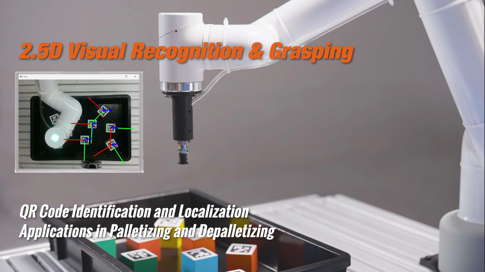


## 1 套件硬件介绍
### 1.1 MyCobot Pro630机械臂


## 1.1 RealSense D435

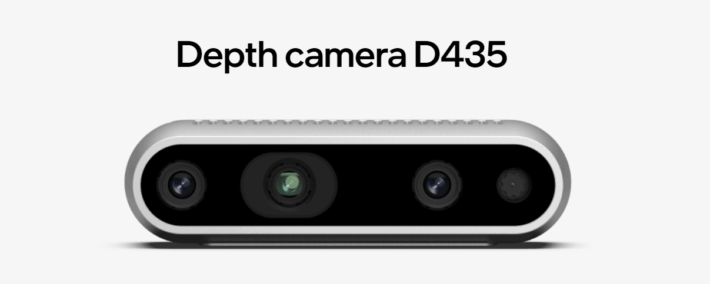

## 2 realsense软件环境搭建
### 2.1 下载RealSense SDK 2.0
[进入网址](https://github.com/IntelRealSense/librealsense/releases/tag/v2.50.0)

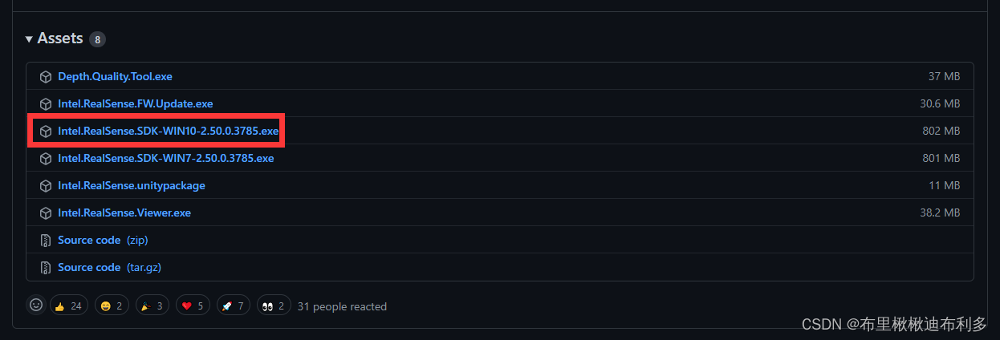
下载完成后文件夹内有如下图所示软件，直接安装即可。

### 2.2 测试RealSense D435
打开RealSense Viewer。
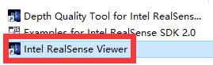

将赠送的usb3.0线连接到电脑上，一定要是usb3.0的插口！！！！如果是3.0插口和线，那么在Viewer界面左侧就如下图所示。接下来只要将Stereo Module和RGB Camera的off设置成on即可。

将off设置成on后，就会出现如下图所示界面。测试成功后，即可以关闭该软件


## 3 Pyhton 环境搭建
### 3.1 下载python
[下载地址](https://www.python.org/downloads/windows/)

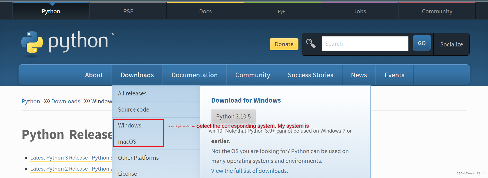

选择你要安装的版本,推荐安装3.7以上版本
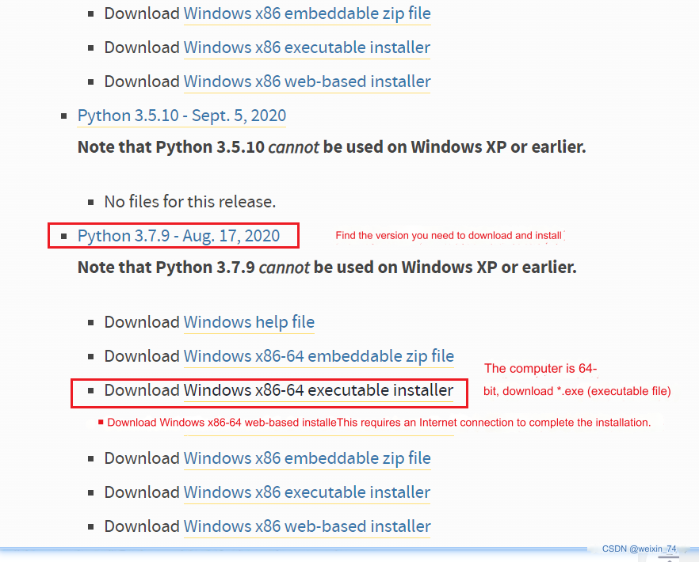

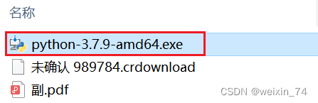

双击安装包后
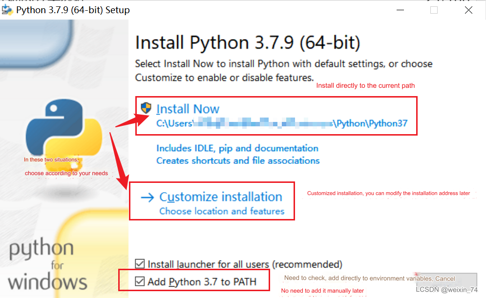

保持默认配置，直接点击Next
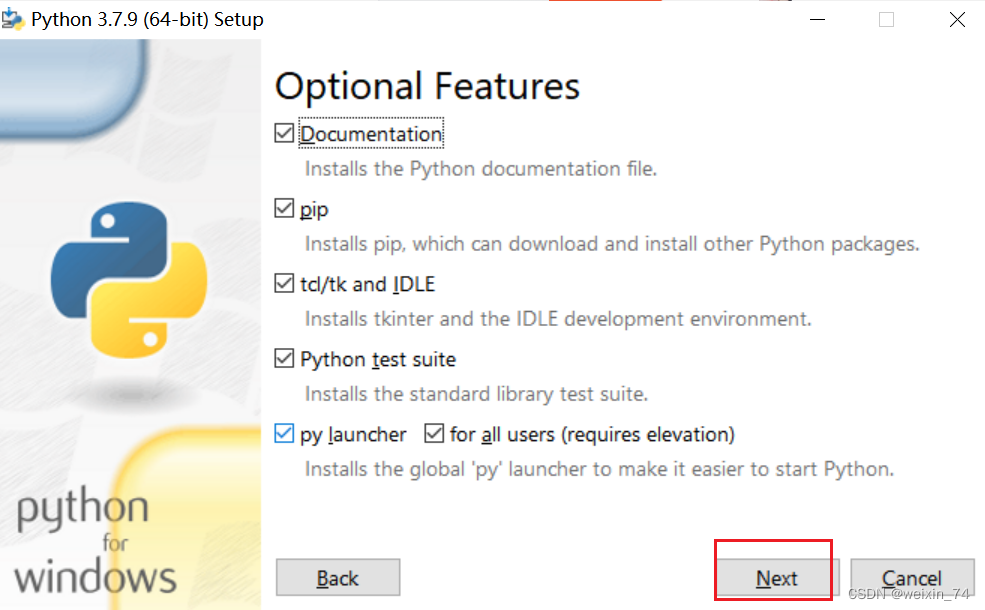
若选择自定义软件安装位置后，点击Install
（建议安装的文件路径是全英路径，因为有些软件安装遇到中文会打不开）

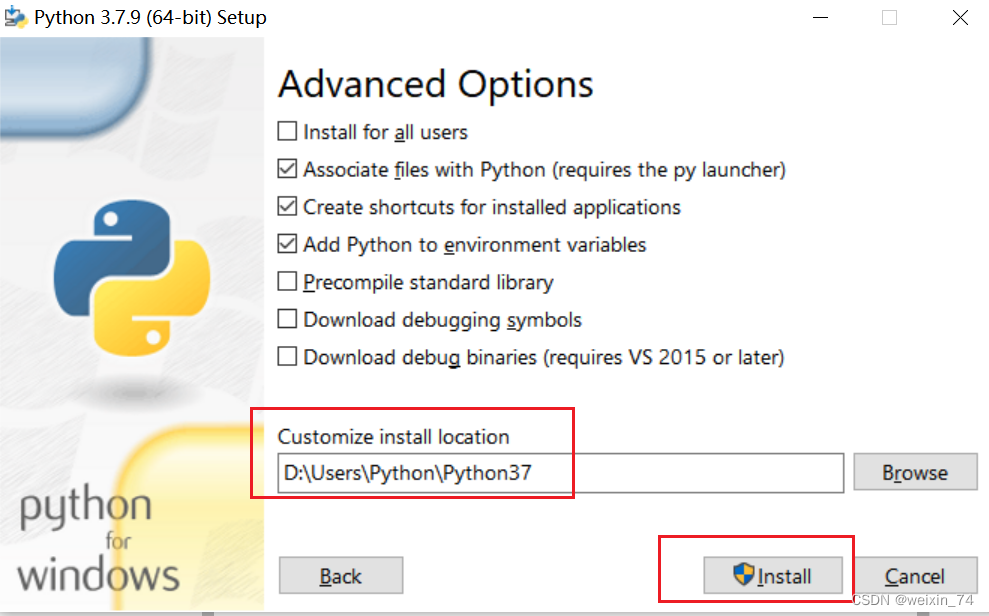

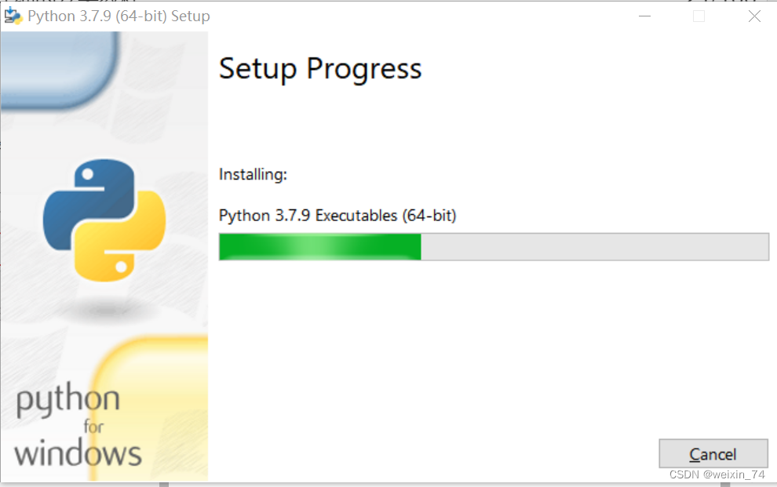

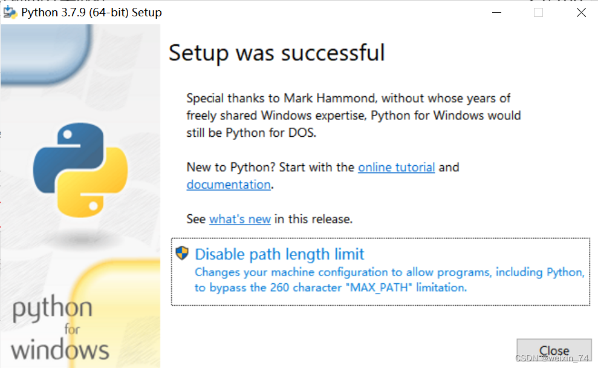

安装完成后，可以完毕当前页面，然后按键盘的 Windows键 + r键，并输入 cmd
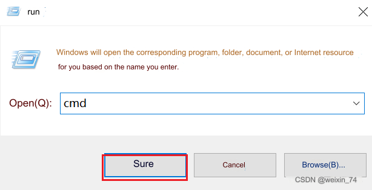
pymycobot安装
  ```python
  pip install pymycobot --upgrade --user
  ```
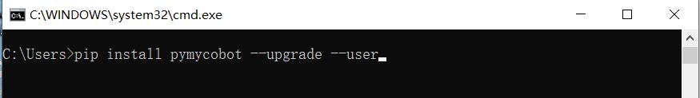

opencv安装
```bash
# 二者版本号需保持一致，这里安装4.5.5.62版本
pip install opencv-python==4.5.5.62
pip install opencv-contrib-python==4.5.5.62
```

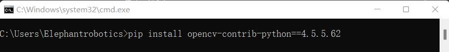

## 3 手眼标定

第一步：当机械臂与相机安装好后，将二维码放在相机的正下方，运行HandToEye脚本进行手眼标定，观察脚本输出的XY值
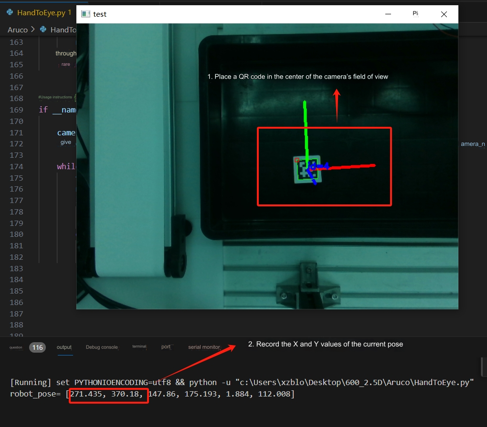
第二步：利用roboflow的快速移动，将机械臂示教到二维码的正上方，记录下roboflow的XY的实际值
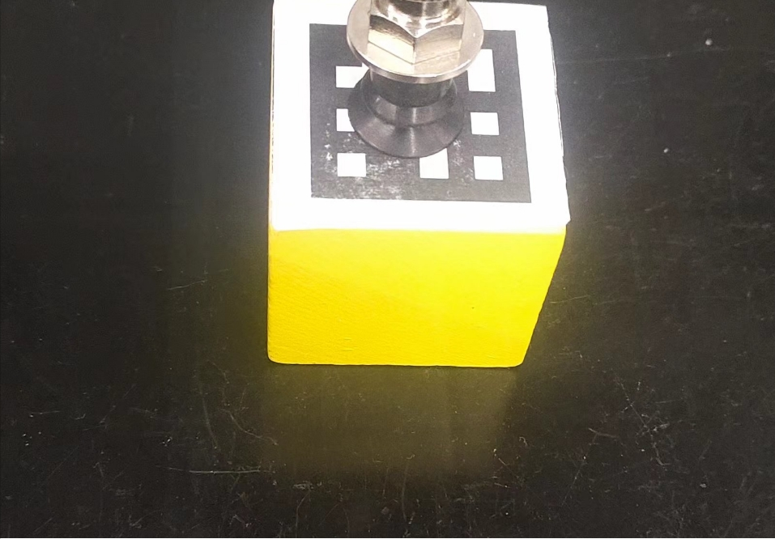

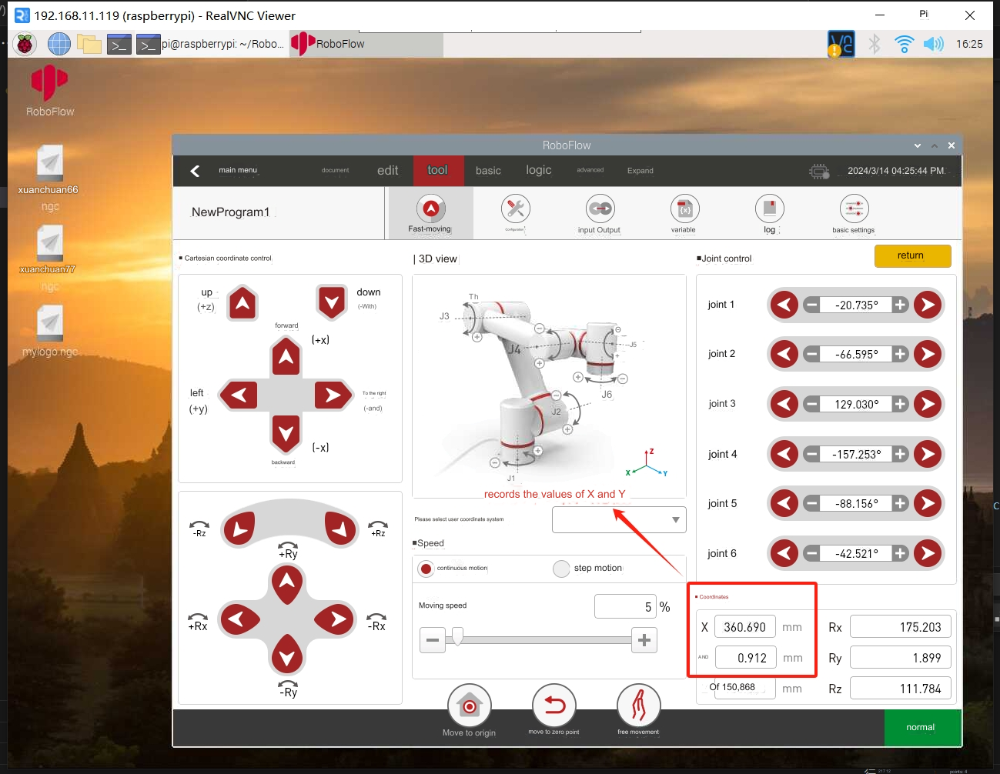
第三步：代开count.py脚本，填写对应参数后运行脚本。用roboflow的XY的实际值减去，脚本的XY值，就是相机坐标系对与机械臂的基座标系的偏位置关系
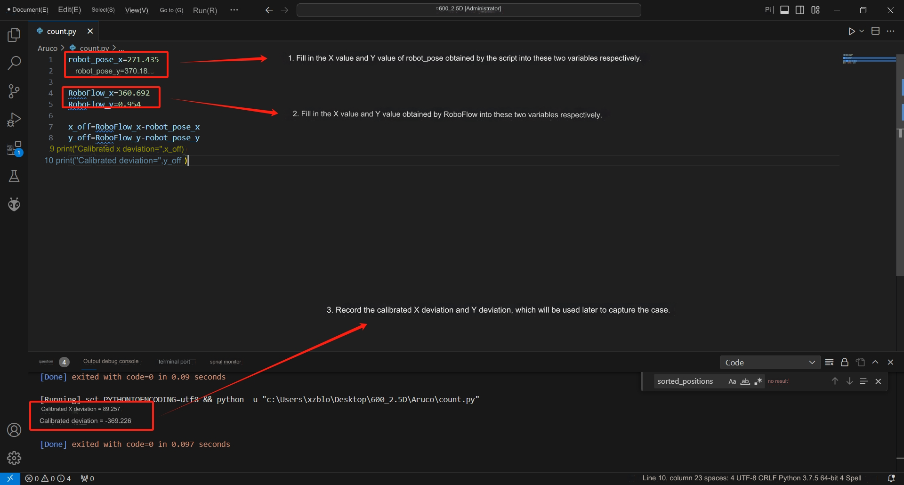

## 4 案列复现
第一步：打开demo.py脚本用户可根据实际情况修改过渡点位，分拣区点位
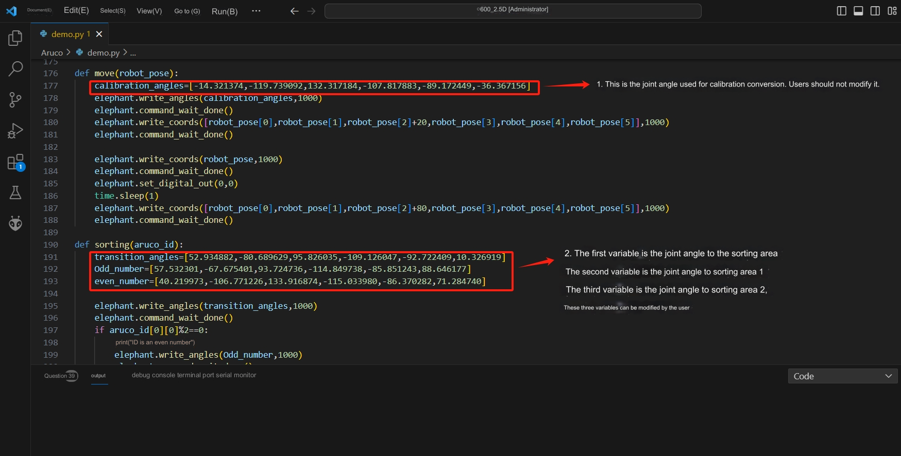

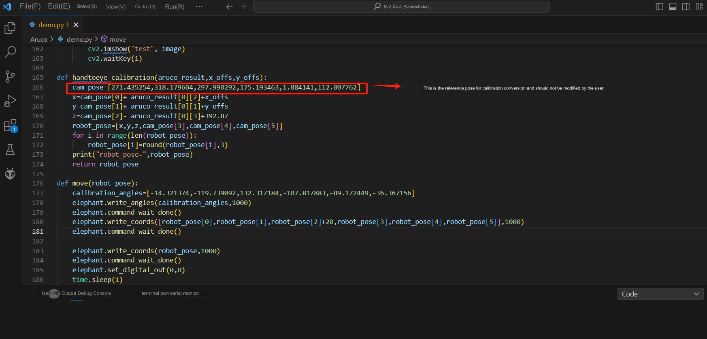
第二步：填写标定计算出来的X偏差和Y偏差，运行脚本即可
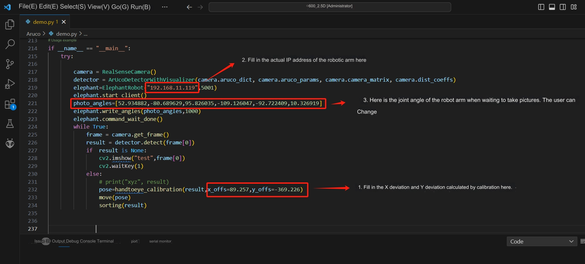