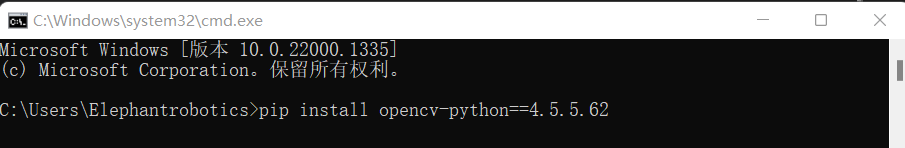

# 2.5D QR code sorting kit


## 1 Kit Hardware Introduction
### 1.1 MyCobot Pro630 Robotic Arm


## 1.1 RealSense D435


## 2 Realsense software environment construction
### 2.1 Download RealSense SDK 2.0
[Enter URL](https://github.com/IntelRealSense/librealsense/releases/tag/v2.50.0)


After the download is complete, the software shown in the picture below will be in the folder, and you can install it directly.

### 2.2 Test RealSense D435
Open RealSense Viewer.


Connect the free USB3.0 cable to the computer, it must be a USB3.0 socket! ! ! ! If it is a 3.0 socket and cable, the left side of the Viewer interface will look like the picture below. Next, just set the Stereo Module and RGB Camera off to on.

After setting off to on, the interface shown below will appear. After the test is successful, you can close the software


## 3 Python environment construction
### 3.1 Download python
[Download address](https://www.python.org/downloads/windows/)


Select the version you want to install. It is recommended to install version 3.7 or above.


After double-clicking the installation package


Keep the default configuration and click Next

If you select a custom software installation location, click Install
(It is recommended that the installation file path be an English path, because some software installations cannot be opened when encountering Chinese)


After the installation is complete, you can complete the current page, then press the Windows key + r key on the keyboard and enter cmd

pymycobot installation
   ```python
   pip install pymycobot --upgrade --user
   ```


opencv installation
```bash
# The version numbers of the two must be consistent. Install version 4.5.5.62 here.
pip install opencv-python==4.5.5.62
pip install opencv-contrib-python==4.5.5.62
```



## 3 Hand-eye calibration

Step 1: After the robotic arm and camera are installed, place the QR code directly below the camera, run the HandToEye script for hand-eye calibration, and observe the XY values output by the script.

Step 2: Use the rapid movement of roboflow to teach the robot arm directly above the QR code, and record the actual XY value of roboflow


Step 3: Open the count.py script, fill in the corresponding parameters and run the script. Subtract the actual XY value of roboflow, and the XY value of the script is the offset position relationship between the camera coordinate system and the base coordinate system of the robot arm.


## 4 Case recurrence
Step 1: Open the demo.py script. Users can modify the transition points and sorting area points according to the actual situation.


Step 2: Fill in the X deviation and Y deviation calculated by the calibration and run the script.


---

[← Previous page](../3D/3D.md) | [Next section →](../draw/draw.md)