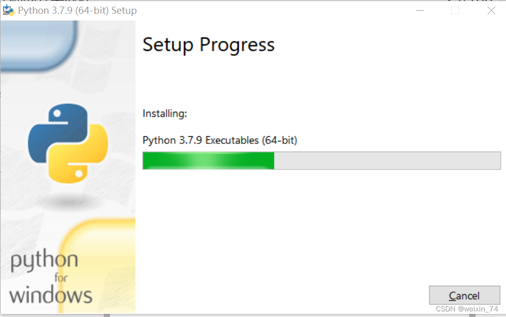
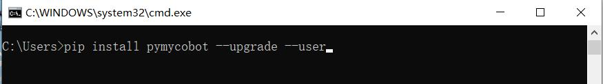

# 3D无序抓取套件


## 1 套件硬件介绍
### 1.1 MyCobot Pro630机械臂


### 1.2 图漾 FS820-E1


## 2 图漾 FS820-E1基本使用说明
### 2.1 摄像头软件环境搭建
&emsp;&emsp;图漾提供两种开发者模式，SDK和RVS模式，这里使用的是**RVS**进行开发，可以利用RVS中的视觉算子写成节点(Node)快速搭建抓取功能。根据[安装手册](http://res1.percipio.xyz/rvs/RVS_Install.pdf)完成RVS安装。

官网提供两种版本，两种版本只在**AI算子**上有差别，FULL版本就是使用GPU进行AI训练，其他一样，套件选择FULL版本
CPU 版文件名为：[RobotVisionSuite-WIN-XX-CPU.zip](http://res1.percipio.xyz/rvs/RobotVisionSuite-1.5-WinCPU.zip)
FULL 版文件名为：[RobotVisionSuite-WIN-XX-GPU.zip](http://res1.percipio.xyz/rvs/RobotVisionSuite-1.5-WinGPU.zip)

**注意**：
> - **安装后需要复制机器码发给官网邮箱或询问相关人员，得到激活码创建license.txt放在license文件夹里进行激活**
> - **安装路径选择在(D:\\)方便算子路径读取文件**
> 


### 2.2 摄像头硬件连接
在官网查找相机供电方式，这里使用[FS820-E1相机](https://www.percipio.xyz/product-fmseries/product_fs820-e1/)型号，使用**DC 12V~24V**供电。连接方式[参考这里](http://doc.percipio.xyz/cam/latest/getstarted/hardware-connection.html#net-connection-label)。这里使用**方式1**


### 2.3 算子总览
详情[参考这里](http://res1.percipio.xyz/rvs/RVS_Node_Introduction.pdf)


### 2.4 图漾相机数据实时采集
在左上角窗口**资源**中，找到TyCameraResource 算子添加到算子图中的 ResourceGroup 中，在算子列表搜索**TyCameraAccess**,**trigger** 算子添加到算子图中，并根据需要调整算子参数。然后点击**运行**和属性面板**Trigger->ture**即可查看可视化数据。没有报错能正常显示即可进行下一步。
> TyCameraResource 算子
> - start 以及 stop 分别用于开启、关闭资源算子的线程。**auto_start** 也是用于开启资源算子，如果
勾选，则仅在打开 RVS 软件后第一次进入运行状态时自动开启资源线程。
> - reset：在打开资源线程后如果需要更改属性参数，需要选中该选项进行重置。

> TyCameraAccess 算子 
> - 打开cloud、rgb、depth可视化属性，将 cloud_color设置为**-2**，代表**真实颜色**


## 3 Pyhton 环境搭建
[下载地址](https://www.python.org/downloads/windows/)


选择你要安装的版本,推荐安装3.7以上版本


双击安装包后


保持默认配置，直接点击Next

若选择自定义软件安装位置后，点击Install
（建议安装的文件路径是全英路径，因为有些软件安装遇到中文会打不开）





安装完成后，可以完毕当前页面，然后按键盘的 Windows键 + r键，并输入 cmd

pymycobot安装
  ```python
  pip install pymycobot --upgrade --user
  ```


## 4 手眼标定
准备棋盘格，算好棋盘格行列数，以及**棋盘格边长(mm)**
**注意**：
每一次的手眼标定开始前需要把RVS安装目录下的runtime\handeye_data
文件夹里面的文件全部清空
### 4.1数据录制

第一步：点击左上角加载，打开unstacking_runtime/HandEyeCalibration/HandEyeCalibration.xml，根据下图标注操作


第二步：启动机械臂
> 在终端运行HandInEyeCalib.py文件
> 

第三步：启动机械臂脚本后，就会开始自动标定

> 标定前确保相机能完整识别完整的棋盘格，以及标定过程中，棋盘格是固定的，不能发生移动。运行完成会得到20组数据。


### 4.2 计算标定结果
计算手眼标定结果


位置误差在 0.005（5毫米）以内，则比较理想；如果误差很大，请检查前述步骤是否正确执行


## 5 模型训练
**注意**：
模型已训练好，客户直接使用，无需再训练，直接阅读案列运行章节即可。若客户想自己训练，可以先把安装目录下的runtime/MaskRCNN/train data的文件夹里面的文件全部删除即可,根据下面内容操作。
### 5.1 采集图像
打开RVS加载unstacking_runtime/MaskRCNN/ty_ai_savedata.xml文件


**在图像采集时，我们应注意以下几点：**

+ 背景光照
  + 单一稳定光源，亮暗适宜且没有过多反光
  + 户外光照情况变化过大，不建议

+ 复杂工况考虑
  + 尽量使得采样样本对实际运行的全局样本有足够的代表性而不仅仅是全局样本的一种特例
 
+ 图像质量
  + 人眼需清晰可见目标边缘，尤其是距离相机最远的那层目标，否则考虑更换相机具体图像录制可以参考unstacking_runtime/MaskRCNN/train_data 中的 rgb 图像
  
### 5.2 图像标注
第一步：在需要标注图片的文件夹新建class_name.txt(文件名不能更改)


第二步：打开RVS，利用RVS自带图像标注工具对图像进行标注


第三步：点击打开目录，选择要标注的图片的所在目录

第四步：标注图片


### 5.3 数据训练
第一步：加载unstacking_runtime/MaskRCNN/ty_ai_train.xml工程，进行数据训练


第二步：训练完成后，会生成一个train_output文件夹,里面会包含一个模型权重文件


## 6 案列运行
第一步：打开unstacking_runtime/demo/demo.xml工程后，检查相机标定文件路径是否正常，保持默认即可

第二步：检查手眼标定文件路径是否正常，保持默认即可

第三步：打开计算抓取点算子

第四步：检查AI推理算子的类名文件、权重文件、配置文件是否正常；根据实际情况调节得分阈值，上述配置保持默认即可

第五步：检查机械臂模型文件路径是否正常，保持默认即可

第六步：验证工程是否能正常运行

第七步：调整cube，cube用于设置点云识别计算区域，保持默认即可

第八步：运行机械臂脚本，复现案列


